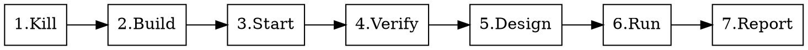

# Aleph E2E Verify — Production-Level Module Verification

Run a 7-step verification against the live Aleph server over WebSocket. Tests both tool invocation (LLM calls the right tool) and state mutation (database actually changes).

**This is an iron-clad 7-step process. No steps may be skipped or reordered.**

## The Seven Steps



### Step 1: Kill All Aleph Processes

**CRITICAL — skipping this corrupts the vault and destroys all stored API keys.**

```bash
pkill -f "target/release/aleph-server" 2>/dev/null
pkill -f "target/debug/aleph-server" 2>/dev/null
sleep 2
ps aux | grep "[a]leph-server" | grep -v zsh | grep -v cp | grep -v tail
```

If any process remains, `kill -15 <pid>` and wait. **Never proceed to Step 3 with a running instance.**

### Step 2: Build

Default: `just build` (release). Use `just build-debug` if `--skip-build` not set and speed matters.

If `--skip-build` flag: skip this step (only valid when user confirms no code changed since last build).

Wait for build to complete. Report build time.

### Step 3: Start Server

```bash
target/release/aleph-server start &
sleep 5
```

Run in background. Wait 5 seconds for initialization.

### Step 4: Verify Server Ready

Three checks, all must pass:

```bash
# 1. Process running
ps aux | grep "[a]leph-server" | grep release

# 2. Port listening
lsof -i -P | grep aleph | grep TCP | grep LISTEN

# 3. Get shared token
sqlite3 ~/.aleph/data/security.db "SELECT plaintext_token FROM shared_token LIMIT 1;"
```

If any check fails, STOP. Do not proceed to Step 5.

Save the token and port for Step 6.

### Step 5: Design Test Scenarios

Analyze the target module to determine what to test. For each scenario, define:

1. **Phase name** — what aspect is being tested
2. **Chat prompt** — the natural language instruction to send to the LLM
3. **Expected tools** — which tool(s) the LLM should call
4. **State verification** — which RPC call confirms the state changed

**Two-Layer Verification Rule**: every test scenario MUST have both:
- **Tool-call layer**: verify `stream.tool_start` fires with the correct `tool_name`
- **State layer**: verify via direct RPC or DB query that the operation actually took effect

**Module analysis checklist:**
- What tools does this module expose? (check `builtin_tools/` and `definitions.rs`)
- What RPC endpoints exist? (check `gateway/handlers/`)
- What state transitions should be testable? (CRUD operations, status changes)
- What are the happy path and error scenarios?

### Step 6: Run Tests

Generate a Python test script following this template structure:

```python
#!/usr/bin/env python3
"""Aleph E2E: {module_name} module verification."""
import asyncio, json, sys, subprocess, websockets

ALEPH_WS = "ws://127.0.0.1:{port}/ws"

# === ANSI colors ===
GREEN, RED, YELLOW, CYAN, RESET, BOLD = (
    "\033[92m", "\033[91m", "\033[93m", "\033[96m", "\033[0m", "\033[1m"
)

def print_test(name, passed, detail=""):
    icon = f"{GREEN}PASS{RESET}" if passed else f"{RED}FAIL{RESET}"
    print(f"  [{icon}] {name}")
    if detail and not passed:
        print(f"         {YELLOW}{detail}{RESET}")

def print_section(name):
    print(f"\n{BOLD}{CYAN}=== {name} ==={RESET}")


class AlephClient:
    """WebSocket JSON-RPC client with streaming event collection."""

    def __init__(self):
        self.ws = None
        self.msg_id = 0

    async def connect(self, shared_token):
        self.ws = await websockets.connect(ALEPH_WS, close_timeout=5)
        resp = await self.rpc("connect", {
            "shared_token": shared_token, "device_name": "E2E Verify"
        })
        return resp

    async def rpc(self, method, params=None):
        """Direct JSON-RPC call. Returns result dict."""
        self.msg_id += 1
        msg = {"jsonrpc": "2.0", "id": self.msg_id, "method": method}
        if params:
            msg["params"] = params
        await self.ws.send(json.dumps(msg))
        while True:
            raw = await asyncio.wait_for(self.ws.recv(), timeout=30)
            data = json.loads(raw)
            if "id" in data and data["id"] == self.msg_id:
                if "error" in data:
                    return {"_error": data["error"]}
                return data.get("result", {})

    async def chat(self, message, agent_id="main", timeout=120):
        """Send chat, collect streaming tool calls + text response."""
        resp = await self.rpc("chat.send", {
            "message": message, "agent_id": agent_id
        })
        if "_error" in resp:
            return resp

        run_id = resp.get("run_id", "")
        full_text, tool_calls = "", []
        start = asyncio.get_event_loop().time()

        while True:
            try:
                raw = await asyncio.wait_for(self.ws.recv(), timeout=timeout)
                data = json.loads(raw)
                method = data.get("method", "")
                p = data.get("params", {}) if isinstance(data.get("params"), dict) else {}

                if method == "stream.response_chunk":
                    full_text += p.get("delta", "")
                elif method == "stream.tool_start":
                    tool_calls.append({
                        "name": p.get("tool_name", "") or p.get("tool_id", ""),
                        "input": p.get("params", {}),
                    })
                elif method == "stream.tool_end":
                    if tool_calls:
                        tool_calls[-1]["result"] = p.get("result", "")
                elif method == "stream.run_complete":
                    break
                elif method == "stream.run_failed":
                    return {"_error": p.get("error", "run failed")}

                if asyncio.get_event_loop().time() - start > timeout:
                    break
            except asyncio.TimeoutError:
                break

        return {"text": full_text, "tool_calls": tool_calls}

    async def close(self):
        if self.ws:
            await self.ws.close()


# === Test Phases (generated per module) ===

async def test_phase_N(client):
    """Each phase follows this pattern."""
    print_section("Phase N: Description")

    # Tool-call verification
    resp = await client.chat("Instruction to trigger the tool...")
    tools = [tc["name"] for tc in resp.get("tool_calls", [])]
    print_test("Called expected_tool", "expected_tool" in tools, f"tools: {tools}")

    # State verification via RPC
    state = await client.rpc("relevant.rpc_method", {"id": "..."})
    print_test("State changed correctly", some_condition(state), str(state)[:200])


async def main():
    # Get token
    result = subprocess.run(
        ["sqlite3", f"{__import__('os').path.expanduser('~')}/.aleph/data/security.db",
         "SELECT plaintext_token FROM shared_token LIMIT 1;"],
        capture_output=True, text=True
    )
    token = result.stdout.strip()
    if not token:
        print(f"{RED}Cannot read shared token{RESET}")
        sys.exit(1)

    print(f"{BOLD}Aleph E2E: {{module_name}}{RESET}")
    client = AlephClient()
    try:
        await client.connect(token)
        print_test("Connected", True)

        # Run phases in order
        await test_phase_1(client)
        await test_phase_2(client)
        # ...

        print(f"\n{BOLD}{GREEN}=== Verification Complete ==={RESET}")
    except Exception as e:
        print(f"\n{RED}Error: {e}{RESET}")
        import traceback; traceback.print_exc()
    finally:
        await client.close()

if __name__ == "__main__":
    asyncio.run(main())
```

Save to `tests/{module}_e2e_test.py`. Run with `python3 tests/{module}_e2e_test.py`.

If `--debug` flag: also dump raw WebSocket messages for tool_start/tool_end events.

### Step 7: Report

Present results in this format:

```
=== Aleph E2E Verification Report ===
Module: {module_name}
Build: {release|debug} ({duration})
Server: running on :{port}

| Phase | Test | Result | Evidence |
|-------|------|--------|----------|
| 1 | ... | PASS/FAIL | ... |

Summary: X/Y PASS, Z FAIL
```

If any FAIL:
- List each failure with the raw tool_calls and state query result
- Suggest likely causes (tool not registered? store not wired? schema mismatch?)

If all PASS:
- Commit the test script: `git add -f tests/{module}_e2e_test.py`

## Red Flags — STOP

| If you're thinking... | STOP because... |
|----------------------|-----------------|
| "I'll skip the kill step, server's not running" | You don't know that. `ps aux` first. |
| "Build takes too long, I'll test the old binary" | You're testing stale code. Useless. |
| "The tool was called, no need to check state" | Tool call ≠ state change. A tool can succeed but do nothing. |
| "One RPC check is enough" | Both layers required. Tool-call proves visibility, state proves correctness. |
| "I'll write the tests from memory" | Read the actual tool implementations first. |

## Aleph WebSocket Protocol Reference

| Event | Method | Key Fields (in `params`) |
|-------|--------|--------------------------|
| Text chunk | `stream.response_chunk` | `delta`, `full_text`, `seq` |
| Tool start | `stream.tool_start` | `tool_name`, `tool_id`, `params`, `seq` |
| Tool end | `stream.tool_end` | `result`, `duration_ms`, `tool_id`, `seq` |
| Run complete | `stream.run_complete` | `run_id`, `summary`, `total_duration_ms` |
| Run failed | `stream.run_failed` | `error`, `run_id` |

Authentication: `connect` RPC with `shared_token` from `sqlite3 ~/.aleph/data/security.db "SELECT plaintext_token FROM shared_token LIMIT 1;"`.

## Existing Test Scripts

Reference these as examples when designing new module tests:
- `tests/teams_e2e_test.py` — Teams module (9 tools, 8 phases)
- `tests/tc2_test_suite.py` — General test suite
