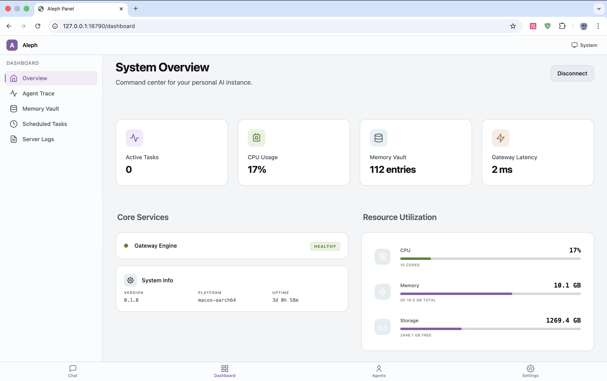

# Aleph (ℵ)

> Self-hosted personal AI assistant — one core, many shells.

[](https://www.rust-lang.org/)
[](LICENSE)
[]()

[中文文档](README_CN.md)



## What is Aleph?

Aleph is a self-hosted personal AI assistant built in Rust. It runs entirely on your own devices, connecting through a unified Gateway to 15+ messaging channels (Telegram, Discord, Slack, WhatsApp, IRC, Matrix, Signal, and more). The Rust core drives an agent loop with multi-provider LLM support, 30+ built-in tools, hybrid memory search, and a plugin system — accessible through native apps, CLI, a web panel, and social bots simultaneously.

## Architecture

```
┌─────────────────────────────────────────────────────────────────────┐
│                        INTERFACE LAYER (I/O)                        │
│  macOS Native | Tauri | CLI | Panel (WASM) | WebChat | Telegram |  │
│  Discord | Slack | WhatsApp | IRC | Matrix | Signal | Nostr | ...  │
├─────────────────────────────┬───────────────────────────────────────┤
│                       GATEWAY LAYER                                 │
│  Router | Session Manager | Event Bus | Channel Registry | Reload  │
├─────────────────────────────┼───────────────────────────────────────┤
│                        AGENT LAYER                                  │
│  Agent Loop | Thinker | Dispatcher | Task Planner | Compressor     │
├─────────────────────────────┼───────────────────────────────────────┤
│                      EXECUTION LAYER                                │
│  Providers | Executor | Tool Server | MCP | Extensions | Exec      │
├─────────────────────────────┼───────────────────────────────────────┤
│                       STORAGE LAYER                                 │
│  Memory (LanceDB) | State (SQLite) | Config (~/.aleph/)            │
└─────────────────────────────┴───────────────────────────────────────┘
```

See [docs/reference/ARCHITECTURE.md](docs/reference/ARCHITECTURE.md) for the full architecture documentation.

## Features

### Core

- Multi-provider LLM support (Claude, GPT-4, Gemini, DeepSeek, Ollama, Moonshot)
- 15+ messaging channel interfaces via unified Gateway
- 30+ built-in tools with JSON Schema auto-generation
- Memory system with hybrid search (vector ANN + full-text via LanceDB)
- MCP protocol support for external tool integration
- POE (Principle-Operation-Evaluation) agent architecture
- Desktop Bridge for native OS control (OCR, screenshots, input automation)

### Developer Experience

- Hot reload for configuration changes
- Plugin system (WASM + Node.js)
- `just` build pipeline with one-command workflows
- 58+ Gateway JSON-RPC handlers
- JSON Schema auto-generation via schemars
- Proptest and Loom concurrency test suites

## Getting Started

### Prerequisites

- **Rust** 1.92+ — install via [rustup](https://rustup.rs/)
- **just** — `cargo install just`
- Optional: `wasm-bindgen-cli` + `npm` (for WASM panel build)
- Optional: Xcode + [XcodeGen](https://github.com/yonaskolb/XcodeGen) (for macOS native app)

### Quick Start

```bash
git clone https://github.com/rootazero/Aleph.git
cd Aleph

# Start the server
cargo run --bin aleph
```

### Configuration

Aleph stores configuration and data at `~/.aleph/`:

```
~/.aleph/
├── aleph.toml       # Main configuration
├── logs/            # Server logs
├── skills/          # User-installed skills
└── plugins/         # Extensions
```

Channel configuration example in `aleph.toml`:

```toml
[channels.telegram]
enabled = true
token = "your-bot-token"
```

## Building

| Command               | Description                                |
|-----------------------|--------------------------------------------|
| `just dev`            | Run server in debug mode (rebuilds WASM)   |
| `just build`          | Build server in release mode               |
| `just wasm`           | Build WASM Panel UI only                   |
| `just macos`          | Build macOS native app (release)           |
| `just test`           | Run core tests                             |
| `just test-all`       | Run all tests (core + desktop + proptest)  |
| `just clippy`         | Lint core with clippy                      |
| `just check`          | Quick compilation check                    |
| `just deps`           | Verify build dependencies are installed    |
| `just clean`          | Clean all build artifacts                  |

No feature flags are needed for production builds.

## Project Structure

```
Aleph/
├── core/                        # Rust Core (alephcore crate)
│   └── src/
│       ├── gateway/             # WebSocket control plane
│       │   ├── handlers/        # 58+ RPC method handlers
│       │   ├── interfaces/      # 15+ channel interfaces
│       │   └── security/        # Auth, pairing, device management
│       ├── agent_loop/          # Observe-Think-Act-Feedback loop
│       ├── thinker/             # LLM interaction layer
│       ├── dispatcher/          # Task orchestration (DAG scheduling)
│       ├── executor/            # Tool execution engine
│       ├── builtin_tools/       # 30+ built-in tools
│       ├── memory/              # LanceDB storage (vectors + FTS)
│       ├── resilience/          # State management (SQLite)
│       ├── extension/           # WASM + Node.js plugin system
│       ├── providers/           # AI provider integrations
│       ├── domain/              # DDD domain model
│       ├── mcp/                 # MCP protocol client
│       └── exec/                # Shell execution + security
├── crates/
│   ├── desktop/                 # DesktopCapability native impl
│   └── logging/                 # Logging infrastructure
├── shared/
│   ├── protocol/                # Shared protocol types
│   └── ui_logic/                # Shared UI logic
├── apps/
│   ├── cli/                     # CLI client
│   ├── panel/                   # Leptos/WASM Panel UI
│   ├── webchat/                 # React WebChat UI
│   ├── desktop/                 # Tauri cross-platform app
│   └── macos-native/            # Native macOS app (Swift/Xcode)
├── docs/
│   ├── reference/               # Architecture & system docs
│   └── plans/                   # Design documents
├── justfile                     # Build pipeline
└── Cargo.toml                   # Workspace root
```

## Documentation

| Document | Link |
|----------|------|
| Architecture | [ARCHITECTURE.md](docs/reference/ARCHITECTURE.md) |
| Agent System | [AGENT_SYSTEM.md](docs/reference/AGENT_SYSTEM.md) |
| Gateway Protocol | [GATEWAY.md](docs/reference/GATEWAY.md) |
| Tool System | [TOOL_SYSTEM.md](docs/reference/TOOL_SYSTEM.md) |
| Memory System | [MEMORY_SYSTEM.md](docs/reference/MEMORY_SYSTEM.md) |
| Extension System | [EXTENSION_SYSTEM.md](docs/reference/EXTENSION_SYSTEM.md) |
| Security | [SECURITY.md](docs/reference/SECURITY.md) |
| Design Patterns | [DESIGN_PATTERNS.md](docs/reference/DESIGN_PATTERNS.md) |
| Code Organization | [CODE_ORGANIZATION.md](docs/reference/CODE_ORGANIZATION.md) |
| Domain Modeling | [DOMAIN_MODELING.md](docs/reference/DOMAIN_MODELING.md) |
| Agent Design Philosophy | [AGENT_DESIGN_PHILOSOPHY.md](docs/reference/AGENT_DESIGN_PHILOSOPHY.md) |
| Server Development | [SERVER_DEVELOPMENT.md](docs/reference/SERVER_DEVELOPMENT.md) |

## Contributing

Single-branch development on `main`. Commit format: `<scope>: <description>` (English).

Example: `gateway: add WebSocket server foundation`

## License

MIT. See [LICENSE](LICENSE).

## Acknowledgments

- [Ghost in the Shell](https://en.wikipedia.org/wiki/Ghost_in_the_Shell) — the vision of human-AI symbiosis
- [Jorge Luis Borges](https://en.wikipedia.org/wiki/The_Aleph_(short_story)) — the Aleph metaphor: a point containing all points
