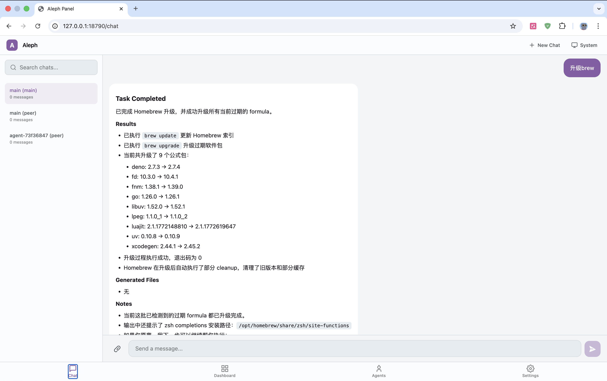
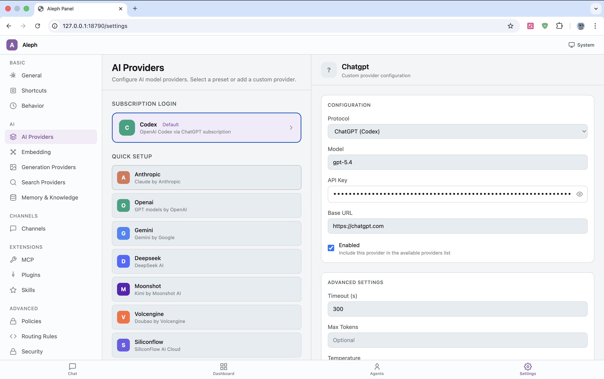

# Aleph (ℵ)

> Self-hosted personal AI assistant — one core, many shells.

[](https://www.rust-lang.org/)
[](LICENSE)
[]()

[中文文档](README_CN.md)

## A Note from the Author

This is a personal hobby project. I'm not a professional programmer — just someone who got fascinated by the possibilities of AI and started building. I've been learning AI-assisted coding along the way, and Aleph is the result of that journey. The project draws heavy inspiration from [OpenClaw](https://github.com/AIChatClaw/OpenClaw) and [Claude Code](https://docs.anthropic.com/en/docs/claude-code).

I'm sharing it in the spirit of open source, in case it's useful or interesting to others. Contributions, feedback, and ideas are always welcome.





## What is Aleph?

Aleph is a self-hosted personal AI assistant built in Rust. It runs entirely on your own devices, connecting through a unified Gateway to 15+ messaging channels (Telegram, Discord, Slack, WhatsApp, IRC, Matrix, Signal, and more). The Rust core drives an agent loop with multi-provider LLM support, 30+ built-in tools, hybrid memory search, and a plugin system — accessible through native apps, CLI, a web panel, and social bots simultaneously.

## Architecture

```
┌─────────────────────────────────────────────────────────────────────┐
│                        INTERFACE LAYER (I/O)                        │
│  macOS Native | Tauri | CLI | Panel (WASM) | Telegram |           │  │
│  Discord | Slack | WhatsApp | IRC | Matrix | Signal | Nostr | ...  │
├─────────────────────────────┬───────────────────────────────────────┤
│                       GATEWAY LAYER                                 │
│  Router | Session Manager | Event Bus | Channel Registry | Reload  │
├─────────────────────────────┼───────────────────────────────────────┤
│                        AGENT LAYER                                  │
│  Agent Loop | Thinker | Dispatcher | Task Planner | Compressor     │
├─────────────────────────────┼───────────────────────────────────────┤
│                      EXECUTION LAYER                                │
│  Providers | Executor | Tool Server | MCP | Extensions | Exec      │
├─────────────────────────────┼───────────────────────────────────────┤
│                       STORAGE LAYER                                 │
│  Memory (LanceDB) | State (SQLite) | Config (~/.aleph/)            │
└─────────────────────────────┴───────────────────────────────────────┘
```

See [docs/reference/ARCHITECTURE.md](docs/reference/ARCHITECTURE.md) for the full architecture documentation.

## Features

### Core

- Multi-provider LLM support (Claude, GPT-4, Gemini, DeepSeek, Ollama, Moonshot)
- 15+ messaging channel interfaces via unified Gateway
- 30+ built-in tools with JSON Schema auto-generation
- Memory system with hybrid search (vector ANN + full-text via LanceDB)
- MCP protocol support for external tool integration
- POE (Principle-Operation-Evaluation) agent architecture
- Desktop Bridge for native OS control (OCR, screenshots, input automation)

### Developer Experience

- Hot reload for configuration changes
- Plugin system (WASM + Node.js)
- `just` build pipeline with one-command workflows
- 58+ Gateway JSON-RPC handlers
- JSON Schema auto-generation via schemars
- Proptest and Loom concurrency test suites

## Why Aleph? — Comparison with OpenClaw

Aleph started as a personal fork inspired by [OpenClaw](https://github.com/AIChatClaw/OpenClaw). Over time it diverged significantly in architecture and capabilities. Here is a honest, code-level comparison.

### At a Glance

| | OpenClaw | Aleph |
|---|---|---|
| **Language** | TypeScript (Node.js ≥22) | Rust (tokio async runtime) |
| **Binary size** | ~200MB+ (node_modules) | Single static binary (~50MB) |
| **Memory footprint** | ~150-300MB (V8 heap) | ~20-50MB (no GC) |
| **Concurrency model** | Single-threaded event loop | Multi-threaded async (tokio) |
| **Type safety** | TypeScript (runtime exceptions possible) | Rust (compile-time guarantees, no null/undefined) |

### Architecture: Brain-Limb Separation vs Monolith

OpenClaw runs everything in a single Node.js process — gateway, agent, tools, and desktop control share one runtime. If a tool crashes or a memory leak occurs, the entire assistant goes down.

Aleph enforces strict **Brain-Limb separation** (Architectural Redline R1). The Rust Core (brain) communicates with Desktop Bridge, UI shells, and external tools through typed IPC protocols. Each layer can crash independently without taking down the core. This is enforced at compile time through Rust's trait system — platform-specific code physically cannot be imported into `core/src`.

### Security: Defense in Depth vs Trust-Based

OpenClaw operates on a **single-user trust model** — once authenticated, the operator has full access. Exec approval is available but optional. Sandbox mode uses Docker containers for isolation.

Aleph implements **layered security with compile-time enforcement**:

- **Three-tier exec security** — `AllowlistEntry` (pre-approved patterns) → `RiskAssessment` (pattern-based danger scoring with SAFE/DANGER/BLOCKED categories) → `ApprovalManager` (async user confirmation via Unix socket IPC)
- **10-type action approval system** — every action type (BrowserNavigate, DesktopClick, ShellExec, FileWrite, etc.) passes through `ConfigApprovalPolicy` with blocklist → allowlist → defaults → ask chain
- **Secret masking** — `SecretMasker` redacts sensitive data in logs and tool outputs
- **Sandbox profiles** — macOS sandbox profiles for tool execution, beyond Docker
- **Lock safety** — all mutex access uses poison recovery (`.unwrap_or_else(|e| e.into_inner())`) as a project-wide convention
- **UTF-8 safety** — string slicing uses `char_indices()` / `.get(..n)`, never `&s[..n]`

### Agent Intelligence: POE Architecture vs Simple Loop

OpenClaw's agent loop is powered by `@mariozechner/pi-agent-core` — a third-party library that handles observe-think-act. The agent runs until it produces a response or hits a token limit.

Aleph implements a **POE (Principle-Operation-Evaluation) architecture** — a self-correcting agent loop with three phases:

1. **Principle** — Before execution, `SuccessManifest` defines success criteria with `ValidationRule` (hard constraints: file exists, command passes) and `SoftMetric` (weighted quality scores)
2. **Operation** — The agent executes with budget tracking (`PoeBudget` monitors tokens, attempts, and entropy-based stuck detection with `BudgetStatus`: Improving/Stable/Degrading/Stuck/Exhausted)
3. **Evaluation** — Two-phase validation: `HardValidator` (deterministic checks) + `SemanticValidator` (LLM-based quality assessment). If evaluation fails, the loop self-corrects with strategy switching

This means Aleph doesn't just "try until done" — it defines success upfront, monitors its own progress, detects when it's stuck, and can switch strategies autonomously.

### Multi-Agent: Swarm Intelligence vs Config Routing

OpenClaw supports multi-agent through config-driven routing — you define agents in config, each gets a workspace, and `sessions_send` tool passes messages between them. It's functional but static.

Aleph has **three multi-agent systems**:

1. **A2A Protocol** — Full HTTP-based agent-to-agent communication with server/client adapters, SSE streaming, task store, smart router, agent card discovery, and tiered authentication
2. **Swarm Intelligence** — `SwarmCoordinator` orchestrates multiple agents with `AgentMessageBus` (event bus), `SemanticAggregator` (compresses insights from N agents), `CollectiveMemory` (shared team history), and `RuleEngine` (event filtering)
3. **SharedArena** — Multi-agent collaboration workspace with slot-based events, settlement protocol, and persistent storage via `ArenaManager`

### Memory: Cognitive Architecture vs Flat Storage

OpenClaw uses LanceDB for vector search with batch embedding and compression. It works well for basic RAG retrieval.

Aleph's memory system is a **cognitive architecture** with 50+ modules:

- **Tiered storage** — `MemoryTier`: Ephemeral → Short-term → Long-term → Archive, with automatic decay (`DecayScheduler`)
- **Fact typing** — `FactType`: Fact, Hypothesis, Pattern, Policy, Config, Observation, Artifact
- **Memory layers** — `MemoryLayer`: Operational (working), Tactical (recent), Strategic (long-term)
- **Specialized stores** — `MemoryStore` (facts), `SessionStore` (conversations), `GraphStore` (entity relationships), `DreamStore` (daily insights), `CompressionStore` (summarization)
- **Dreaming** — `CompressionDaemon` runs background consolidation, generating insights from accumulated experiences (similar to human sleep-based memory consolidation)
- **Adaptive retrieval** — `AdaptiveRetrievalGate` decides when to search memory, `Reranker` re-orders results, `ValueEstimator` scores importance via LLM
- **Ripple effects** — `RippleEffect` propagates memory impact across related facts

### Self-Learning: Experience Crystallization vs None

OpenClaw has no self-learning mechanism. Session facts are stored but never analyzed for patterns.

Aleph implements a **skill evolution pipeline**:

```
EvolutionTracker → SolidificationDetector → SkillGenerator → GitCommitter
```

1. `EvolutionTracker` logs every execution to SQLite
2. `SolidificationDetector` identifies recurring patterns that cross a success threshold
3. `SkillGenerator` creates new skills (SKILL.md) from solidified patterns
4. `GitCommitter` auto-commits new skills to the repository

Safety gates (`SafetyLevel`: Benign → Caution → Warning → Danger → Blocked) and user approval workflows prevent unsafe skills from being generated.

### MCP: First-Class Protocol vs Bridge

OpenClaw supports MCP through `mcporter` — a skill that bridges MCP servers as OpenClaw tools. This adds latency and limits feature coverage.

Aleph implements **first-class MCP** with three transport layers:

- `StdioTransport` — local subprocess communication
- `HttpTransport` — remote HTTP servers
- `SseTransport` — HTTP + Server-Sent Events for streaming

Plus: `McpResourceManager` (resource discovery), `McpPromptManager` (prompt templates), `OAuthStorage` (token persistence), and `SamplingCallback` (LLM sampling support).

### Intent Detection: Unified LLM-Forward Pipeline vs Simple Routing

OpenClaw routes messages based on session configuration and agent assignment.

Aleph uses a **unified, LLM-forward pipeline** (`UnifiedIntentClassifier`) where the heavy lifting is done by AI:

| Layer | Name | What It Does |
|-------|------|-------------|
| Abort | `AbortDetector` | Exact-match multilingual stop words (11 languages: EN/ZH/JA/KO/RU/DE/FR/ES/PT/AR/HI). Fast, no LLM needed |
| L0 | Slash commands | Built-in commands (`/screenshot`, `/ocr`, `/search`, etc.) + runtime-registered directives (`/think`, `/model`, `/notools`) |
| L1 | `StructuralDetector` | Pattern matching for file paths (Unix/Windows), URLs, context signals (selected file, clipboard). No language dependency |
| L2 | `KeywordIndex` | **Optional** weighted keyword matching with CJK-aware tokenization. Kept as fast-path shortcut, not relied upon |
| L3 | `AiBinaryClassifier` | **Core decision maker** — LLM binary classification (execute vs converse) with 3s timeout and confidence threshold |
| L4 | Default fallback | If all layers abstain, falls back to execute (confidence 0.5) or converse |

Early-exit optimization: first layer to match wins. The pipeline output is a single `IntentResult` enum (DirectTool / Execute / Converse / Abort) that carries the detection layer and confidence metadata. Optional `ConfidenceCalibrator` applies post-pipeline tuning based on history and context.

### Resilience: State Recovery vs None

OpenClaw has no crash recovery mechanism. If the process dies, context is lost.

Aleph includes:

- `ShadowReplayEngine` — replay execution traces after crash
- `RecoveryManager` — coordinates recovery decisions (Resume, Rollback, Replay, Fail)
- `ResourceGovernor` + `QuotaManager` — per-agent resource quotas (tokens, tasks, memory)
- `RecursiveSentry` — prevents infinite recursion in agent loops
- `GracefulShutdown` — clean agent termination with state persistence
- `StateDatabase` (SQLite) — persistent event/task/trace/session tracking

### Performance: Compiled vs Interpreted

| Metric | OpenClaw (Node.js) | Aleph (Rust) |
|--------|-------------------|--------------|
| Startup time | ~2-3s (V8 warmup) | ~100ms |
| Tool dispatch | JS event loop (single-threaded) | tokio multi-threaded async |
| Concurrency testing | Vitest (unit tests) | Loom (exhaustive state exploration) |
| Property testing | None | Proptest (1024+ cases per test) |
| Memory safety | GC-managed (potential leaks) | Ownership system (compile-time guarantees) |

### What OpenClaw Does Better

To be fair:

- **Easier to extend** — TypeScript plugins vs Rust compilation
- **Larger skill library** — 52 bundled skills + ClawHub registry
- **More mature channels** — WhatsApp (Baileys), Signal, Zalo are production-tested
- **Simpler setup** — `npm install` vs Rust toolchain
- **Mobile nodes** — iOS/Android companion apps with camera/location/canvas

## Installation

### macOS / Linux

```bash
curl -fsSL https://raw.githubusercontent.com/rootazero/Aleph/main/install.sh | bash
```

### Windows (PowerShell)

```powershell
irm https://raw.githubusercontent.com/rootazero/Aleph/main/install.ps1 | iex
```

The installer automatically detects your platform and architecture (x86_64 / ARM64), downloads the latest release binary, installs it to your PATH, and optionally sets up auto-start as a system service.

After installation, run:

```bash
aleph
```

### Build from Source

If you prefer to build from source:

```bash
# Prerequisites: Rust 1.92+, just (cargo install just)
git clone https://github.com/rootazero/Aleph.git
cd Aleph
cargo run --bin aleph
```

### Configuration

Aleph stores configuration and data at `~/.aleph/`:

```
~/.aleph/
├── aleph.toml       # Main configuration
├── logs/            # Server logs
├── skills/          # User-installed skills
└── plugins/         # Extensions
```

Channel configuration example in `aleph.toml`:

```toml
[channels.telegram]
enabled = true
token = "your-bot-token"
```

## Building

| Command               | Description                                |
|-----------------------|--------------------------------------------|
| `just dev`            | Run server in debug mode (rebuilds WASM)   |
| `just build`          | Build server in release mode               |
| `just wasm`           | Build WASM Panel UI only                   |
| `just macos`          | Build macOS native app (release)           |
| `just test`           | Run core tests                             |
| `just test-all`       | Run all tests (core + desktop + proptest)  |
| `just clippy`         | Lint core with clippy                      |
| `just check`          | Quick compilation check                    |
| `just deps`           | Verify build dependencies are installed    |
| `just clean`          | Clean all build artifacts                  |

No feature flags are needed for production builds.

## Project Structure

```
Aleph/
├── core/                        # Rust Core (alephcore crate)
│   └── src/
│       ├── gateway/             # WebSocket control plane
│       │   ├── handlers/        # 58+ RPC method handlers
│       │   ├── interfaces/      # 15+ channel interfaces
│       │   └── security/        # Auth, pairing, device management
│       ├── agent_loop/          # Observe-Think-Act-Feedback loop
│       ├── thinker/             # LLM interaction layer
│       ├── dispatcher/          # Task orchestration (DAG scheduling)
│       ├── executor/            # Tool execution engine
│       ├── builtin_tools/       # 30+ built-in tools
│       ├── memory/              # LanceDB storage (vectors + FTS)
│       ├── resilience/          # State management (SQLite)
│       ├── extension/           # WASM + Node.js plugin system
│       ├── providers/           # AI provider integrations
│       ├── domain/              # DDD domain model
│       ├── mcp/                 # MCP protocol client
│       └── exec/                # Shell execution + security
├── crates/
│   ├── desktop/                 # DesktopCapability native impl
│   └── logging/                 # Logging infrastructure
├── shared/
│   ├── protocol/                # Shared protocol types
│   └── ui_logic/                # Shared UI logic
├── apps/
│   ├── cli/                     # CLI client
│   ├── panel/                   # Leptos/WASM Panel UI
│   ├── desktop/                 # Tauri cross-platform app
│   └── macos-native/            # Native macOS app (Swift/Xcode)
├── docs/
│   ├── reference/               # Architecture & system docs
│   └── plans/                   # Design documents
├── justfile                     # Build pipeline
└── Cargo.toml                   # Workspace root
```

## Documentation

| Document | Link |
|----------|------|
| Architecture | [ARCHITECTURE.md](docs/reference/ARCHITECTURE.md) |
| Agent System | [AGENT_SYSTEM.md](docs/reference/AGENT_SYSTEM.md) |
| Gateway Protocol | [GATEWAY.md](docs/reference/GATEWAY.md) |
| Tool System | [TOOL_SYSTEM.md](docs/reference/TOOL_SYSTEM.md) |
| Memory System | [MEMORY_SYSTEM.md](docs/reference/MEMORY_SYSTEM.md) |
| Extension System | [EXTENSION_SYSTEM.md](docs/reference/EXTENSION_SYSTEM.md) |
| Security | [SECURITY.md](docs/reference/SECURITY.md) |
| Design Patterns | [DESIGN_PATTERNS.md](docs/reference/DESIGN_PATTERNS.md) |
| Code Organization | [CODE_ORGANIZATION.md](docs/reference/CODE_ORGANIZATION.md) |
| Domain Modeling | [DOMAIN_MODELING.md](docs/reference/DOMAIN_MODELING.md) |
| Agent Design Philosophy | [AGENT_DESIGN_PHILOSOPHY.md](docs/reference/AGENT_DESIGN_PHILOSOPHY.md) |
| Server Development | [SERVER_DEVELOPMENT.md](docs/reference/SERVER_DEVELOPMENT.md) |

## Contributing

Single-branch development on `main`. Commit format: `<scope>: <description>` (English).

Example: `gateway: add WebSocket server foundation`

## License

MIT. See [LICENSE](LICENSE).

