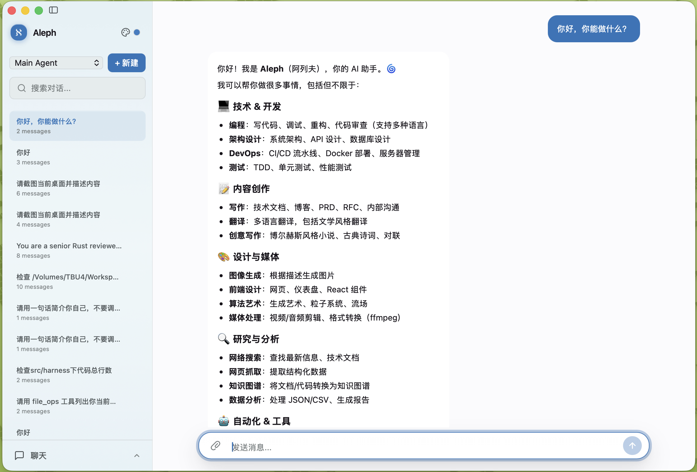

# Aleph (ℵ)

> Your personal AI assistant — **native on your desktop, reachable anywhere**.

[](https://www.rust-lang.org/)
[](LICENSE)
[]()

[中文文档](README_CN.md)

<p align="center">
  
</p>

---

## What is Aleph?

Aleph is a self-hosted personal AI assistant that lives on **your** machine. It ships as a **native desktop app** for macOS, Windows, and Linux — install the `.dmg` / `.msi` / `.deb`, launch it, and you have a conversational, multi-modal assistant in your tray within a minute.

The same app quietly hosts `aleph-server`, your private AI brain. Because the brain is always running, Aleph can also reach you on the channels you already use — Telegram, Discord, Slack, WhatsApp, iMessage, Matrix, IRC, email, and a dozen more — so you can keep talking to your assistant from your phone, your watch, or any browser.

**One brain. Many doors. Your data, your devices.**

---

## Why a desktop app?

Aleph started as a headless server. We rebuilt it around a real desktop app because that's where personal AI actually lives — next to your work, not behind a URL.

### 🖥️ Install in one click, run forever

Download → double-click → done. The installer bundles the `aleph-server` daemon, registers launch-at-login, and parks Aleph in your system tray. No port forwarding, no `docker compose`, no terminal — it just works for non-developers too.

### 💬 A real conversation surface

A polished chat panel (Leptos + WASM) with streaming responses, code blocks, file drops, image previews, voice input, inline tool calls, and approval prompts. It's the experience you'd expect from a Claude/ChatGPT desktop app — but talking to *your* assistant, with *your* memory and *your* tools.

### ⚙️ Visual setup, no config files

Pick a model, paste an API key, toggle a channel, install a skill, manage memory notes — all through the in-app settings panel. Configuration files still exist for power users, but you don't have to touch them.

### 🖱️ Truly native

- **System tray** — Always there, never in the way
- **Global summon hotkey** — `⌘ ⇧ Space` (configurable) to focus the chat from anywhere
- **OS notifications** — Push results, daemon alerts, and approval requests through native toast notifications
- **`aleph://` deep links** — Launch tasks from the browser, other apps, or shortcuts
- **Auto-update** — Signed updates land in the background; restart when you're ready
- **Native input/screenshot/clipboard** — Aleph can read your screen and type, with explicit permission

### 🔒 Your data stays local

All conversations, memory notes, vectors, and credentials live under `~/.aleph/`. Aleph only talks to the LLM provider *you* configured (or a local Ollama). Nothing routes through a vendor cloud.

---

## Remote channels — your assistant comes with you

The desktop app is the home base, but Aleph also reaches outward. Through the unified **Gateway**, the same brain handles messages from:

| Category | Channels |
|----------|----------|
| **Chat** | Telegram · Discord · Slack · WhatsApp · iMessage · WeChat · QQ · Feishu · Matrix · IRC · LINE · Mattermost · MS Teams · XMPP · Signal · Nostr |
| **Async** | Email · Webhooks |
| **Power-user** | Web Chat (browser) · CLI · TUI · MCP · A2A · ACP |

Configure a channel once in the settings panel and your assistant is reachable from your phone, your team's Slack, or a coffee-shop browser — replying with the same memory, the same skills, and the same identity it has on your desktop.

> **R5 design principle — "AI Comes to You"**: Aleph never makes you switch apps. It reaches you where you already are.

---

## Highlights

### 🧠 Cognitive memory, not just RAG
- **Notes layer** — Markdown memory with Obsidian-style `[[wikilink]]` graphs
- **Hybrid retrieval** — Vector ANN (sqlite-vec) + FTS5 + wikilink traversal for multi-hop reasoning
- **Self-learning** — Auto-distills skills from your note patterns
- **Dream daemon** — Background compaction synthesizing memories into higher-level concepts

### 🤖 Thin-harness agent loop
Built around the **LLM-Sovereignty** principle: a deliberately tiny `Think → Act` loop (~1,500 LOC) defers every judgment call — intent, tool selection, completion, safety — to the model itself. Stronger models make Aleph stronger, with zero harness changes.

### 🔌 Pluggable everywhere
- **30+ built-in tools** (filesystem, shell, browser, vision, OCR, memory, …)
- **MCP** client for external tool servers
- **Skills** (Python / shell scripts) and **WASM / Node.js extensions**
- **Multi-provider** LLMs: Claude · GPT · Gemini · DeepSeek · Ollama · Moonshot · Kimi · Qwen

### 🛡️ Sandbox by default
Every tool runs inside an OS-native sandbox (Seatbelt / Landlock / AppContainer) with capability ledgers, deny-by-default network/file rules, and explicit user approvals for risky actions.

---

## Architecture (one core, many shells)

```
                ┌─────────────────────────────────────────┐
                │      🖥  Native Desktop App (Tauri)      │
                │   chat panel · tray · hotkey · notify    │
                └──────────────────┬──────────────────────┘
                                   │  JSON-RPC (local)
┌────────────┐  remote ┌───────────▼──────────┐ ┌────────────────┐
│  Browser   │────────▶│      Gateway         │◀│ Telegram bot   │
│ (Web Chat) │  WS     │  (origin · sessions  │ │ Discord · Slack│
└────────────┘         │   channel registry)  │ │ WhatsApp · …   │
                       └───────────┬──────────┘ └────────────────┘
                                   │
                       ┌───────────▼──────────┐
                       │   Orchestrator       │
                       │   → Harness          │
                       │      (Think→Act)     │
                       │   → Thinker (LLM)    │
                       └─┬─────┬─────┬─────┬──┘
                         ▼     ▼     ▼     ▼
                     Session Tools Memory Sandbox
                                   │
                            ┌──────┴──────┐
                            │  ~/.aleph/  │
                            │  SQLite +   │
                            │  sqlite-vec │
                            └─────────────┘
```

Full design: [docs/reference/ARCHITECTURE.md](docs/reference/ARCHITECTURE.md) · [HARNESS_PHILOSOPHY.md](docs/reference/HARNESS_PHILOSOPHY.md)

---

## Install

Each release ships **three** flavours — pick one. All are on the
[latest release](https://github.com/rootazero/Aleph/releases/latest) page.

### 1. Full desktop app (recommended)

The complete app with `aleph-server` bundled inside — zero configuration,
runs entirely on one machine. Download the installer and launch it:

| Platform | Installer |
|----------|-----------|
| macOS    | `.dmg` (Apple Silicon + Intel) |
| Windows  | `.msi` |
| Linux    | `.deb` · `.AppImage` |

On first launch it starts the daemon, registers launch-at-login, and lives
in the system tray. Open the chat panel from the tray icon or the global
hotkey.

### 2. Aleph Panel — thin-shell app

A UI-only desktop app with **no** bundled server. Use it to connect to an
`aleph-server` already running elsewhere on your LAN — point it at the
server's IP, or let mDNS discover it. Same three installers (`Aleph
Panel.dmg` / `.msi` / `.deb`).

### 3. Standalone `aleph-server` (servers / NAS)

Install just the daemon, no GUI:

```bash
curl -fsSL https://github.com/rootazero/Aleph/releases/latest/download/install.sh | bash
```

It drops the `aleph-server` binary into `/usr/local/bin` (or `~/.local/bin`
if that isn't writable). Start it with `aleph-server start`. By default it
binds `127.0.0.1` (local only); to let Aleph Panel or browsers on your LAN
reach it, set `[gateway] host = "0.0.0.0"` in `~/.aleph/config.toml`.

> **Trust = your network.** Aleph has no login step — binding `0.0.0.0`
> gives every device on your LAN full control of the agent. Only do it on a
> network you trust; to expose Aleph over the internet, front it with your
> own reverse proxy / VPN.

> Skills that need Node.js / Python runtimes: **Settings → Runtime** bootstraps them on demand.

### Data layout

Everything lives under `~/.aleph/`:

```
~/.aleph/
├── aleph.toml       # Main config (channels, providers, ...)
├── data/            # SQLite + sqlite-vec (memory, sessions, vectors)
├── logs/            # Server logs
├── skills/          # Installed skills
├── plugins/         # Extensions
└── workspaces/      # Per-session sandbox dirs
```

---

## Build from source

Prerequisites: Rust 1.95+, [`just`](https://github.com/casey/just), Node.js, `wasm-bindgen`, Swift toolchain (macOS only).

```bash
git clone https://github.com/rootazero/Aleph.git
cd Aleph
just shell-dev       # Run the desktop app in dev mode (rebuilds WASM)
```

| Command | Description |
|---------|-------------|
| `just shell-dev` | Run the desktop app in dev mode |
| `just shell-build` | Build signed desktop installers (`.dmg` / `.msi` / `.deb`) |
| `just dev` | Run `aleph-server` headlessly (debug) |
| `just build` | Release build (WASM + server) |
| `just test-all` | Run all tests (core + desktop + proptest) |
| `just clippy` | Lint |
| `just verify-build` | CI-validate three-platform build (no release) |
| `just release YY.M.D` | Tag + publish via GitHub workflow |

### Headless / server-only mode

Don't want the desktop GUI? You can still run `aleph-server` directly — it's the same binary the app embeds. Useful for VPS deployments where you only need Web Chat + channel bots.

```bash
cargo run --bin aleph-server start
```

---

## Project layout

```
Aleph/
├── src/                 # Rust core (alephcore crate)
│   ├── gateway/         # JSON-RPC control plane + channel interfaces
│   ├── orchestrator/    # AgentDef resolution + Harness dispatch
│   ├── harness/         # Think→Act loop (thin, ~1500 LOC)
│   ├── thinker/         # LLM interaction layer
│   ├── memory/          # SQLite + sqlite-vec (notes, vectors, FTS)
│   ├── builtin_tools/   # 30+ built-in tools
│   ├── sandbox/         # OS-native isolation
│   ├── providers/       # Multi-protocol LLM clients
│   ├── mcp/             # MCP client
│   ├── extension/       # WASM + Node.js plugin system
│   └── ...              # session · approval · scheduler · daemon · ...
├── desktop/
│   ├── shell/           # Tauri desktop app (tray, hotkey, notifications, ...)
│   ├── shared/          # DesktopCapability trait + IPC protocol
│   ├── macos/ + bridge/ # macOS native (AppKit, Vision, Swift bridge)
│   ├── windows/         # Windows native (Win32)
│   └── linux/           # Linux native (Wayland/X11)
├── interfaces/
│   ├── webchat/         # Leptos + WASM Panel UI (used by desktop + browser)
│   ├── cli/             # CLI client
│   └── tui/             # TUI client
├── plugins/             # Built-in plugin crates
├── docs/reference/      # Architecture & system docs
└── justfile             # Build pipeline
```

---

## Documentation

| Document | Link |
|----------|------|
| Architecture | [ARCHITECTURE.md](docs/reference/ARCHITECTURE.md) |
| Harness philosophy | [HARNESS_PHILOSOPHY.md](docs/reference/HARNESS_PHILOSOPHY.md) |
| Agent system | [AGENT_SYSTEM.md](docs/reference/AGENT_SYSTEM.md) |
| Gateway protocol | [GATEWAY.md](docs/reference/GATEWAY.md) |
| Tool system | [TOOL_SYSTEM.md](docs/reference/TOOL_SYSTEM.md) |
| Memory system | [MEMORY_SYSTEM.md](docs/reference/MEMORY_SYSTEM.md) |
| Sandbox | [SANDBOX.md](docs/reference/SANDBOX.md) |
| Security | [SECURITY.md](docs/reference/SECURITY.md) |
| Desktop shell | [DESKTOP_SHELL.md](docs/reference/DESKTOP_SHELL.md) |
| Desktop bridge | [DESKTOP_BRIDGE.md](docs/reference/DESKTOP_BRIDGE.md) |
| Multi-agent system | [MULTI_AGENT_SYSTEM.md](docs/reference/MULTI_AGENT_SYSTEM.md) |
| Extension system | [EXTENSION_SYSTEM.md](docs/reference/EXTENSION_SYSTEM.md) |

---

## Contributing

Single-branch development on `main`. Commit format: `<scope>: <description>` (English).
Example: `gateway: add WebSocket server foundation`

Before restarting Aleph in development:

```bash
pkill -f "target/release/aleph-server" 2>/dev/null
pkill -f "target/debug/aleph-server" 2>/dev/null
```

Multiple concurrent daemons → HMAC failure → **vault data loss**. The flock-based singleton makes this very rare, but the safety reminder stands.

See [CONTRIBUTING.md](CONTRIBUTING.md) for the full workflow.

---

## License

MIT. See [LICENSE](LICENSE).
