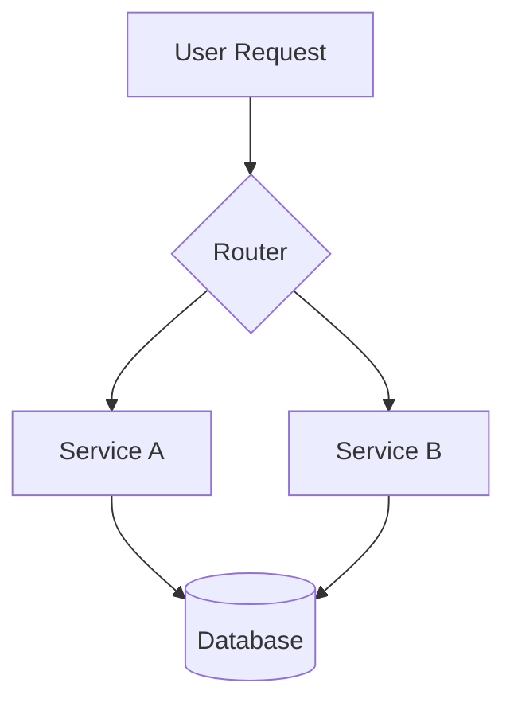
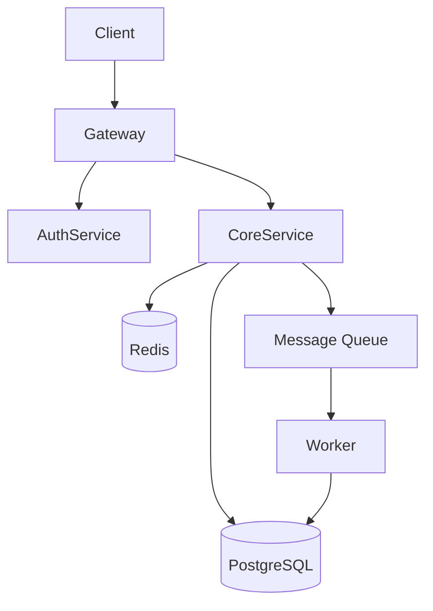
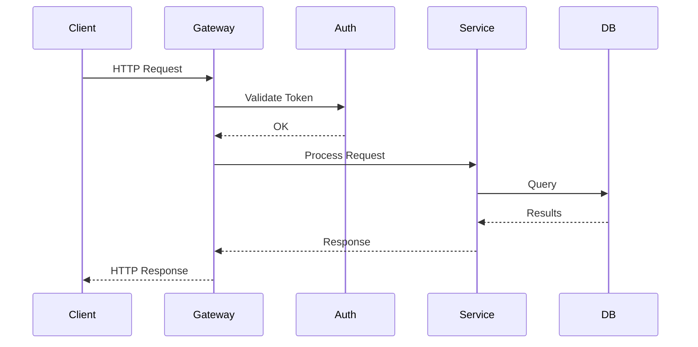

# Official Skills Implementation Plan

> **For Claude:** REQUIRED SUB-SKILL: Use superpowers:executing-plans to implement this plan task-by-task.

**Goal:** Create 20 official SKILL.md files for Aleph, organized in a pyramid (8 foundation + 7 workflow + 5 specialist), all redesigned from openclaw inspirations.

**Architecture:** Each skill is a standalone SKILL.md file with YAML frontmatter parsed by Aleph's `SkillFrontmatter` struct. Skills use pure prompt injection — no internal API calls, no external scripts. Content guides LLM behavior through methodology, checklists, and decision trees.

**Tech Stack:** Markdown + YAML frontmatter. Aleph parser fields: `name`, `description`, `scope`, `disable-model-invocation`, `bound-tool`. Template substitutions: `$ARGUMENTS`, `@./path`, `@/path`.

**Design Doc:** `docs/plans/2026-02-25-official-skills-design.md`

**Target Directory:** `skills/` at project root (will be discoverable via `~/.aleph/skills/` symlink or build install)

---

## Task 1: Create directory structure

**Files:**
- Create: `skills/foundation/debug/SKILL.md` (placeholder)
- Create: `skills/foundation/test/SKILL.md` (placeholder)
- Create: `skills/foundation/code-review/SKILL.md` (placeholder)
- Create: `skills/foundation/git/SKILL.md` (placeholder)
- Create: `skills/foundation/refactor/SKILL.md` (placeholder)
- Create: `skills/foundation/shell/SKILL.md` (placeholder)
- Create: `skills/foundation/search/SKILL.md` (placeholder)
- Create: `skills/foundation/doc/SKILL.md` (placeholder)
- Create: `skills/workflow/plan/SKILL.md` (placeholder)
- Create: `skills/workflow/api-design/SKILL.md` (placeholder)
- Create: `skills/workflow/database/SKILL.md` (placeholder)
- Create: `skills/workflow/deploy/SKILL.md` (placeholder)
- Create: `skills/workflow/security/SKILL.md` (placeholder)
- Create: `skills/workflow/performance/SKILL.md` (placeholder)
- Create: `skills/workflow/ci-cd/SKILL.md` (placeholder)
- Create: `skills/specialist/architecture/SKILL.md` (placeholder)
- Create: `skills/specialist/emergency/SKILL.md` (placeholder)
- Create: `skills/specialist/regex/SKILL.md` (placeholder)
- Create: `skills/specialist/mcp-dev/SKILL.md` (placeholder)
- Create: `skills/specialist/knowledge/SKILL.md` (placeholder)

**Step 1: Create all directories**

```bash
mkdir -p skills/foundation/{debug,test,code-review,git,refactor,shell,search,doc}
mkdir -p skills/workflow/{plan,api-design,database,deploy,security,performance,ci-cd}
mkdir -p skills/specialist/{architecture,emergency,regex,mcp-dev,knowledge}
```

**Step 2: Verify structure**

```bash
find skills -type d | sort
```

Expected:
```
skills
skills/foundation
skills/foundation/code-review
skills/foundation/debug
skills/foundation/doc
skills/foundation/git
skills/foundation/refactor
skills/foundation/search
skills/foundation/shell
skills/foundation/test
skills/specialist
skills/specialist/architecture
skills/specialist/emergency
skills/specialist/knowledge
skills/specialist/mcp-dev
skills/specialist/regex
skills/workflow
skills/workflow/api-design
skills/workflow/ci-cd
skills/workflow/database
skills/workflow/deploy
skills/workflow/performance
skills/workflow/plan
skills/workflow/security
```

**Step 3: Commit**

```bash
git add skills/
git commit -m "skills: create directory structure for 20 official skills"
```

---

## Task 2: F1 — debug (Systematic Debugging)

**Files:**
- Create: `skills/foundation/debug/SKILL.md`

**Step 1: Write the skill**

```markdown
---
name: debug
description: Systematic debugging methodology — 7-step protocol with POE-aligned success contracts
scope: standalone
---

# Systematic Debugging

## When to Use

Invoke this skill when investigating bugs, unexpected behavior, test failures, or production incidents. It provides a structured methodology that prevents random guessing and ensures reproducible fixes.

## Step 0: Define Success (POE — Principle)

Before touching code, answer: **"What does 'fixed' look like?"**

Write a success contract:
- What is the expected behavior?
- What is the actual behavior?
- What evidence confirms the fix? (a passing test, a specific output, a metric)

If you cannot articulate the success criteria, you do not yet understand the bug.

## The 7-Step Protocol

### 1. Reproduce

Get the bug to fail **consistently**. Document:
- Exact steps to trigger
- Environment (OS, runtime version, dependencies)
- Input data that causes the failure

If you cannot reproduce it, you cannot fix it. Investigate intermittent failures with logging before proceeding.

### 2. Isolate

Narrow the scope. Techniques by effectiveness:

| Technique | When to Use |
|-----------|-------------|
| `git bisect` | Bug appeared recently, you have a known-good commit |
| Binary search (comment out) | Large module, unclear which part fails |
| Minimal reproduction | Complex setup, need to strip to essentials |
| Input reduction | Large input triggers bug, simplify until it still fails |

**Default choice:** `git bisect` — it's the fastest for regression bugs:
```bash
git bisect start
git bisect bad          # current commit is broken
git bisect good <sha>   # last known good commit
# test each checkout, mark good/bad, repeat
git bisect reset        # when done
```

### 3. Hypothesize

Form a **specific, testable** theory:
- "The null check on line 42 doesn't handle the empty-array case"
- NOT "something is wrong with the data"

Write down your hypothesis. If it's vague, break it into sub-hypotheses.

### 4. Instrument

Add **targeted** observation to confirm or refute the hypothesis:
- Logging at suspected failure point
- Assertions that validate assumptions
- Breakpoints in debugger
- Print intermediate values

**Rule:** Instrument to test the hypothesis, not to "see what's happening."

### 5. Verify

Confirm the root cause matches your hypothesis.
- If **confirmed**: proceed to fix.
- If **refuted**: return to step 3 with new hypothesis. Update your mental model.

Do NOT skip this step. Fixing the wrong cause wastes more time than it saves.

### 6. Fix

Apply the **minimal correct fix**.

**Rules:**
- Fix the root cause, not the symptom
- Do not refactor while debugging — resist the urge
- Do not fix adjacent issues — file them separately
- If the fix is larger than ~20 lines, reconsider whether you found the real root cause

### 7. Regression Test

Write a test that:
1. Fails **without** the fix (demonstrates the bug)
2. Passes **with** the fix (proves the fix works)

This test prevents the bug from returning. It is not optional.

## Common Error Patterns

| Error | Root Cause | Fix Pattern |
|-------|-----------|-------------|
| `undefined`/`null` reference | Missing null check or wrong data shape | Optional chaining, validate at boundary |
| Off-by-one | Loop bounds, array indexing, range calculations | Verify with edge case: 0, 1, N, N-1, N+1 |
| Race condition | Concurrent access without synchronization | Mutex/lock, atomic operations, message passing |
| ENOENT / file not found | Path construction error, missing prerequisite | Verify path, check file exists before access |
| Connection refused | Service not running, wrong port/host | Verify service status, check port binding |
| Timeout | Network latency, deadlock, infinite loop | Add timeout bounds, check for cycles |
| Encoding error | UTF-8/ASCII mismatch, byte vs string | Explicit encoding at I/O boundary |
| Permission denied | File/network/process permission | Check ownership, capabilities, firewall |
| Memory leak | Unclosed resources, growing caches, circular refs | Track allocations, weak references, explicit cleanup |
| Serialization error | Schema mismatch, missing field, type change | Validate schema, version protocol |

## Anti-Patterns

- **Shotgun debugging**: Changing random things hoping something works
- **Printf avalanche**: Dumping everything instead of targeted instrumentation
- **Fix and pray**: Applying a fix without understanding the root cause
- **Refactor during debug**: Mixing bug fixes with code improvements
- **Ignoring the reproduction step**: "It only happens in production" is not an excuse

## Quick Diagnostic Commands

```bash
# What's using this port?
lsof -i :PORT

# What's this process doing?
ps aux | grep PROCESS
strace -p PID           # Linux
dtruss -p PID           # macOS

# Recent changes that might have caused this
git log --oneline -20
git diff HEAD~5

# System resources
df -h                   # disk
free -h                 # memory (Linux)
vm_stat                 # memory (macOS)
```
```

**Step 2: Verify frontmatter is valid**

Check that the file starts with `---`, has valid YAML with `name`, `description`, `scope` fields, and closes with `---`.

**Step 3: Commit**

```bash
git add skills/foundation/debug/SKILL.md
git commit -m "skills: add debug — systematic debugging methodology"
```

---

## Task 3: F2 — test (Testing & TDD)

**Files:**
- Create: `skills/foundation/test/SKILL.md`

**Step 1: Write the skill**

```markdown
---
name: test
description: Unified testing workflow — TDD cycles, framework selection, test patterns across languages
scope: standalone
---

# Testing & TDD

## When to Use

Invoke this skill when writing tests, setting up test infrastructure, running TDD cycles, or analyzing test coverage. It provides a unified approach across frameworks.

## Framework Detection

Before writing tests, identify the project's framework:

| Config File | Framework | Run Command |
|-------------|-----------|-------------|
| `Cargo.toml` | Rust built-in | `cargo test` |
| `vitest.config.*` | Vitest | `npx vitest` |
| `jest.config.*` | Jest | `npx jest` |
| `pyproject.toml` (pytest) | pytest | `pytest` |
| `Package.swift` | XCTest | `swift test` |
| `playwright.config.*` | Playwright | `npx playwright test` |

If no test config exists, recommend the idiomatic default for the language.

## TDD Cycle (POE-Mapped)

### Red — Define the Contract (Principle)

Write a failing test that describes the desired behavior. This IS the success contract.

```
1. Name the test after the behavior, not the implementation
   ✓ test_returns_empty_list_when_no_items_match
   ✗ test_filter_function

2. Use Arrange-Act-Assert structure:
   Arrange: Set up inputs and expected outputs
   Act:     Call the function/method under test
   Assert:  Verify the result matches expectation

3. Run the test — it MUST fail
   If it passes, either the test is wrong or the feature already exists
```

### Green — Minimal Implementation (Operation)

Write the **minimum code** to make the test pass. No more.

```
- Hardcode the return value if that passes the test
- Resist adding error handling for cases not yet tested
- Resist making it "clean" — that's the next step
- Run the test — it MUST pass
```

### Refactor — Clean Up (Evaluation)

Improve the code while keeping all tests green.

```
- Remove duplication
- Improve naming
- Extract helper functions if repeated
- Run ALL tests after each change — they MUST stay green
```

### Cycle Complete → Commit → Next Test

## What to Test

**Always test:**
- Public API / exported functions
- Edge cases: empty input, null/None, boundary values, overflow
- Error paths: invalid input, network failures, missing resources
- Business logic: calculations, state transitions, conditional branches

**Don't test:**
- Private implementation details (they change without affecting behavior)
- Framework internals (someone else tests those)
- Trivial getters/setters with no logic
- Third-party library behavior

## Test Patterns

### Isolation

Each test must be independent. No test should depend on another test's state.

```
- Reset state in setup/beforeEach/setUp
- Use fresh fixtures per test
- Avoid shared mutable state between tests
- Tests must pass in any order
```

### Mocking

Mock external dependencies, not internal collaborators:

```
Mock:  HTTP clients, databases, file systems, clocks, random
Don't: Internal classes, helper functions, data transformations
```

Use the **narrowest mock possible** — mock the specific method, not the entire object.

### Test Naming

Format: `test_<behavior>_when_<condition>_expects_<outcome>`

```
✓ test_login_with_invalid_password_returns_401
✓ test_search_with_empty_query_returns_all_items
✓ test_checkout_with_expired_coupon_ignores_discount
```

## Coverage

Coverage measures lines/branches executed, not quality. Use it to find **untested paths**, not as a target.

- 80% line coverage is a reasonable floor
- 100% is usually not worth the effort
- Branch coverage matters more than line coverage
- A single well-designed test beats ten shallow ones

## Anti-Patterns

- **Testing implementation**: Assert on internal state instead of observable behavior
- **Flaky tests**: Tests that sometimes pass, sometimes fail — fix or delete immediately
- **Test interdependence**: Test B fails when Test A doesn't run first
- **Excessive mocking**: Mocking everything makes tests brittle and meaningless
- **No assertion**: A test that runs code but checks nothing
- **Copy-paste tests**: Duplicated test code — extract helpers instead
```

**Step 2: Verify frontmatter is valid**

**Step 3: Commit**

```bash
git add skills/foundation/test/SKILL.md
git commit -m "skills: add test — testing and TDD workflow"
```

---

## Task 4: F3 — code-review (Code Review)

**Files:**
- Create: `skills/foundation/code-review/SKILL.md`

**Step 1: Write the skill**

```markdown
---
name: code-review
description: Multi-dimensional code review with confidence-based filtering — security, logic, error handling
scope: standalone
---

# Code Review

## When to Use

Invoke this skill when reviewing code changes — pull requests, diffs, or files. It provides a structured, prioritized review that surfaces high-confidence issues first.

## Review Protocol

### Step 1: Understand Context

Before reviewing code, understand:
- What problem does this change solve?
- What's the scope? (new feature, bug fix, refactor, performance)
- Are there tests? Do they cover the change?

Read the PR description, linked issues, and relevant documentation first.

### Step 2: Review by Priority

Review in **descending priority**. Stop deeper if critical issues found.

#### P0 — Security (Blocking)

| Check | What to Look For |
|-------|-----------------|
| Secrets | Hardcoded API keys, passwords, tokens, connection strings |
| Injection | SQL injection, command injection, XSS, template injection |
| Auth bypass | Missing authentication/authorization checks on endpoints |
| Path traversal | User input used in file paths without sanitization |
| Deserialization | Unsafe deserialization of untrusted data |

**Rule:** Any P0 finding blocks the review. Fix before proceeding.

#### P1 — Logic (Blocking)

| Check | What to Look For |
|-------|-----------------|
| Correctness | Does the code actually do what it claims? |
| Edge cases | Empty inputs, null/None, boundary values, concurrent access |
| Error handling | Are errors caught? Are they handled correctly? Do they propagate? |
| State management | Race conditions, stale state, missing cleanup |
| Data integrity | Truncation, overflow, precision loss, encoding issues |

#### P2 — Error Handling (Important)

| Check | What to Look For |
|-------|-----------------|
| Missing error paths | What happens when this call fails? |
| Swallowed errors | Catch blocks that do nothing or just log |
| Error messages | Are they helpful for debugging? Do they leak internals? |
| Resource cleanup | Are connections, files, locks released on error? |

#### P3 — Performance (Informational)

| Check | What to Look For |
|-------|-----------------|
| N+1 queries | Loop with DB query inside |
| Unbounded growth | Lists/maps that grow without limit |
| Missing pagination | Returning all records from a large table |
| Blocking I/O | Synchronous I/O in async context |

#### P4 — Style (Optional, on request only)

Naming, formatting, idiomatic patterns. Only raise if significantly impacts readability.

### Step 3: Report Findings

For each finding, provide:

```
**[P0/P1/P2/P3] file:line — Title**
Description of the issue.
Suggested fix: (concrete code suggestion)
```

**Default behavior:** Report P0-P2 findings only. Mention P3-P4 count but don't detail unless asked.

## Confidence Filter

Only report findings where you have **high confidence** the issue is real.

| Confidence | Action |
|------------|--------|
| High (>80%) | Report with specific fix |
| Medium (50-80%) | Report as "potential issue, verify" |
| Low (<50%) | Do not report — avoid false positives |

**Rule:** 5 high-confidence findings > 20 speculative ones.

## Review Summary Template

```
## Review Summary

**Scope:** [feature/bugfix/refactor] — [brief description]
**Verdict:** [APPROVE / REQUEST CHANGES / NEEDS DISCUSSION]

### Findings
[P0-P2 findings listed]

### Observations
[P3-P4 count, general impressions, positive notes]

### Missing
[Tests not covering change, documentation not updated, etc.]
```

## Anti-Patterns

- **Nitpicking style over substance**: Don't flag formatting when there are logic bugs
- **Rubber-stamping**: "LGTM" without actually reading the code
- **Rewriting in review**: Suggesting complete rewrites instead of incremental improvements
- **Ignoring tests**: Reviewing implementation without checking test coverage
- **Scope creep**: Requesting changes unrelated to the PR's purpose
```

**Step 2: Verify frontmatter is valid**

**Step 3: Commit**

```bash
git add skills/foundation/code-review/SKILL.md
git commit -m "skills: add code-review — multi-dimensional review with confidence filtering"
```

---

## Task 5: F4 — git (Git Workflow)

**Files:**
- Create: `skills/foundation/git/SKILL.md`

**Step 1: Write the skill**

```markdown
---
name: git
description: Git workflow — daily operations, advanced techniques, and Aleph conventions
scope: standalone
---

# Git Workflow

## When to Use

Invoke this skill for any Git operation — committing, branching, merging, recovering from mistakes, or working with advanced features like bisect, reflog, and worktrees.

## Commit Convention

Aleph uses the format: `<scope>: <description>`

```
gateway: add WebSocket server foundation
memory: fix LanceDB connection pool leak
tools: implement shell execution with timeout
```

- Scope = module/component being changed
- Description = imperative mood, lowercase, no period
- English commit messages always

## Daily Operations

### Stage and Commit

```bash
git add <specific-files>           # stage specific files
git diff --staged                  # review what will be committed
git commit -m "scope: description" # commit with message
```

**Never** use `git add .` or `git add -A` blindly — review what you're staging.

### Branching

```bash
git checkout -b feature/name       # create and switch to new branch
git branch -d feature/name         # delete merged branch
git branch -D feature/name         # force delete unmerged branch (careful!)
```

### Sync with Remote

```bash
git fetch origin                   # update remote tracking branches
git pull --rebase origin main      # rebase local changes on top of remote
git push -u origin feature/name    # push and set upstream
```

## Advanced Operations

### Bisect — Find the Commit That Broke It

```bash
git bisect start
git bisect bad                     # current is broken
git bisect good <known-good-sha>   # last known working commit
# Git checks out midpoint — test it, then:
git bisect good   # or   git bisect bad
# Repeat until found. Automate with:
git bisect run <test-script>
git bisect reset                   # exit bisect
```

### Reflog — Recover from Mistakes

The reflog records every HEAD movement. Nothing is truly lost (for ~30 days).

```bash
git reflog                         # see recent HEAD history
git checkout <reflog-sha>          # go to any previous state
git branch recovery <reflog-sha>   # save as a branch
```

Use when: accidentally deleted a branch, reset --hard too far, lost commits after rebase.

### Cherry-Pick — Apply Specific Commits

```bash
git cherry-pick <sha>              # apply one commit
git cherry-pick <sha1>..<sha3>     # apply a range
git cherry-pick --no-commit <sha>  # stage changes without committing
```

### Interactive Rebase — Clean Up History

```bash
git rebase -i HEAD~5               # rewrite last 5 commits
# In editor: pick/squash/reword/edit/drop
# After editing:
git rebase --continue              # or --abort to cancel
```

**Warning:** Never rebase commits that have been pushed to a shared branch.

### Worktree — Parallel Branches

```bash
git worktree add ../feature-branch feature/name
# Work in ../feature-branch independently
git worktree remove ../feature-branch
git worktree prune                 # clean up stale entries
```

**Aleph-specific rule:** Never delete a worktree from within it. The CWD lock will corrupt your shell. Always `cd` to the main repo or use a separate terminal.

### Sparse Checkout — Partial Clone

```bash
git sparse-checkout init --cone
git sparse-checkout set src/core src/gateway
```

Useful for large monorepos when you only need specific directories.

## Conflict Resolution

```bash
# During merge/rebase with conflicts:
git status                         # see conflicting files
# Edit files — look for <<<<<<< / ======= / >>>>>>>
git add <resolved-file>            # mark as resolved
git merge --continue               # or git rebase --continue
```

**Strategy:** If conflicts are large, consider `git rerere` to record resolutions:
```bash
git config rerere.enabled true     # auto-record conflict resolutions
```

## Useful Aliases

```bash
git config --global alias.st 'status -sb'
git config --global alias.lg 'log --oneline --graph --all -20'
git config --global alias.unstage 'reset HEAD --'
git config --global alias.last 'log -1 HEAD --stat'
```

## Anti-Patterns

- **Force push to shared branches**: Destroys other people's work. Only force-push your own feature branches.
- **Giant commits**: "implement everything" — break into logical units
- **Vague messages**: "fix stuff", "update", "WIP" — describe what and why
- **Committing secrets**: Even after removal, they exist in history. Use `git-secrets` or pre-commit hooks.
- **Never rebasing**: Merge commits clutter history. Rebase feature branches before merge.
```

**Step 2: Verify frontmatter is valid**

**Step 3: Commit**

```bash
git add skills/foundation/git/SKILL.md
git commit -m "skills: add git — workflow with Aleph conventions"
```

---

## Task 6: F5 — refactor (Code Refactoring)

**Files:**
- Create: `skills/foundation/refactor/SKILL.md`

**Step 1: Write the skill**

```markdown
---
name: refactor
description: Safe code refactoring — smell detection, technique selection, test-protected incremental changes
scope: standalone
---

# Code Refactoring

## When to Use

Invoke this skill when code needs restructuring without changing external behavior. Always refactor separately from bug fixes and feature additions.

## Prerequisites

Before refactoring, you MUST have:

1. **Passing tests** covering the code to refactor
2. If no tests exist, write **characterization tests** first (tests that capture current behavior, right or wrong)
3. A clear statement of **what smell you're removing** and **what the target structure looks like**

## Code Smell Catalog

| Smell | Symptom | Refactoring |
|-------|---------|-------------|
| **Long method** | Function > 30 lines, does multiple things | Extract Method |
| **God class** | Class with 10+ responsibilities | Extract Class, move methods to collaborators |
| **Feature envy** | Method uses another class's data more than its own | Move Method to the data's class |
| **Shotgun surgery** | One change requires edits in 10+ files | Move related logic into one module |
| **Primitive obsession** | Using strings/ints where a value object fits | Introduce Value Object / Newtype |
| **Long parameter list** | Function takes 5+ parameters | Introduce Parameter Object or Builder |
| **Duplicate code** | Same logic in 3+ places | Extract into shared function |
| **Dead code** | Unreachable code, unused variables/functions | Delete it. Don't comment it out. |
| **Deep nesting** | 4+ levels of if/for/match | Early return, extract method, flatten |
| **Magic numbers** | Unexplained literals in code | Extract to named constant |

## Refactoring Techniques

### Extract Method
Take a code block and turn it into a named function. The name should describe **what** it does, not **how**.

### Extract Class
Split a large class into smaller, focused classes. Each class should have one reason to change.

### Inline
The opposite of extract — when indirection adds complexity without value, collapse it.

### Rename
The cheapest refactoring with the highest impact. Good names eliminate comments.

### Replace Conditional with Polymorphism
When a switch/match dispatches behavior by type, use trait/interface implementations instead.

### Introduce Parameter Object
Group related parameters into a struct/class. Reduces parameter count and creates a named concept.

## Safety Protocol

**Every refactoring step follows this cycle:**

```
1. Run tests → all green
2. Make ONE structural change (extract, move, rename, inline)
3. Run tests → all green
4. Commit
5. Repeat
```

If tests break: revert the last change (`git checkout -- .`) and try a smaller step.

**Never** combine multiple refactoring techniques in one commit. One commit = one transformation.

## Aleph Conventions

Aleph's CODE_ORGANIZATION.md defines these rules:
- Files > 500 lines should be split
- One public type per file (with exceptions for small related types)
- Module structure mirrors domain concepts

When refactoring Aleph code, respect these boundaries.

## Anti-Patterns

- **Refactoring without tests**: You're changing structure blind — bugs will hide in the gaps
- **Refactoring during debugging**: Fix the bug first, refactor later — never both at once
- **Big bang refactoring**: Rewriting an entire module at once. Small steps, always.
- **Refactoring for aesthetics**: "This could be cleaner" is not a reason unless it causes real problems
- **Premature abstraction**: Don't extract a pattern until you've seen it 3 times
```

**Step 2: Verify frontmatter is valid**

**Step 3: Commit**

```bash
git add skills/foundation/refactor/SKILL.md
git commit -m "skills: add refactor — safe code refactoring methodology"
```

---

## Task 7: F6 — shell (Shell & Containers)

**Files:**
- Create: `skills/foundation/shell/SKILL.md`

**Step 1: Write the skill**

```markdown
---
name: shell
description: Scene-driven shell commands — system diagnostics, Docker operations, process management
scope: standalone
---

# Shell & Containers

## When to Use

Invoke this skill for system administration tasks: checking ports, managing processes, Docker containers, disk cleanup, and network debugging.

## Port & Process Diagnostics

### "What's using this port?"
```bash
lsof -i :3000                      # macOS/Linux
ss -tlnp | grep :3000              # Linux (faster)
```

### "What's this process doing?"
```bash
ps aux | grep <name>               # find process
kill <pid>                         # graceful stop
kill -9 <pid>                      # force kill (last resort)
top -l 1 -n 10                    # top 10 by CPU (macOS)
htop                               # interactive (if installed)
```

### "Something is hanging"
```bash
# Find zombie processes
ps aux | awk '$8 ~ /Z/'

# Find processes holding a file
lsof <filepath>

# Kill all processes matching a pattern
pkill -f <pattern>
```

## Disk & Filesystem

### "Disk is full"
```bash
df -h                              # check disk usage
du -sh * | sort -rh | head -20     # largest items in current dir
du -sh ~/.cache                    # check common cache dirs

# Safe cleanup (check before deleting)
docker system prune -f             # Docker: remove unused data
npm cache clean --force            # npm cache
cargo clean                        # Rust build artifacts
rm -rf node_modules && npm install # reset node_modules
```

### "Find large files"
```bash
find / -type f -size +100M 2>/dev/null | head -20
```

## Docker

### Container Lifecycle
```bash
docker ps                          # running containers
docker ps -a                       # all containers (including stopped)
docker run -d --name <n> <image>   # start detached
docker stop <container>            # graceful stop
docker rm <container>              # remove stopped container
docker logs -f <container>         # follow logs
docker exec -it <container> sh     # interactive shell
```

### Images
```bash
docker images                      # list images
docker pull <image>:<tag>          # pull from registry
docker rmi <image>                 # remove image
docker image prune -a              # remove unused images
```

### Docker Compose
```bash
docker compose up -d               # start all services
docker compose down                # stop and remove
docker compose logs -f <service>   # follow service logs
docker compose restart <service>   # restart one service
docker compose ps                  # service status
docker compose exec <svc> sh       # shell into service
```

### System Cleanup
```bash
docker system df                   # disk usage breakdown
docker system prune -af            # remove ALL unused (careful!)
docker volume prune                # remove unused volumes
```

## Network Debugging

### "Can I reach this host?"
```bash
ping -c 3 <host>                   # basic connectivity
curl -v <url>                      # HTTP request with headers
curl -o /dev/null -w "%{http_code}" <url>  # just status code
```

### "DNS issues"
```bash
dig <domain>                       # DNS lookup
nslookup <domain>                  # alternative DNS lookup
host <domain>                      # simple DNS check
```

### "What's listening?"
```bash
lsof -i -P -n | grep LISTEN       # all listening ports (macOS)
ss -tlnp                           # all listening ports (Linux)
```

## Environment & Config

### "Check environment"
```bash
env | grep <PATTERN>               # search env vars
echo $PATH | tr ':' '\n'           # readable PATH
which <command>                    # find command location
<command> --version                # check installed version
```

### "Manage background jobs"
```bash
<command> &                        # run in background
jobs                               # list background jobs
fg %1                              # bring job 1 to foreground
nohup <command> &                  # survive terminal close
```

## Safety Rules

- **Always preview before bulk delete**: `ls` before `rm`, `docker ps` before `docker rm`
- **Use `-i` flag for interactive rm** when deleting in unfamiliar directories
- **Never `rm -rf /`** or `rm -rf ~` — triple-check paths with variables
- **Docker prune**: Understand what `-a` removes (ALL unused, not just dangling)
- Aleph exec safety: Dangerous commands require explicit user confirmation
```

**Step 2: Verify frontmatter is valid**

**Step 3: Commit**

```bash
git add skills/foundation/shell/SKILL.md
git commit -m "skills: add shell — system diagnostics and Docker operations"
```

---

## Task 8: F7 — search (Technical Search)

**Files:**
- Create: `skills/foundation/search/SKILL.md`

**Step 1: Write the skill**

```markdown
---
name: search
description: Technical search strategies — code archaeology, documentation retrieval, web research
scope: standalone
---

# Technical Search

## When to Use

Invoke this skill when you need to find information — definitions in code, documentation for a library, answers to technical questions, or understanding how existing code works.

## Search Mode Selection

| I Need To... | Mode | Primary Tools |
|--------------|------|---------------|
| Find where something is defined | Code Archaeology | Grep, Glob |
| Understand how code works | Code Reading | Read, Grep |
| Find library documentation | Documentation | WebFetch, WebSearch |
| Answer a technical question | Web Research | WebSearch |
| Understand commit history | History | `git log`, `git blame` |

## Code Archaeology

### Find Definition
```
Glob: **/<ClassName>.{rs,ts,py}    # find file by name pattern
Grep: "struct ClassName"            # find struct/class definition
Grep: "fn function_name"           # find function definition
Grep: "def function_name"          # Python
Grep: "export.*ClassName"          # TypeScript/JavaScript export
```

### Trace Usage
```
Grep: "ClassName"                   # all references
Grep: "function_name("             # all call sites
Grep: "use.*module::ClassName"     # Rust imports
Grep: "import.*ClassName"          # JS/Python imports
```

### Understand History
```bash
git log --oneline -20 -- <file>    # recent changes to file
git blame <file>                    # who changed each line and when
git log -p -S "search_term"        # commits that added/removed this string
git log --all --grep="keyword"     # commits with keyword in message
```

### Find Patterns
```
Grep: "TODO|FIXME|HACK|XXX"       # find tech debt markers
Grep: "unsafe"                     # find unsafe blocks (Rust)
Grep: "\.unwrap()"                 # find potential panics (Rust)
Grep: "console\.(log|error)"      # find debug logging (JS)
```

## Documentation Retrieval

### Priority Order
1. **Official docs** — Most accurate, most up-to-date
2. **GitHub repository** — README, examples, issues, discussions
3. **Stack Overflow** — Community-verified solutions
4. **Blog posts** — Tutorials (verify date — may be outdated)

### Using WebFetch
```
WebFetch URL with specific prompt:
- "Extract the API for <ClassName>"
- "Find the configuration options for <feature>"
- "Show examples of <usage pattern>"
```

### Using WebSearch
```
WebSearch: "<library> <specific question> site:docs.rs"     # Rust
WebSearch: "<library> <specific question> site:docs.python.org"  # Python
WebSearch: "<library> <specific question> 2026"             # recent results
```

## Research Methodology

### 1. Define the Question
Be specific: "How does Tokio handle task cancellation?" not "Tokio help"

### 2. Search
Start narrow, widen if needed:
- Exact error message first
- Then core concept + language/framework
- Then broader architectural question

### 3. Evaluate Sources
- Official docs > GitHub issues > Stack Overflow > blog posts
- Check dates — anything older than 2 years may be outdated
- Check versions — solutions for v1 may not work for v2

### 4. Synthesize
Combine findings into a coherent answer. Cross-reference multiple sources.

## Anti-Patterns

- **Searching too broadly**: "how to code" — be specific
- **Trusting first result**: Cross-reference at least 2 sources
- **Ignoring version**: Solution for React 17 may break React 19
- **Not reading error messages**: The error message often tells you exactly what's wrong
- **Searching when you should read**: If you have the source code, `Read` it
```

**Step 2: Verify frontmatter is valid**

**Step 3: Commit**

```bash
git add skills/foundation/search/SKILL.md
git commit -m "skills: add search — technical search strategies"
```

---

## Task 9: F8 — doc (Documentation Writing)

**Files:**
- Create: `skills/foundation/doc/SKILL.md`

**Step 1: Write the skill**

```markdown
---
name: doc
description: Documentation co-authoring — 3-stage workflow with templates for RFC, ADR, README, and specs
scope: standalone
---

# Documentation Writing

## When to Use

Invoke this skill when writing documentation — READMEs, RFCs, ADRs, design docs, API docs, runbooks, or any structured technical document.

## The 3-Stage Process

### Stage 1: Context Gathering

Before writing anything, collect:

- **Audience**: Who will read this? (developers, users, ops, executives)
- **Purpose**: What decision or action should this document enable?
- **Scope**: What's in and out of scope?
- **Existing material**: Is there prior art to build on?

Ask the user these questions. Don't assume.

### Stage 2: Iterative Refinement

Build the document section by section:

1. Write an outline (section headers only)
2. Get approval on the outline
3. Fill each section, presenting it for review
4. Refine based on feedback

**The Rephrasing Test**: For each core claim, try to express it with completely different words. If the meaning survives, it's a genuine insight. If it falls apart, the original was vague.

### Stage 3: Reader Testing

Before finalizing:
- Read the document as if you know nothing about the project
- List the top 3 questions a new reader would have
- Verify the document answers them
- Check: Could someone act on this document without asking you clarifying questions?

## Document Templates

### README
```
# Project Name
One-line description.

## Quick Start
3-5 steps to get running.

## Usage
Core usage examples.

## Configuration
Required environment variables and options.

## Development
How to build, test, and contribute.
```

### ADR (Architecture Decision Record)
```
# ADR-NNN: Title

**Status:** Proposed | Accepted | Deprecated | Superseded
**Date:** YYYY-MM-DD

## Context
What is the issue that we're seeing that is motivating this decision?

## Decision
What is the change that we're proposing and/or doing?

## Consequences
What becomes easier or harder because of this change?
```

### RFC (Request for Comments)
```
# RFC: Title

**Author:** Name
**Date:** YYYY-MM-DD
**Status:** Draft | In Review | Accepted | Rejected

## Summary
One paragraph.

## Motivation
Why is this needed? What problem does it solve?

## Design
Detailed technical design.

## Alternatives Considered
What other approaches were evaluated and why they were rejected?

## Open Questions
What remains to be decided?
```

### Runbook
```
# Runbook: Operation Name

## Prerequisites
What must be true before starting.

## Steps
Numbered steps with exact commands.

## Verification
How to confirm success.

## Rollback
How to undo if something goes wrong.

## Troubleshooting
Common failure modes and their fixes.
```

## Writing Principles

- **Concise over comprehensive**: If removing a sentence doesn't lose information, remove it
- **Concrete over abstract**: Show examples, not explanations
- **Scannable**: Use headers, tables, and bullet points. Walls of text are not read.
- **Current**: Outdated docs are worse than no docs. Date everything.
- **Honest**: Document limitations and known issues. Don't oversell.

## Anti-Patterns

- **Writing docs nobody reads**: If the audience is hypothetical, don't write it
- **Duplicating code as docs**: If the code is clear, a comment is redundant
- **Never updating**: Docs that drift from reality become traps
- **Over-documenting**: Not everything needs a document. Simple things need simple docs.
- **Burying the lede**: Put the most important information first
```

**Step 2: Verify frontmatter is valid**

**Step 3: Commit**

```bash
git add skills/foundation/doc/SKILL.md
git commit -m "skills: add doc — documentation co-authoring with templates"
```

---

## Task 10: W1 — plan (Technical Design)

**Files:**
- Create: `skills/workflow/plan/SKILL.md`

**Step 1: Write the skill**

```markdown
---
name: plan
description: Technical design — from ambiguous requirements to clear decisions with ADR documentation
scope: standalone
---

# Technical Design

## When to Use

Invoke this skill when starting a new feature, making architectural decisions, or needing to choose between multiple implementation approaches. It produces a decision record and implementation plan.

## The Design Workflow

### 1. Define Success (POE Principle Phase)

Before any design work, answer:
- What problem are we solving?
- What does "done" look like?
- What are the constraints (time, tech, team, budget)?
- What will we NOT build?

Write these down. They are the design contract.

### 2. Explore Constraints

| Constraint Type | Questions |
|----------------|-----------|
| **Technical** | What's the existing architecture? What can't we change? |
| **Performance** | What are the latency/throughput requirements? |
| **Scale** | How many users/requests/records? Growth trajectory? |
| **Team** | Who will build and maintain this? What do they know? |
| **Timeline** | When does this need to ship? |
| **Dependencies** | What external systems or teams are involved? |

### 3. Generate Options

Always propose **2-3 approaches** with trade-offs:

```
## Option A: [Name]
**Approach:** [How it works]
**Pros:** [Benefits]
**Cons:** [Drawbacks]
**Effort:** [T-shirt size: S/M/L/XL]

## Option B: [Name]
...

## Recommendation: Option [X]
**Rationale:** [Why this option wins given our constraints]
```

### 4. Decide and Document

Produce an ADR (Architecture Decision Record):

```
# ADR-NNN: [Decision Title]

Status: Accepted
Date: YYYY-MM-DD

## Context
[What situation requires a decision]

## Decision
[What we decided and why]

## Alternatives Considered
[Options explored and why they were rejected]

## Consequences
[What this enables and what it costs]
```

### 5. Visualize

Generate a Mermaid diagram for the chosen approach:



## Architecture Pattern Quick Reference

| Team Size | Recommended Start |
|-----------|-------------------|
| 1-3 | Modular monolith |
| 4-10 | Modular monolith or service-oriented |
| 10+ | Consider microservices |

| Requirement | Pattern |
|-------------|---------|
| Rapid MVP | Modular monolith |
| Independent deployment | Microservices |
| Complex domain | DDD with bounded contexts |
| Audit trail | Event sourcing |
| Read/write asymmetry | CQRS |
| Third-party integrations | Hexagonal / Ports & Adapters |

## Anti-Patterns

- **Analysis paralysis**: Spending more time deciding than it would take to build both options
- **Resume-driven design**: Choosing tech because it's trendy, not because it fits
- **Premature microservices**: Splitting before you understand the domain boundaries
- **No decision record**: Decisions forgotten and relitigated months later
- **Designing for hypothetical scale**: Build for current needs, design for 10x, worry about 100x later
```

**Step 2: Verify frontmatter is valid**

**Step 3: Commit**

```bash
git add skills/workflow/plan/SKILL.md
git commit -m "skills: add plan — technical design with ADR workflow"
```

---

## Task 11: W2 — api-design (API Design)

**Files:**
- Create: `skills/workflow/api-design/SKILL.md`

**Step 1: Write the skill**

```markdown
---
name: api-design
description: Contract-first API design — REST and GraphQL conventions, error handling, versioning
scope: standalone
---

# API Design

## When to Use

Invoke this skill when designing new API endpoints, reviewing API structure, or establishing API conventions for a project.

## Core Principle: Contract First

Define the API schema **before** writing implementation code:
- REST: Write OpenAPI spec first
- GraphQL: Write schema first
- gRPC: Write protobuf definitions first

The contract IS the documentation. Implementation follows the contract, not the other way around.

## REST Conventions

### HTTP Methods

| Method | Purpose | Idempotent | Body |
|--------|---------|------------|------|
| GET | Read resource(s) | Yes | No |
| POST | Create resource | No | Yes |
| PUT | Replace resource entirely | Yes | Yes |
| PATCH | Partial update | No | Yes |
| DELETE | Remove resource | Yes | No |

### URL Structure

```
GET    /api/v1/users           # list users
GET    /api/v1/users/:id       # get one user
POST   /api/v1/users           # create user
PUT    /api/v1/users/:id       # replace user
PATCH  /api/v1/users/:id       # partial update
DELETE /api/v1/users/:id       # delete user
GET    /api/v1/users/:id/posts # nested resource
```

**Rules:**
- Nouns, not verbs (`/users` not `/getUsers`)
- Plural (`/users` not `/user`)
- Lowercase, hyphens for multi-word (`/user-profiles`)
- No trailing slashes
- Max 3 levels of nesting

### Status Codes

| Code | Meaning | Use When |
|------|---------|----------|
| 200 | OK | Successful GET, PUT, PATCH |
| 201 | Created | Successful POST |
| 204 | No Content | Successful DELETE |
| 400 | Bad Request | Invalid input, validation failure |
| 401 | Unauthorized | Missing or invalid authentication |
| 403 | Forbidden | Authenticated but not authorized |
| 404 | Not Found | Resource doesn't exist |
| 409 | Conflict | Duplicate resource, version conflict |
| 422 | Unprocessable | Valid syntax but semantic error |
| 429 | Too Many Requests | Rate limit exceeded |
| 500 | Internal Error | Server bug (never expose details) |

### Error Response Format

```json
{
  "error": {
    "code": "VALIDATION_FAILED",
    "message": "Human-readable description",
    "details": [
      { "field": "email", "issue": "Invalid email format" }
    ]
  }
}
```

### Pagination

```
GET /api/v1/users?page=2&per_page=20

Response:
{
  "data": [...],
  "pagination": {
    "page": 2,
    "per_page": 20,
    "total": 150,
    "total_pages": 8
  }
}
```

For large datasets, prefer **cursor-based** pagination:
```
GET /api/v1/users?cursor=abc123&limit=20
```

### Filtering and Sorting

```
GET /api/v1/users?status=active&role=admin    # filtering
GET /api/v1/users?sort=-created_at,name       # sort (- = descending)
GET /api/v1/users?fields=id,name,email        # sparse fields
```

## Versioning

| Strategy | Example | Pros | Cons |
|----------|---------|------|------|
| URL path | `/api/v1/users` | Simple, explicit | URL changes |
| Header | `Accept: application/vnd.api+json;v=1` | Clean URLs | Hidden |
| Query param | `/api/users?version=1` | Easy to test | Ugly |

**Recommendation:** URL path versioning. It's the most discoverable.

## Authentication Patterns

| Method | Use When |
|--------|----------|
| API Key | Server-to-server, simple |
| JWT Bearer | User sessions, stateless |
| OAuth 2.0 | Third-party access |
| mTLS | Service mesh, high security |

## Rate Limiting

Include headers:
```
X-RateLimit-Limit: 100
X-RateLimit-Remaining: 95
X-RateLimit-Reset: 1635724800
```

## Anti-Patterns

- **Verbs in URLs**: `/api/getUser/123` — use HTTP methods instead
- **Inconsistent naming**: `/users` and `/get_orders` — pick one convention
- **Nested too deep**: `/users/1/posts/2/comments/3/likes` — flatten with filters
- **Exposing internals**: Database IDs, SQL errors, stack traces in responses
- **Ignoring HATEOAS**: For hypermedia APIs, include `_links` for discoverability
- **No versioning**: Breaking changes destroy clients
```

**Step 2: Verify frontmatter is valid**

**Step 3: Commit**

```bash
git add skills/workflow/api-design/SKILL.md
git commit -m "skills: add api-design — contract-first API design conventions"
```

---

## Task 12: W3 — database (Database Design)

**Files:**
- Create: `skills/workflow/database/SKILL.md`

**Step 1: Write the skill**

```markdown
---
name: database
description: Database design — selection decision tree, schema design, query optimization, migrations
scope: standalone
---

# Database Design

## When to Use

Invoke this skill when choosing a database, designing schemas, optimizing queries, or planning migrations.

## Database Selection

### Decision Tree

| Data Characteristic | Points To |
|-------------------|-----------|
| Structured with relationships | SQL (PostgreSQL) |
| ACID transactions required | SQL |
| Flexible / evolving schema | Document store (MongoDB) |
| Key-value lookups | Redis, DynamoDB |
| Time-series data | TimescaleDB, InfluxDB |
| Full-text search | Elasticsearch, Meilisearch |
| Graph relationships | Neo4j, or PostgreSQL + recursive CTEs |
| Embedded / local | SQLite |
| Vector embeddings | LanceDB, pgvector |

### Scale-Based Selection

| Records | Read Pattern | Write Pattern | Recommendation |
|---------|-------------|---------------|----------------|
| < 1M | Any | Any | PostgreSQL or SQLite |
| 1M-100M | Read-heavy | Low writes | PostgreSQL + read replicas |
| 1M-100M | Write-heavy | High writes | PostgreSQL + partitioning |
| > 100M | Global distribution | Variable | CockroachDB, Spanner |
| > 100M | Key-value pattern | Very high writes | Cassandra, DynamoDB |

**Default choice: PostgreSQL.** It handles 90% of use cases well.

## Schema Design

### From DDD Perspective

| DDD Concept | Database Mapping |
|-------------|-----------------|
| Aggregate Root | Own table, primary key = aggregate ID |
| Entity within aggregate | Own table, FK to aggregate root |
| Value Object | Embedded as columns, or JSON column |
| Bounded Context | Separate schema or database |

### Normalization Quick Guide

- **1NF**: No repeating groups, atomic values
- **2NF**: 1NF + no partial dependencies
- **3NF**: 2NF + no transitive dependencies

**Pragmatic rule:** Normalize by default, denormalize for measured performance needs.

### Indexing Strategy

```sql
-- Primary key (automatic)
-- Foreign keys (always index)
CREATE INDEX idx_posts_user_id ON posts(user_id);

-- Frequently filtered columns
CREATE INDEX idx_users_email ON users(email);

-- Composite for common query patterns
CREATE INDEX idx_orders_user_status ON orders(user_id, status);

-- Partial index for filtered subsets
CREATE INDEX idx_active_users ON users(email) WHERE active = true;
```

**Rules:**
- Index columns used in WHERE, JOIN, and ORDER BY
- Composite index column order matters: most selective first
- Don't over-index: each index slows writes
- Use EXPLAIN to verify index usage

## Query Optimization

### The EXPLAIN Workflow

```sql
EXPLAIN ANALYZE SELECT * FROM users WHERE email = 'test@example.com';
```

| Look For | Meaning | Action |
|----------|---------|--------|
| Seq Scan on large table | Full table scan | Add index |
| Nested Loop with large outer | N+1 pattern | Use JOIN or batch |
| Sort | Sorting without index | Add sorted index |
| Hash Join | Large join | Check join columns are indexed |

### N+1 Query Prevention

**Problem:** Loading a list, then querying related data for each item.

```python
# BAD: N+1
users = db.query("SELECT * FROM users")
for user in users:
    posts = db.query("SELECT * FROM posts WHERE user_id = ?", user.id)  # N queries

# GOOD: JOIN or batch
users_with_posts = db.query("""
    SELECT u.*, p.* FROM users u
    LEFT JOIN posts p ON p.user_id = u.id
""")
```

## Migration Best Practices

### Rules

1. **Every migration must be reversible** (include both `up` and `down`)
2. **Never modify a released migration** — create a new one
3. **One concern per migration** — don't mix schema and data changes
4. **Test migrations** on a copy of production data

### Zero-Downtime Patterns

| Change | Safe Approach |
|--------|---------------|
| Add column | Add as nullable, backfill, then add NOT NULL |
| Remove column | Stop reading it, deploy, then drop |
| Rename column | Add new, copy data, update code, drop old |
| Add index | `CREATE INDEX CONCURRENTLY` (PostgreSQL) |

## Anti-Patterns

- **Premature NoSQL**: Choosing MongoDB because "it's easier" when you need relationships
- **No indexes on FKs**: Causes full table scans on JOINs
- **SELECT ***: Fetches unnecessary columns, prevents index-only scans
- **Stringly-typed data**: Using VARCHAR for dates, numbers, booleans — use proper types
- **No connection pooling**: Opening a new connection per request
- **Mixing DDL and DML in migrations**: Schema changes and data changes should be separate
```

**Step 2: Verify frontmatter is valid**

**Step 3: Commit**

```bash
git add skills/workflow/database/SKILL.md
git commit -m "skills: add database — selection, schema design, query optimization"
```

---

## Task 13: W4 — deploy (Deployment & Operations)

**Files:**
- Create: `skills/workflow/deploy/SKILL.md`

**Step 1: Write the skill**

```markdown
---
name: deploy
description: Deployment lifecycle — containerization, release strategies, monitoring, rollback procedures
scope: standalone
---

# Deployment & Operations

## When to Use

Invoke this skill when containerizing applications, setting up deployment pipelines, planning release strategies, or handling rollbacks.

## Containerization

### Dockerfile Best Practices

```dockerfile
# Multi-stage build (smaller final image)
FROM rust:1.77 AS builder
WORKDIR /app
COPY Cargo.toml Cargo.lock ./
COPY src/ src/
RUN cargo build --release

FROM debian:bookworm-slim
RUN apt-get update && apt-get install -y ca-certificates && rm -rf /var/lib/apt/lists/*
COPY --from=builder /app/target/release/myapp /usr/local/bin/
EXPOSE 8080
CMD ["myapp"]
```

**Rules:**
- Use multi-stage builds to reduce image size
- Pin base image versions (no `latest` in production)
- Order layers from least to most frequently changed (deps before code)
- Use `.dockerignore` to exclude `target/`, `node_modules/`, `.git/`
- Run as non-root user
- One process per container

### Docker Compose for Local Dev

```yaml
services:
  app:
    build: .
    ports: ["8080:8080"]
    environment:
      DATABASE_URL: postgres://user:pass@db:5432/mydb
    depends_on:
      db:
        condition: service_healthy
  db:
    image: postgres:16
    environment:
      POSTGRES_PASSWORD: pass
    healthcheck:
      test: ["CMD-SHELL", "pg_isready -U user"]
      interval: 5s
      retries: 3
    volumes:
      - pgdata:/var/lib/postgresql/data
volumes:
  pgdata:
```

## Release Strategies

| Strategy | Risk | Downtime | Complexity | Best For |
|----------|------|----------|------------|----------|
| **Rolling update** | Low | Zero | Low | Stateless services |
| **Blue-green** | Low | Near-zero | Medium | Critical services |
| **Canary** | Very low | Zero | High | High-traffic services |
| **Recreate** | High | Yes | None | Dev/staging only |

### Rolling Update
Replace instances one at a time. Requires backward-compatible changes.

### Blue-Green
Run two identical environments. Switch traffic from blue (old) to green (new). Keep blue for instant rollback.

### Canary
Route small percentage (1-5%) of traffic to new version. Monitor metrics. Gradually increase if healthy.

## Health Checks

Every deployed service must have:

```
GET /health          → 200 OK (service is running)
GET /health/ready    → 200 OK (service can handle traffic)
GET /health/live     → 200 OK (service is not deadlocked)
```

## Monitoring Essentials

### The Four Golden Signals

| Signal | What to Measure | Alert When |
|--------|----------------|------------|
| **Latency** | Request duration (p50, p95, p99) | p99 > 2x baseline |
| **Traffic** | Requests per second | Sudden drop > 50% |
| **Errors** | Error rate (5xx / total) | > 1% of requests |
| **Saturation** | CPU, memory, disk, connections | > 80% utilization |

## Rollback Procedures

### Application Rollback
```bash
# Git-based
git revert <bad-commit-sha>
git push

# Container-based
docker pull <image>:<previous-tag>
docker compose up -d

# Kubernetes
kubectl rollout undo deployment/<name>
```

### Database Rollback
```bash
# Run the down migration
<migration-tool> migrate down

# If no down migration: apply a corrective migration
# NEVER: drop the database and recreate
```

### When to Rollback
- Error rate spikes above threshold
- Latency degrades significantly
- Health checks failing
- Data corruption detected

**Rule:** Rollback first, investigate later. Don't debug in production under fire.

## Anti-Patterns

- **No health checks**: Can't tell if deployment succeeded
- **No rollback plan**: "We'll figure it out" is not a plan
- **Deploying Friday afternoon**: Save risky deploys for early in the week
- **No monitoring**: If you can't see it, you can't fix it
- **`latest` tag in production**: No way to know what's running or rollback
- **Manual deployment**: If it's not automated, it's not repeatable
```

**Step 2: Verify frontmatter is valid**

**Step 3: Commit**

```bash
git add skills/workflow/deploy/SKILL.md
git commit -m "skills: add deploy — containerization, releases, monitoring, rollback"
```

---

## Task 14: W5 — security (Security Audit)

**Files:**
- Create: `skills/workflow/security/SKILL.md`

**Step 1: Write the skill**

```markdown
---
name: security
description: Security audit — OWASP checklist, credential leak response, dependency scanning, input validation
scope: standalone
---

# Security Audit

## When to Use

Invoke this skill when reviewing code for security vulnerabilities, responding to credential leaks, or establishing security practices for a project.

## OWASP Top 10 Checklist

| # | Vulnerability | What to Check |
|---|--------------|---------------|
| 1 | **Injection** | SQL, command, template injection — parameterize all queries |
| 2 | **Broken Auth** | Weak passwords, missing MFA, session fixation |
| 3 | **Sensitive Data** | Secrets in code, unencrypted PII, verbose error messages |
| 4 | **XXE** | XML parser with external entities enabled |
| 5 | **Broken Access Control** | Missing authorization checks, IDOR, privilege escalation |
| 6 | **Misconfiguration** | Default credentials, debug mode in production, open CORS |
| 7 | **XSS** | Unescaped user input in HTML output |
| 8 | **Insecure Deserialization** | Deserializing untrusted data without validation |
| 9 | **Known Vulnerabilities** | Outdated dependencies with known CVEs |
| 10 | **Insufficient Logging** | No audit trail for security-relevant actions |

## Credential Leak Response

**A credential is compromised the instant it's pushed publicly. History cleanup does NOT undo exposure.**

### Immediate Response (in this order):

```
1. REVOKE the credential immediately (API dashboard, password reset)
2. ROTATE to a new credential
3. AUDIT logs for unauthorized use during exposure window
4. CLEAN history (only after steps 1-3)
   git filter-branch or BFG Repo Cleaner
5. PREVENT future leaks (pre-commit hooks, .gitignore)
```

### Prevention

```bash
# Install git-secrets or similar pre-commit hook
# .gitignore essentials:
.env
.env.*
*.pem
*.key
credentials.json
```

**Never commit:** API keys, passwords, tokens, private keys, connection strings with credentials.

## Input Validation

### At System Boundaries

Validate ALL input at the point it enters your system:

| Input Source | Validation |
|-------------|------------|
| HTTP request params | Type, length, range, format |
| HTTP headers | Expected values only |
| File uploads | Type, size, content validation |
| Database results | Schema validation (defensive) |
| External API responses | Schema validation |
| Environment variables | Required checks at startup |

### Validation Rules

```
- Whitelist over blacklist (allow known-good, reject everything else)
- Validate type before value (is it a number? then check range)
- Validate length before content (reject oversized input early)
- Sanitize for context (HTML-encode for HTML, SQL-parameterize for SQL)
- Never trust client-side validation alone
```

## Authentication Checklist

- [ ] Passwords hashed with bcrypt/argon2 (not MD5/SHA1)
- [ ] JWT tokens have reasonable expiry (< 1 hour for access tokens)
- [ ] Refresh tokens stored securely, rotated on use
- [ ] Failed login attempts rate-limited
- [ ] Session tokens invalidated on logout
- [ ] Password reset tokens single-use and time-limited

## Dependency Scanning

```bash
# Check for known vulnerabilities
npm audit                          # Node.js
cargo audit                        # Rust
pip-audit                          # Python
gh api /repos/:owner/:repo/vulnerability-alerts  # GitHub
```

**Rules:**
- Run `audit` in CI on every build
- Pin dependency versions in production
- Update dependencies regularly (monthly minimum)
- Review changelogs before major version bumps

## Anti-Patterns

- **Security through obscurity**: Hiding the endpoint doesn't protect it
- **Rolling your own crypto**: Use established libraries (ring, openssl, libsodium)
- **Storing secrets in code**: Use environment variables or secret managers
- **Trusting internal networks**: Zero-trust — validate even internal requests
- **Logging sensitive data**: Never log passwords, tokens, PII, credit cards
- **Ignoring audit findings**: A known unpatched vulnerability is negligence
```

**Step 2: Verify frontmatter is valid**

**Step 3: Commit**

```bash
git add skills/workflow/security/SKILL.md
git commit -m "skills: add security — OWASP checklist, credential response, input validation"
```

---

## Task 15: W6 — performance (Performance Optimization)

**Files:**
- Create: `skills/workflow/performance/SKILL.md`

**Step 1: Write the skill**

```markdown
---
name: performance
description: Performance optimization — measure first, profile, optimize with evidence
scope: standalone
---

# Performance Optimization

## When to Use

Invoke this skill when diagnosing slow performance, profiling applications, or optimizing critical paths. Always measure before optimizing.

## The Cardinal Rule

**"If you can't measure it, don't optimize it."**

Every optimization must:
1. Have a **baseline measurement** (before)
2. Target a **specific metric** (latency, throughput, memory, bundle size)
3. Show a **measurable improvement** (after)

Intuition about performance is wrong more often than right. Profile first.

## Profiling by Language

### Rust
```bash
# Benchmarking
cargo bench                        # criterion benchmarks

# CPU profiling
cargo flamegraph                   # generates flamegraph SVG
perf record -g ./target/release/app  # Linux perf

# Memory
valgrind --tool=massif ./target/release/app
heaptrack ./target/release/app
```

### JavaScript / TypeScript
```bash
# Node.js profiling
node --prof app.js                 # generate V8 log
node --prof-process isolate-*.log  # process the log

# Chrome DevTools
node --inspect app.js              # attach debugger
# Performance tab → Record → Analyze flame chart

# Bundle analysis
npx webpack-bundle-analyzer stats.json
npx vite-bundle-visualizer
```

### Python
```bash
# CPU profiling
python -m cProfile -s cumulative app.py
py-spy record -o profile.svg -- python app.py  # flamegraph

# Memory profiling
python -m tracemalloc
objgraph                           # object reference graphs

# Line-by-line
kernprof -l -v script.py           # with @profile decorator
```

## Common Optimization Patterns

### Caching

| Level | Tool | TTL | Use For |
|-------|------|-----|---------|
| In-process | HashMap/LRU | App lifetime | Computed values, config |
| Distributed | Redis | Minutes-hours | Session, API responses |
| CDN | Cloudflare/Fastly | Hours-days | Static assets, media |
| HTTP | Cache-Control headers | Varies | Browser caching |

**Cache invalidation** is the hard part. Prefer TTL-based expiry over event-based invalidation.

### Database

| Problem | Solution |
|---------|----------|
| Slow queries | Add indexes, use EXPLAIN ANALYZE |
| Too many queries | Batch operations, eager loading |
| Connection overhead | Connection pooling |
| Large result sets | Pagination, streaming |
| Hot table | Read replicas, caching layer |

### Concurrency

| Problem | Solution |
|---------|----------|
| Sequential I/O | Parallelize independent operations |
| Blocking calls in async | Move to background thread/task |
| Contention | Reduce lock scope, use lock-free structures |
| Thread overhead | Use async I/O (Tokio, asyncio, libuv) |

### Frontend

| Problem | Solution |
|---------|----------|
| Large bundle | Code splitting, tree shaking, lazy imports |
| Slow initial load | SSR/SSG, preloading critical resources |
| Layout shifts | Reserve dimensions for images/embeds |
| Render blocking | Defer non-critical JS/CSS |
| Large images | WebP/AVIF format, responsive sizing, lazy loading |

## Anti-Patterns

- **Premature optimization**: Optimizing code that isn't on the critical path
- **Optimizing without measuring**: Gut feeling is not a benchmark
- **Micro-optimizations**: Saving nanoseconds when the bottleneck is a network call
- **Caching everything**: Cache misses, staleness, and invalidation bugs
- **Adding complexity for speed**: If the simpler version is fast enough, keep it simple
```

**Step 2: Verify frontmatter is valid**

**Step 3: Commit**

```bash
git add skills/workflow/performance/SKILL.md
git commit -m "skills: add performance — profiling methodology and optimization patterns"
```

---

## Task 16: W7 — ci-cd (CI/CD Pipelines)

**Files:**
- Create: `skills/workflow/ci-cd/SKILL.md`

**Step 1: Write the skill**

```markdown
---
name: ci-cd
description: CI/CD pipeline design — GitHub Actions templates, caching, secrets, pipeline patterns
scope: standalone
---

# CI/CD Pipelines

## When to Use

Invoke this skill when setting up continuous integration, continuous deployment, or automating build/test/deploy workflows.

## GitHub Actions Fundamentals

### Workflow Structure
```yaml
name: CI
on:
  push:
    branches: [main]
  pull_request:
    branches: [main]

jobs:
  test:
    runs-on: ubuntu-latest
    steps:
      - uses: actions/checkout@v4
      - name: Run tests
        run: cargo test
```

### Common Triggers

| Trigger | Use Case |
|---------|----------|
| `push` | Run on every push to specified branches |
| `pull_request` | Run on PR open/update |
| `schedule` | Cron-based (e.g., nightly builds) |
| `workflow_dispatch` | Manual trigger with inputs |
| `release` | On GitHub release creation |

## Pipeline Templates

### Rust CI
```yaml
jobs:
  check:
    runs-on: ubuntu-latest
    steps:
      - uses: actions/checkout@v4
      - uses: dtolnay/rust-toolchain@stable
      - uses: Swatinem/rust-cache@v2
      - run: cargo check
      - run: cargo test
      - run: cargo clippy -- -D warnings
      - run: cargo fmt --check
```

### Node.js CI
```yaml
jobs:
  test:
    runs-on: ubuntu-latest
    steps:
      - uses: actions/checkout@v4
      - uses: actions/setup-node@v4
        with:
          node-version: 20
          cache: 'npm'
      - run: npm ci
      - run: npm run lint
      - run: npm test
      - run: npm run build
```

### Python CI
```yaml
jobs:
  test:
    runs-on: ubuntu-latest
    steps:
      - uses: actions/checkout@v4
      - uses: actions/setup-python@v5
        with:
          python-version: '3.12'
      - run: pip install -e ".[dev]"
      - run: ruff check .
      - run: pytest --cov
```

## Caching Strategies

| What to Cache | Key | Restore |
|---------------|-----|---------|
| Rust target/ | `Cargo.lock` hash | `Swatinem/rust-cache` |
| node_modules/ | `package-lock.json` hash | `actions/cache` or setup-node cache |
| pip packages | `requirements.txt` hash | `actions/cache` |
| Docker layers | Dockerfile hash | `docker/build-push-action` with cache |

**Rule:** Cache dependencies, not build artifacts (unless builds are very slow).

## Pipeline Patterns

### Fan-Out / Fan-In
```yaml
jobs:
  lint:
    runs-on: ubuntu-latest
    steps: [...]
  test:
    runs-on: ubuntu-latest
    steps: [...]
  build:
    needs: [lint, test]    # runs after both pass
    steps: [...]
```

### Matrix Build
```yaml
jobs:
  test:
    strategy:
      matrix:
        os: [ubuntu-latest, macos-latest]
        node: [18, 20]
    runs-on: ${{ matrix.os }}
    steps:
      - uses: actions/setup-node@v4
        with:
          node-version: ${{ matrix.node }}
```

### Conditional Deploy
```yaml
jobs:
  deploy:
    if: github.ref == 'refs/heads/main' && github.event_name == 'push'
    needs: [test]
    steps: [...]
```

## Secret Management

```yaml
steps:
  - name: Deploy
    env:
      API_KEY: ${{ secrets.API_KEY }}
    run: deploy.sh
```

**Rules:**
- Never echo secrets in logs
- Use environment-scoped secrets for production
- Rotate secrets regularly
- Use OIDC for cloud providers (no long-lived keys)

## Anti-Patterns

- **No caching**: Downloading dependencies every run wastes minutes
- **Testing only on push**: PRs should be tested before merge
- **Manual deploy steps**: If it's not in the pipeline, it's not repeatable
- **Ignoring flaky tests**: A flaky CI pipeline trains people to ignore failures
- **Secrets in workflow files**: Use GitHub Secrets, never hardcode
- **No timeout**: Jobs that hang forever waste runner minutes
```

**Step 2: Verify frontmatter is valid**

**Step 3: Commit**

```bash
git add skills/workflow/ci-cd/SKILL.md
git commit -m "skills: add ci-cd — pipeline design with GitHub Actions templates"
```

---

## Task 17: S1 — architecture (System Architecture)

**Files:**
- Create: `skills/specialist/architecture/SKILL.md`

**Step 1: Write the skill**

```markdown
---
name: architecture
description: System architecture design — pattern selection, dependency analysis, architecture visualization
scope: standalone
---

# System Architecture

## When to Use

Invoke this skill for system-level design decisions: choosing between monolith and microservices, designing module boundaries, evaluating tech stacks, or visualizing architecture.

## Architecture Decision Framework

### Step 1: Map Requirements to Patterns

| Requirement | Recommended Pattern |
|-------------|-------------------|
| Rapid MVP, small team (1-5) | Modular Monolith |
| Independent team deployments | Microservices |
| Complex domain logic | Domain-Driven Design |
| Different read/write patterns | CQRS |
| Audit trail, temporal queries | Event Sourcing |
| Heavy third-party integrations | Hexagonal (Ports & Adapters) |
| Real-time features | Event-driven + WebSocket |
| Offline-first | Local-first with sync |

### Step 2: Evaluate Trade-offs

| Pattern | Complexity | Scalability | Maintainability | Deployment |
|---------|-----------|-------------|-----------------|------------|
| Monolith | Low | Vertical | High (when small) | Simple |
| Modular Monolith | Low-Medium | Vertical | High | Simple |
| Microservices | High | Horizontal | Medium | Complex |
| Serverless | Medium | Auto | Low (cold starts) | Very simple |
| Event-Driven | High | Horizontal | Medium | Medium |

### Step 3: Apply the Hybrid Default

**Start with a modular monolith.** Extract services only when:
- A module has significantly different scaling needs
- A team needs independent deployment cadence
- Technology constraints require separation
- The domain boundary is well-understood and stable

## Module Design Principles

### Coupling and Cohesion

| Goal | Measure |
|------|---------|
| **Low coupling** | Modules communicate through interfaces, not implementations |
| **High cohesion** | Everything in a module serves the same purpose |

### Dependency Rules

```
Outer layers depend on inner layers, never the reverse.

┌──────────────────────────────┐
│  Infrastructure (DB, HTTP)    │  ← depends on
│  ┌──────────────────────┐    │
│  │  Application (Use Cases) │  ← depends on
│  │  ┌──────────────┐       │
│  │  │  Domain (Core) │       │  ← depends on nothing
│  │  └──────────────┘       │
│  └──────────────────────┘    │
└──────────────────────────────┘
```

### Aleph's 1-2-3-4 Model (Case Study)

```
1 Core    = Rust Core (reasoning, state, routing)
2 Faces   = Panel (Leptos/WASM) + Bot Gateway
3 Limbs   = Native (Desktop Bridge) + MCP + Skills/Plugins
4 Nerves  = WebSocket + UDS/IPC + gRPC/NATS + JSON-RPC

Redline: Core never imports platform-specific APIs.
         UI logic lives in Leptos only, not in Tauri shell.
```

## Architecture Diagrams

### Generating Mermaid Diagrams

Component diagram:


Sequence diagram:


## Dependency Analysis

When reviewing architecture, check for:

| Issue | Symptom | Fix |
|-------|---------|-----|
| **Circular dependency** | A → B → C → A | Introduce interface, invert dependency |
| **God module** | One module imported by everything | Split by responsibility |
| **Leaky abstraction** | Implementation details in public API | Hide behind trait/interface |
| **Distributed monolith** | Microservices that must deploy together | Merge or redesign boundaries |
| **Shared database** | Multiple services write to same tables | Separate schemas, use events |

## Tech Stack Evaluation

When choosing technologies, evaluate:

| Criterion | Weight | Questions |
|-----------|--------|-----------|
| **Maturity** | High | Production-proven? Active maintenance? |
| **Team expertise** | High | Does the team know it? Learning curve? |
| **Community** | Medium | Documentation? Stack Overflow answers? |
| **Performance** | Medium | Meets requirements without heroics? |
| **Licensing** | Low | Compatible with project license? |

**Rule:** Boring technology wins. Choose the most boring technology that meets requirements.

## Anti-Patterns

- **Architecture astronaut**: Designing for problems you don't have
- **Resume-driven architecture**: Microservices because "everyone does it"
- **Distributed monolith**: Microservices without service boundaries
- **Golden hammer**: Using one pattern for everything
- **Accidental complexity**: Architecture that serves the architect, not the users
```

**Step 2: Verify frontmatter is valid**

**Step 3: Commit**

```bash
git add skills/specialist/architecture/SKILL.md
git commit -m "skills: add architecture — system design, pattern selection, visualization"
```

---

## Task 18: S2 — emergency (Emergency Rescue)

**Files:**
- Create: `skills/specialist/emergency/SKILL.md`

**Step 1: Write the skill**

```markdown
---
name: emergency
description: Developer emergency rescue — Git disasters, disk full, DB locks, credential leaks, deployment failures
scope: standalone
---

# Emergency Rescue

## When to Use

Invoke this skill when something is broken and needs immediate recovery — Git catastrophes, system failures, data corruption, or credential exposure.

**Rule:** Stabilize first, investigate later. Don't debug under fire.

## Git Disasters

### Accidentally Force-Pushed / Lost Commits

```bash
# Find the lost commit in reflog
git reflog

# The commit is still there (for ~30 days)
git checkout <lost-sha>          # inspect it
git branch recovery <lost-sha>   # save it
git reset --hard <lost-sha>      # restore branch to this point
```

### Committed to Wrong Branch

```bash
# Save the commit hash
git log -1                        # note the SHA

# Move to correct branch
git checkout correct-branch
git cherry-pick <sha>

# Remove from wrong branch
git checkout wrong-branch
git reset --hard HEAD~1           # careful: destroys local changes
```

### Merge Conflict Nightmare

```bash
# Option 1: Abort and start over
git merge --abort                  # or git rebase --abort

# Option 2: Accept theirs / ours for specific files
git checkout --theirs <file>       # accept their version
git checkout --ours <file>         # keep our version
git add <file>
```

### Corrupted Repository

```bash
# Verify integrity
git fsck --full

# If objects are corrupted, re-clone
git clone <remote-url> fresh-clone
# Copy your uncommitted changes manually
```

## Credential Leak

**A credential is compromised the moment it appears in ANY public history.**

### Response Checklist (in order)

1. **REVOKE** — Invalidate the credential NOW (API dashboard, admin panel)
2. **ROTATE** — Generate a new credential
3. **AUDIT** — Check logs for unauthorized access during exposure window
4. **CLEAN** — Remove from history (BFG Repo Cleaner or git filter-repo)
5. **PREVENT** — Add pre-commit hook, update .gitignore

```bash
# Clean history with BFG (after revoking!)
bfg --delete-files credentials.json
bfg --replace-text passwords.txt
git reflog expire --expire=now --all
git gc --prune=now
git push --force
```

## Disk Full

### Immediate Relief

```bash
# Find what's consuming space
df -h                              # overview
du -sh /* 2>/dev/null | sort -rh | head -20  # top consumers

# Quick wins
docker system prune -af            # Docker cleanup (aggressive)
rm -rf /tmp/*                      # temp files
journalctl --vacuum-size=100M      # trim logs (Linux)

# Language-specific
cargo clean                        # Rust
rm -rf node_modules && npm ci      # Node.js
pip cache purge                    # Python

# Find large files
find / -type f -size +100M 2>/dev/null | head -20
```

**Warning:** Don't delete log files — truncate them instead:
```bash
> /var/log/large-logfile.log       # truncate to zero
```

## Database Issues

### Deadlock / Stuck Queries

```sql
-- PostgreSQL: find blocking queries
SELECT pid, state, query, wait_event_type
FROM pg_stat_activity
WHERE state != 'idle'
ORDER BY query_start;

-- Kill stuck query
SELECT pg_cancel_backend(<pid>);     -- gentle
SELECT pg_terminate_backend(<pid>);  -- force
```

### Failed Migration

```bash
# Check current migration state
<migration-tool> status

# Rollback the failed migration
<migration-tool> down

# If manually broken:
# 1. Fix the database state manually
# 2. Update the migration version table
# 3. Create a corrective migration going forward
```

### Connection Pool Exhaustion

Symptoms: "too many connections", timeouts, new connections refused

```bash
# Check active connections (PostgreSQL)
SELECT count(*) FROM pg_stat_activity;
SELECT max_connections FROM pg_settings WHERE name = 'max_connections';

# Kill idle connections
SELECT pg_terminate_backend(pid)
FROM pg_stat_activity
WHERE state = 'idle' AND query_start < now() - interval '10 minutes';
```

## Deployment Failure

### Rollback Immediately

```bash
# Container rollback
docker compose down
docker compose -f docker-compose.previous.yml up -d

# Kubernetes
kubectl rollout undo deployment/<name>

# Git-based deploy
git revert <bad-commit>
git push
```

### "I Don't Know What's Wrong"

Universal diagnostic:
```bash
# 1. Is the process running?
ps aux | grep <service-name>

# 2. Are ports open?
lsof -i :<expected-port>

# 3. What do the logs say?
journalctl -u <service> -n 100 --no-pager  # systemd
docker logs --tail 100 <container>           # Docker

# 4. Can it reach dependencies?
curl -v http://localhost:<dep-port>/health

# 5. Resource exhaustion?
df -h && free -h && top -bn1 | head -5
```

## Post-Mortem Template

After every emergency, fill this out (POE Evaluation Phase):

```
## Post-Mortem: [Incident Title]
Date: YYYY-MM-DD
Duration: X hours
Severity: P0/P1/P2

### What Happened
[Timeline of events]

### Root Cause
[Technical explanation of why]

### What We Did
[Actions taken to resolve]

### What We'll Change
[Preventive measures]

### Detection
[How we found out — monitoring? user report? accident?]
[How can we detect this faster next time?]
```
```

**Step 2: Verify frontmatter is valid**

**Step 3: Commit**

```bash
git add skills/specialist/emergency/SKILL.md
git commit -m "skills: add emergency — disaster recovery handbook"
```

---

## Task 19: S3 — regex (Regular Expressions)

**Files:**
- Create: `skills/specialist/regex/SKILL.md`

**Step 1: Write the skill**

```markdown
---
name: regex
description: Practical regex cookbook — validation, parsing, replacement patterns across languages
scope: standalone
---

# Regular Expressions

## When to Use

Invoke this skill when writing, debugging, or optimizing regular expressions. It provides ready-to-use patterns organized by use case.

## Quick Reference

### Metacharacters
| Pattern | Matches |
|---------|---------|
| `.` | Any character (except newline) |
| `\d` | Digit [0-9] |
| `\w` | Word character [a-zA-Z0-9_] |
| `\s` | Whitespace |
| `\b` | Word boundary |
| `^` | Start of string/line |
| `$` | End of string/line |
| `[abc]` | Character class |
| `[^abc]` | Negated class |

### Quantifiers
| Pattern | Meaning |
|---------|---------|
| `*` | 0 or more (greedy) |
| `+` | 1 or more (greedy) |
| `?` | 0 or 1 (optional) |
| `{n}` | Exactly n |
| `{n,m}` | Between n and m |
| `*?` `+?` | Lazy (non-greedy) versions |

### Groups
| Pattern | Meaning |
|---------|---------|
| `(abc)` | Capturing group |
| `(?:abc)` | Non-capturing group |
| `(?P<name>abc)` | Named group (Python) |
| `(?<name>abc)` | Named group (JS/Rust) |
| `a\|b` | Alternation (a or b) |

### Lookaround
| Pattern | Meaning |
|---------|---------|
| `(?=abc)` | Lookahead (followed by abc) |
| `(?!abc)` | Negative lookahead |
| `(?<=abc)` | Lookbehind (preceded by abc) |
| `(?<!abc)` | Negative lookbehind |

## Validation Patterns

```
Email (basic):    ^[a-zA-Z0-9._%+-]+@[a-zA-Z0-9.-]+\.[a-zA-Z]{2,}$
URL:              ^https?://[^\s/$.?#].[^\s]*$
IPv4:             ^(\d{1,3}\.){3}\d{1,3}$
UUID:             ^[0-9a-f]{8}-[0-9a-f]{4}-[0-9a-f]{4}-[0-9a-f]{4}-[0-9a-f]{12}$
Semver:           ^(0|[1-9]\d*)\.(0|[1-9]\d*)\.(0|[1-9]\d*)(-[\w.]+)?(\+[\w.]+)?$
ISO Date:         ^\d{4}-\d{2}-\d{2}$
Phone (intl):     ^\+?[1-9]\d{1,14}$
Hex Color:        ^#([0-9a-fA-F]{3}|[0-9a-fA-F]{6})$
```

## Parsing Patterns

```
Log line:         ^(\d{4}-\d{2}-\d{2}T\d{2}:\d{2}:\d{2})\s+(\w+)\s+(.+)$
                  → timestamp, level, message

Key=Value:        (\w+)=("[^"]*"|\S+)
                  → key, value (handles quoted values)

CSV field:        (?:^|,)("(?:[^"]*"")*[^"]*"|[^,]*)
                  → handles quoted fields with escaped quotes

Markdown heading: ^(#{1,6})\s+(.+)$
                  → level, title

Import statement: ^import\s+(?:\{([^}]+)\}|(\w+))\s+from\s+['"]([^'"]+)['"]
                  → named imports, default import, module path
```

## Replacement Patterns

```
# CamelCase to snake_case
Find:    ([a-z])([A-Z])
Replace: $1_\L$2           (or use lowercase flag)

# Remove trailing whitespace
Find:    \s+$
Replace: (empty)

# Wrap words in quotes
Find:    (\b\w+\b)
Replace: "$1"

# Swap first/last name
Find:    (\w+)\s+(\w+)
Replace: $2, $1
```

## Language-Specific Usage

### JavaScript
```javascript
const re = /pattern/gi;          // literal
const re = new RegExp('pattern', 'gi');  // constructor
str.match(re)                    // all matches
str.replace(re, 'new')          // replace
re.test(str)                     // boolean test
```

### Python
```python
import re
re.search(r'pattern', string)    # first match
re.findall(r'pattern', string)   # all matches
re.sub(r'pattern', 'new', string) # replace
re.compile(r'pattern')           # compile for reuse
```

### Rust
```rust
use regex::Regex;
let re = Regex::new(r"pattern").unwrap();
re.is_match(&text)              // boolean
re.find(&text)                  // first match
re.captures(&text)              // capture groups
re.replace_all(&text, "new")   // replace
```

## Common Gotchas

| Gotcha | Problem | Fix |
|--------|---------|-----|
| Greedy by default | `.*` matches too much | Use `.*?` (lazy) |
| Backtracking | `(a+)+b` on "aaaaac" is exponential | Simplify pattern, use atomic groups |
| `.` doesn't match `\n` | Multiline content not matched | Use `[\s\S]` or `s` flag |
| Escaping | Backslashes in strings need double-escaping | Use raw strings: `r"pattern"` |
| Unicode | `\w` may not match accented chars | Use Unicode categories: `\p{L}` |
| Anchors in multiline | `^$` match string boundaries, not lines | Use `m` flag for per-line |

## Performance Tips

- **Anchor patterns** with `^` and `$` when possible — prevents scanning entire string
- **Avoid nested quantifiers** like `(a+)+` — causes catastrophic backtracking
- **Compile and reuse** regex objects (don't recompile in loops)
- **Use non-capturing groups** `(?:...)` when you don't need the capture
- **Be specific** — `\d{4}` is faster than `\d+` for a 4-digit year
```

**Step 2: Verify frontmatter is valid**

**Step 3: Commit**

```bash
git add skills/specialist/regex/SKILL.md
git commit -m "skills: add regex — practical regex cookbook"
```

---

## Task 20: S4 — mcp-dev (MCP Server Development)

**Files:**
- Create: `skills/specialist/mcp-dev/SKILL.md`

**Step 1: Write the skill**

```markdown
---
name: mcp-dev
description: MCP Server development guide — agent-centric design, 4-phase workflow, Aleph extension integration
scope: standalone
---

# MCP Server Development

## When to Use

Invoke this skill when building MCP (Model Context Protocol) servers — the primary mechanism for extending Aleph's capabilities with external tools and integrations.

## Core Design Principles

### Agent-Centric Design

MCP tools should be designed for **agent workflows**, not as thin API wrappers:

```
BAD:  get_user(id) → returns raw JSON blob
GOOD: find_active_users_with_overdue_tasks() → returns actionable summary

BAD:  send_request(method, url, body) → generic HTTP
GOOD: create_github_issue(title, body, labels) → domain-specific
```

### Optimize for Context

LLM context windows are limited. Every tool response should have high signal-to-noise:

- Return **actionable summaries**, not raw data dumps
- Include only fields the agent needs for the next decision
- Truncate large responses with a "more available" indicator
- Use structured format (JSON) for machine consumption

### Clear Errors

Error messages should guide the agent toward correct usage:

```
BAD:  "Error 400"
GOOD: "Authentication failed. Provide API_KEY environment variable. Get one at https://example.com/settings/api"
```

## 4-Phase Development

### Phase 1: Research & Planning

1. **Study the API**: Read documentation, understand auth, rate limits, data models
2. **Identify workflows**: What agent tasks will this server enable?
3. **Design tools**: Each tool = one complete agent action (not one API call)
4. **Define schemas**: Input validation, output format for each tool

Deliverable: Tool specification document listing tools, inputs, outputs, error cases.

### Phase 2: Implementation

**Project structure (Python with FastMCP):**
```
my-mcp-server/
├── src/
│   ├── server.py          # FastMCP server setup + tool registration
│   ├── tools/             # One file per tool
│   ├── auth.py            # Authentication handling
│   └── utils.py           # Shared utilities
├── tests/
├── pyproject.toml
└── README.md
```

**Implementation order:**
1. Server skeleton with health check
2. Authentication and shared utilities
3. One tool at a time, simplest first
4. Error handling for each tool

**Key patterns:**
```python
from mcp.server.fastmcp import FastMCP

mcp = FastMCP("my-server")

@mcp.tool()
async def search_issues(query: str, status: str = "open") -> str:
    """Search GitHub issues by query and status.

    Args:
        query: Search terms
        status: Filter by status (open, closed, all)
    """
    # Validate inputs
    if not query.strip():
        return "Error: query cannot be empty"

    # Call API
    results = await github.search_issues(query, status)

    # Format for agent consumption
    return format_issue_summary(results)
```

### Phase 3: Review & Refine

Quality checklist:
- [ ] Each tool has clear docstring explaining what it does
- [ ] Input validation with helpful error messages
- [ ] Consistent response format across all tools
- [ ] Rate limiting handled gracefully
- [ ] Auth failures return actionable guidance
- [ ] No sensitive data logged
- [ ] Timeouts on all external calls

### Phase 4: Evaluation

Create 5-10 realistic test scenarios:

```
Scenario: "Find all open bugs assigned to me and prioritize by severity"
Expected: Agent uses search_issues → filter_by_assignee → sort_by_severity
Verify: Correct tool sequence, accurate results, no hallucinated data
```

## Aleph Integration

### Configuration

Add MCP server to Aleph's config (`~/.aleph/aleph.jsonc`):

```jsonc
{
  "mcp": {
    "my-server": {
      "command": ["python", "-m", "my_mcp_server"],
      "environment": {
        "API_KEY": "${MY_API_KEY}"
      }
    }
  }
}
```

### As Aleph Plugin

Alternatively, package as an Aleph plugin with MCP capability:

```
my-plugin/
├── .claude-plugin/
│   └── plugin.json          # Manifest
├── skills/
│   └── my-skill/SKILL.md   # Usage instructions
└── src/
    └── server.py            # MCP server
```

## Anti-Patterns

- **Thin API wrappers**: One MCP tool per API endpoint — combine into workflow-level tools
- **Raw data dumps**: Returning entire API responses instead of agent-friendly summaries
- **No error context**: "Request failed" without guidance on how to fix
- **Hardcoded credentials**: Use environment variables, never embed secrets
- **No input validation**: Agents may pass unexpected types or values
- **Synchronous blocking**: Use async for all I/O operations
```

**Step 2: Verify frontmatter is valid**

**Step 3: Commit**

```bash
git add skills/specialist/mcp-dev/SKILL.md
git commit -m "skills: add mcp-dev — MCP server development guide"
```

---

## Task 21: S5 — knowledge (Knowledge Distillation)

**Files:**
- Create: `skills/specialist/knowledge/SKILL.md`

**Step 1: Write the skill**

```markdown
---
name: knowledge
description: Knowledge distillation — extract core insights using the Rephrasing Test, compress for retention
scope: standalone
---

# Knowledge Distillation

## When to Use

Invoke this skill when extracting key insights from long documents, code reviews, meeting notes, research papers, or any content that needs to be compressed to its essentials.

## The Rephrasing Test

An idea is **essential** if you can express it with completely different words and the meaning stays exactly the same.

```
Original: "Functions should do one thing"
Rephrased: "Each function should have a single responsibility"
→ Same meaning survives → This is an essential principle

Original: "Use meaningful variable names"
Rephrased: "Name variables so their purpose is clear without comments"
→ Same meaning survives → Essential

Original: "We should probably refactor this sometime"
Rephrased: [vague — what to refactor? why? when?]
→ Meaning collapses → Not a real insight, just noise
```

## Distillation Process

### Step 1: Read Without Judgment

Read the entire source material. Don't highlight or extract yet. Let the content settle.

### Step 2: Identify Candidates

Find statements, claims, or patterns that seem important. For each, ask:
- Does this survive the Rephrasing Test?
- Is this actionable (can someone act on it)?
- Is this specific (not a platitude)?

### Step 3: Classify Confidence

| Level | Criteria |
|-------|----------|
| **High** | Survives rephrasing, supported by evidence, actionable |
| **Medium** | Survives rephrasing but lacks evidence or specificity |
| **Low** | Partially survives rephrasing, may be context-dependent |

### Step 4: Output

For each extracted principle:

```
**Principle:** [One clear sentence]
**Confidence:** High / Medium / Low
**Evidence:** [Where in the source this comes from]
**Normalized form:** [Canonical version for cross-source comparison]
```

## The N-Count System

Track how many independent sources confirm a principle:

| N | Meaning | Trust Level |
|---|---------|-------------|
| 1 | Single source | Observation — might be opinion |
| 2 | Two independent sources | Corroborated — likely real pattern |
| 3+ | Multiple sources | Invariant — reliable principle |

Cross-reference extractions from different sources. When the same principle appears independently, increase its N-count.

## Applications

### Code Review Distillation

Extract the recurring feedback patterns from code reviews:
- What mistakes keep appearing?
- What standards are implicitly enforced?
- What's the team's actual (not stated) quality bar?

### Meeting Notes

Distill meetings to:
- Decisions made (with owner and deadline)
- Action items (who does what by when)
- Open questions (unresolved, need follow-up)

Drop: Status updates, tangential discussion, restated context.

### Research Papers

Extract:
- Core claim (one sentence)
- Method (how they proved it)
- Key finding (quantified if possible)
- Limitations (what it doesn't show)
- Relevance (how it applies to your problem)

### CLAUDE.md / AI Instructions

Apply the "less is more" principle:
- For each instruction, ask: "Would removing this cause the AI to make a mistake?"
- If no → remove it
- Target: ~15-50 lines for most projects
- Every line should prevent a specific, real error

## Output Format

```
## Distillation: [Source Title]

**Source:** [reference]
**Compression:** [X principles from Y pages/lines]

### Principles

1. **[Principle]** (High confidence, N=2)
   Evidence: [quote/reference]

2. **[Principle]** (Medium confidence, N=1)
   Evidence: [quote/reference]

### Noise Removed
[Brief note on what was discarded and why]

### Open Questions
[Things the source raised but didn't resolve]
```

## Anti-Patterns

- **Extracting everything**: If nothing is cut, nothing is distilled
- **Losing specificity**: "Be good at coding" is not a principle
- **Ignoring context**: A principle valid in one domain may not transfer
- **Confusing frequency with importance**: Something repeated often may just be filler
- **No evidence**: Principles without source references can't be verified
```

**Step 2: Verify frontmatter is valid**

**Step 3: Commit**

```bash
git add skills/specialist/knowledge/SKILL.md
git commit -m "skills: add knowledge — distillation with Rephrasing Test"
```

---

## Task 22: Final review and summary commit

**Step 1: Verify all 20 files exist**

```bash
find skills -name "SKILL.md" | sort | wc -l
```

Expected: `20`

```bash
find skills -name "SKILL.md" | sort
```

Expected:
```
skills/foundation/code-review/SKILL.md
skills/foundation/debug/SKILL.md
skills/foundation/doc/SKILL.md
skills/foundation/git/SKILL.md
skills/foundation/refactor/SKILL.md
skills/foundation/search/SKILL.md
skills/foundation/shell/SKILL.md
skills/foundation/test/SKILL.md
skills/specialist/architecture/SKILL.md
skills/specialist/emergency/SKILL.md
skills/specialist/knowledge/SKILL.md
skills/specialist/mcp-dev/SKILL.md
skills/specialist/regex/SKILL.md
skills/workflow/api-design/SKILL.md
skills/workflow/ci-cd/SKILL.md
skills/workflow/database/SKILL.md
skills/workflow/deploy/SKILL.md
skills/workflow/performance/SKILL.md
skills/workflow/plan/SKILL.md
skills/workflow/security/SKILL.md
```

**Step 2: Verify each file has valid frontmatter**

For each SKILL.md, confirm:
- Starts with `---`
- Has `name:` field
- Has `description:` field
- Has `scope: standalone`
- Ends frontmatter with `---`
- Has meaningful body content

**Step 3: Verify line counts are within 150-300 range**

```bash
for f in $(find skills -name "SKILL.md" | sort); do
  lines=$(wc -l < "$f")
  echo "$lines  $f"
done
```

All files should be between 150-300 lines.

**Step 4: Create summary commit (if individual commits weren't made)**

```bash
git add skills/
git commit -m "skills: add 20 official skills (8 foundation + 7 workflow + 5 specialist)"
```
