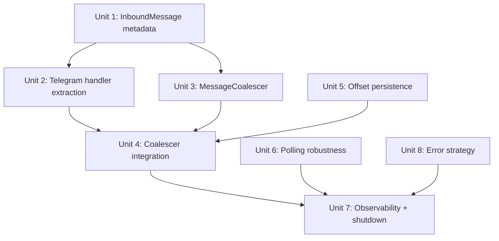

# feat: Telegram Channel Reliability Enhancement

## Overview

Enhance Aleph's Telegram channel with message coalescing, update offset persistence, polling robustness, error cooldowns, and observability. All changes target the Gateway and Telegram interface layers — no Channel trait modifications.

## Problem Frame

Single-user Telegram bot has three reliability gaps: (1) rapid multi-message sends trigger separate LLM calls instead of coalescing, (2) service restart drops pending updates, (3) polling recovery from network issues is basic. (see origin: docs/brainstorms/2026-04-04-telegram-reliability-enhancement-requirements.md)

## Requirements Trace

- R0. InboundMessage metadata field + Telegram handler extraction
- R1. MessageCoalescer in Gateway's InboundMessageRouter
- R2. 800ms debounce with early-flush heuristic
- R3. media_group_id aggregation (500ms timeout)
- R5. Preserve all attachments in coalesced message
- R6. Configurable debounce parameters
- R7-R10. Update offset watermark with SQLite persistence
- R14-R17. Polling stall detection + improved backoff
- R18-R20. Per-conversation error cooldown + SendChatAction circuit breaker
- R21. Structured logging for all new subsystems
- R22. Graceful shutdown with coalescing buffer flush

Deferred: R4 (forward-specific debounce), R11-R13 (per-conversation serialization)

## Scope Boundaries

- No Channel trait changes
- No streaming response (Draft Stream)
- No thread bindings, approval flows, webhook, multi-account
- No AccessController/DmPolicy/GroupPolicy changes
- Coalescing interface kept minimal (Telegram-only consumer today)

## Context & Research

### Relevant Code and Patterns

- `src/gateway/channel.rs:209-234` — InboundMessage struct (has `raw` field but no metadata)
- `src/gateway/inbound_router/mod.rs:257-285` — run_loop: dedup check → tokio::spawn per message
- `src/gateway/interfaces/telegram/handlers.rs` — convert_message extracts text/attachments but not media_group_id or forward_origin
- `src/gateway/interfaces/telegram/polling.rs:42-188` — PollingState with backoff (5×2^n, cap 60s), watchdog (120s get_me, 3-strike), maybe_reset_attempts (5min)
- `src/gateway/interfaces/telegram/delivery.rs:22-77` — ErrorClass enum (PreConnect/PostConnect/Rejected/RateLimited)
- `src/gateway/interfaces/telegram/config.rs` — TelegramConfig (no coalescing params yet)
- `src/resilience/database/migration.rs` — Idempotent migrate_add_* functions with savepoint pattern
- `src/resilience/database/state_database/mod.rs:86-153` — Arc<Mutex<Connection>>, migrations in constructor
- `src/gateway/channel.rs:82` — ChannelState::new(100) mpsc buffer

### Key Technical Facts

- teloxide Message struct exposes `media_group_id: Option<MediaGroupId>` and `forward_origin: Option<ForwardOrigin>` — available but not extracted
- InboundMessageRouter run_loop currently spawns unbounded tasks per message with no coalescing
- SQLite access via Arc<Mutex<Connection>> — all queries serialized through mutex
- No GatewayConfig exists as unified struct — config is per-channel

## Key Technical Decisions

- **Metadata via typed enum, not HashMap**: InboundMessage gets `metadata: Vec<MessageMeta>` where `MessageMeta` is an enum with variants like `MediaGroupId(String)`, `ForwardOrigin(...)`. Type-safe, zero-cost when empty, no serde_json dependency at struct level. `raw` field already exists for unstructured debug data (see origin: Key Decisions)
- **Coalescer as standalone struct**: `MessageCoalescer` lives in `src/gateway/coalescer.rs`, owns per-conversation debounce timers via `DashMap<ConversationId, CoalesceBuffer>`. The run_loop drives it: recv → dedup → coalescer.push() → coalescer tick fires → flush → spawn handler
- **Coalescing config in TelegramConfig**: Since only Telegram uses coalescing, add `coalescing: Option<CoalescingConfig>` to TelegramConfig. Gateway reads it from channel config at registration. No new GatewayConfig struct
- **Watermark in Telegram polling module**: offset persistence is Telegram-internal, stored in SQLite but managed by polling.rs, not the Channel trait (see origin: Key Decisions)
- **Stall detection via tokio::select!**: Wrap the polling loop's getUpdates with a timeout. Track last_response_time. Combine with existing get_me watchdog for dual confirmation before transport rebuild

## Open Questions

### Resolved During Planning

- **InboundMessage metadata design**: Typed enum `MessageMeta` — avoids HashMap overhead, compile-time checked, extensible via new variants
- **teloxide field access**: `media_group_id` and `forward_origin` are direct fields on teloxide::Message — extract in convert_message
- **Coalescer insertion**: Replace run_loop's direct spawn with coalescer-mediated flow. Coalescer runs its own timer task internally, calls a flush callback that spawns the handler
- **SQLite table**: `channel_offsets` table with (channel_id TEXT PK, bot_id TEXT, last_update_id INTEGER, updated_at TEXT)
- **Stall detection in teloxide**: teloxide's Dispatcher uses long-polling internally. We already wrap it with a watchdog task. Add a response timestamp tracker alongside the existing health check

### Deferred to Implementation

- Exact debounce timer implementation: `tokio::time::sleep` reset vs `tokio::time::Interval` — benchmark during implementation
- Whether `raw` field should be dropped in favor of metadata enum — evaluate after R0 lands

## High-Level Technical Design

> *This illustrates the intended approach and is directional guidance for review, not implementation specification.*

```
InboundMessage flow (after changes):

Channel (Telegram)
  │ InboundMessage { ..., metadata: [MediaGroupId("abc")] }
  ▼
InboundMessageRouter::run_loop
  │ dedup check (existing)
  ▼
MessageCoalescer::push(msg)
  │ per-conversation buffer
  │ debounce timer (800ms, reset on new msg)
  │ early flush if msg ends with ?/。/！
  │ media_group aggregation by group_id (500ms)
  │ max 12 fragments / 50KB
  ▼
MessageCoalescer::flush(conversation_id)
  │ merge texts (newline-separated)
  │ collect all attachments
  │ take max update_id from batch
  ▼
tokio::spawn(router.handle_message(merged_msg))
  │ (existing processing pipeline)
  ▼
on success → watermark::advance(max_update_id)
```

## Implementation Units



- [ ] **Unit 1: InboundMessage metadata enum**

**Goal:** Add typed metadata to InboundMessage for platform-specific signals

**Requirements:** R0

**Dependencies:** None

**Files:**
- Modify: `src/gateway/channel.rs`
- Test: `src/gateway/channel_test.rs` (or inline #[cfg(test)])

**Approach:**
- Define `MessageMeta` enum with initial variants: `MediaGroupId(String)`, `ForwardOrigin { sender_name: Option<String>, date: Option<DateTime<Utc>> }`
- Add `metadata: Vec<MessageMeta>` field to `InboundMessage`
- Add helper methods: `meta_media_group_id(&self) -> Option<&str>`, `is_forwarded(&self) -> bool`
- Default to empty vec — zero overhead for channels that don't use metadata

**Patterns to follow:**
- Existing `Attachment` type pattern in same file for enum design
- `InboundMessage` builder pattern already used in handlers

**Test scenarios:**
- Happy path: Create InboundMessage with MediaGroupId metadata, verify helper returns correct value
- Happy path: Create InboundMessage with ForwardOrigin metadata, verify `is_forwarded()` returns true
- Edge case: Empty metadata vec, verify helpers return None/false
- Edge case: Multiple metadata entries of different types, verify each helper finds its own

**Verification:**
- `cargo check -p alephcore` passes with new field
- Existing tests still pass (metadata defaults to empty)

---

- [ ] **Unit 2: Telegram handler metadata extraction**

**Goal:** Extract media_group_id and forward_origin from teloxide Message into InboundMessage metadata

**Requirements:** R0

**Dependencies:** Unit 1

**Files:**
- Modify: `src/gateway/interfaces/telegram/handlers.rs`
- Test: `src/gateway/interfaces/telegram/handlers_test.rs` (or inline)

**Approach:**
- In `convert_message()`, after existing field extraction:
  - Check `msg.media_group_id` → push `MessageMeta::MediaGroupId(id)`
  - Check `msg.forward_origin` → push `MessageMeta::ForwardOrigin { ... }`
- Populate metadata vec before constructing InboundMessage

**Patterns to follow:**
- Existing `extract_attachments()` pattern for optional field extraction
- teloxide Message field access patterns already in handlers.rs

**Test scenarios:**
- Happy path: teloxide Message with media_group_id → InboundMessage has MediaGroupId metadata
- Happy path: teloxide Message with forward_origin → InboundMessage has ForwardOrigin metadata
- Edge case: Message with neither field → metadata is empty
- Edge case: Message with both fields → both metadata entries present

**Verification:**
- `cargo test` for handler tests pass
- Manual: send a grouped media message in Telegram, verify metadata is logged

---

- [ ] **Unit 3: MessageCoalescer component**

**Goal:** Implement debounce-based message coalescing logic as standalone testable component

**Requirements:** R1, R2, R3, R5, R6

**Dependencies:** Unit 1

**Files:**
- Create: `src/gateway/coalescer.rs`
- Create: `src/gateway/coalescer_test.rs` (or inline #[cfg(test)])
- Modify: `src/gateway/mod.rs` (add module)

**Approach:**
- `MessageCoalescer` struct owns `DashMap<ConversationId, CoalesceBuffer>`
- `CoalesceBuffer` holds: `messages: Vec<InboundMessage>`, `deadline: Instant`, `total_text_bytes: usize`
- `push(msg)` → find or create buffer for conversation_id:
  - If buffer has media_group_id and msg matches → aggregate (500ms timeout, separate from text debounce)
  - Otherwise → reset text debounce timer to now + 800ms
  - If early-flush condition (text ends with `?`, `。`, `！`, `.`) → set short deadline (200ms)
  - If buffer exceeds 12 fragments or 50KB → immediate flush
- `tick()` → called periodically, checks all buffers for expired deadlines, returns flushed batches
- `merge(buffer) -> InboundMessage` → concatenate texts with `\n`, union attachments, take max update_id, preserve first message's sender/conversation/channel info
- `flush_all() -> Vec<InboundMessage>` → for graceful shutdown (R22)
- Config: `CoalescingConfig { debounce_ms: u64, early_flush_ms: u64, media_group_timeout_ms: u64, max_fragments: usize, max_bytes: usize }`

**Patterns to follow:**
- `DashMap` usage pattern from existing codebase (search for DashMap imports)
- `tokio::time::Instant` for deadline tracking

**Test scenarios:**
- Happy path: Push 3 text messages for same conversation within 800ms → flush produces 1 merged message with all 3 texts newline-separated
- Happy path: Push message ending with "?" → flushes after 200ms instead of 800ms
- Happy path: Push 2 messages with same media_group_id → aggregated into one with both attachments
- Edge case: Push 13th fragment → immediate flush of first 12, 13th starts new buffer
- Edge case: Push text exceeding 50KB → immediate flush
- Edge case: Push messages for 2 different conversations → independent buffers, independent flushes
- Edge case: Media group message + text message in same conversation → separate coalescing tracks (media_group by group_id, text by conversation debounce)
- Error path: flush_all with empty coalescer → returns empty vec
- Integration: Push message, wait 800ms, verify tick() returns the flushed batch

**Verification:**
- All unit tests pass
- `cargo clippy` clean on new module

---

- [ ] **Unit 4: Coalescer integration into InboundMessageRouter**

**Goal:** Wire MessageCoalescer into the run_loop message flow

**Requirements:** R1, R22

**Dependencies:** Unit 2, Unit 3, Unit 5

**Files:**
- Modify: `src/gateway/inbound_router/mod.rs`
- Modify: `src/gateway/interfaces/telegram/config.rs` (add CoalescingConfig)

**Approach:**
- Add `coalescer: Option<MessageCoalescer>` to InboundMessageRouter
- Modify `run_loop`:
  - After dedup check, if coalescer exists: `coalescer.push(msg)` instead of direct spawn
  - Add a periodic tick (50ms interval) via `tokio::select!` alongside `rx.recv()`:
    ```
    loop {
      select! {
        msg = rx.recv() => { dedup + coalescer.push(msg) }
        _ = tick_interval.tick() => { for batch in coalescer.tick() { spawn(handle(batch)) } }
      }
    }
    ```
  - On loop exit (rx closed / shutdown): call `coalescer.flush_all()` and process remaining batches before returning (R22)
- Add `CoalescingConfig` to `TelegramConfig` as `coalescing: Option<CoalescingConfig>`
- InboundMessageRouter receives coalescing config at construction from ChannelRegistry

**Patterns to follow:**
- Existing `tokio::select!` usage in polling.rs watchdog
- run_loop's existing dedup pattern

**Test scenarios:**
- Happy path: Send 3 messages rapidly to router with coalescer → handle_message called once with merged message
- Happy path: Send messages for 2 conversations → each conversation handled independently
- Edge case: Coalescer is None (non-Telegram channel) → direct spawn as before (backward compatible)
- Integration: Shutdown signal during active coalescing → pending buffers are flushed before loop exits
- Error path: handle_message fails for coalesced batch → error logged, other conversations unaffected

**Verification:**
- Existing InboundMessageRouter tests still pass (coalescer = None path)
- New integration test: simulate rapid messages, verify single handler invocation

---

- [ ] **Unit 5: Update offset persistence**

**Goal:** Persist Telegram update_id watermark to SQLite, load on startup

**Requirements:** R7, R8, R9, R10

**Dependencies:** None (can develop in parallel with Units 1-3)

**Files:**
- Modify: `src/resilience/database/migration.rs` (add migrate_add_channel_offsets)
- Modify: `src/resilience/database/state_database/mod.rs` (call migration + add query methods)
- Create: `src/gateway/interfaces/telegram/offset.rs`
- Modify: `src/gateway/interfaces/telegram/mod.rs` (add module)
- Modify: `src/gateway/interfaces/telegram/polling.rs` (use offset on startup, update after processing)

**Approach:**
- Migration: `channel_offsets` table — `channel_id TEXT PRIMARY KEY, bot_id TEXT NOT NULL, last_update_id INTEGER NOT NULL DEFAULT 0, updated_at TEXT NOT NULL`
- StateDatabase methods: `get_channel_offset(channel_id) -> Option<i64>`, `set_channel_offset(channel_id, bot_id, update_id)`
- `offset.rs`: `OffsetTracker` struct wrapping StateDatabase reference, provides `load() -> i64`, `advance(update_id)` (only advances if > current)
- polling.rs changes:
  - On startup: load offset from DB. If no record (first startup), call `delete_webhook().drop_pending_updates(true)`, get resulting offset, persist it
  - Remove unconditional `drop_pending_updates(true)` from line 64
  - Pass loaded offset to teloxide dispatcher as initial getUpdates offset
  - After coalesced batch successfully submitted to ExecutionEngine, call `offset_tracker.advance(max_update_id)`

**Patterns to follow:**
- `migrate_add_experience_replays()` pattern in migration.rs (savepoint, existence check, create)
- StateDatabase query pattern with `conn.lock()` + `query_row`/`execute`

**Test scenarios:**
- Happy path: First startup with no DB record → drop_pending_updates called once, offset persisted
- Happy path: Normal startup → offset loaded from DB, passed to getUpdates
- Happy path: After processing update_id=42 → DB shows last_update_id=42
- Edge case: advance() called with lower update_id than current → ignored (monotonic)
- Edge case: advance() called with same update_id → no-op
- Error path: DB write fails → error logged, processing continues (offset will be re-written next time)
- Integration: Simulate restart — process message with id=100, restart, verify getUpdates starts from offset 101

**Verification:**
- Migration is idempotent (can run twice without error)
- `cargo test` for offset module passes
- Manual: restart server, verify no duplicate message processing

---

- [ ] **Unit 6: Polling robustness enhancement**

**Goal:** Improve stall detection and backoff strategy

**Requirements:** R14, R15, R16, R17

**Dependencies:** None (can develop in parallel)

**Files:**
- Modify: `src/gateway/interfaces/telegram/polling.rs`

**Approach:**
- **Stall detection (R14, R17)**: Add `last_response_time: Instant` tracking. In the polling loop, update it on every getUpdates response (including empty ones). Add a stall check in the watchdog's select! loop: if `now - last_response_time > 90s` AND get_me also fails → trigger restart. Share `last_response_time` via `Arc<AtomicU64>` (store as epoch millis for lock-free access)
- **Backoff (R15)**: Replace `5 * 2^n` capped at 60 with: `base=2s, factor=1.8, cap=30s, jitter=0.25`. Formula: `min(2.0 * 1.8^(attempt-1), 30.0) * (1.0 + random(-0.25, 0.25))`
- **Recovery reset (R16)**: Keep existing `maybe_reset_attempts()` logic (5 min healthy → reset to attempt 1)

**Patterns to follow:**
- Existing PollingState struct and watchdog task pattern in polling.rs
- `Arc<AtomicU64>` for lock-free timestamp sharing between polling loop and watchdog

**Test scenarios:**
- Happy path: Normal polling → last_response_time updates on each cycle, no stall triggered
- Happy path: Network outage 2 min → stall detected (90s threshold), get_me also fails → transport rebuild triggered
- Edge case: Idle bot (no messages) but getUpdates returns empty lists → NOT a stall (empty response updates timestamp)
- Edge case: Stall detected but get_me succeeds → NOT rebuilt (combined judgment)
- Happy path: Backoff sequence verify: ~2s, ~3.6s, ~6.5s, ~11.6s, ~20.9s, 30s cap (with jitter)
- Happy path: After 5 min healthy, attempt resets to 1 → next failure starts from 2s
- Error path: Watchdog task panics → polling continues without health checks (graceful degradation)

**Verification:**
- Existing polling tests pass with new backoff values
- Manual: disconnect network for 2 min, verify polling recovers within 10s of reconnection

---

- [ ] **Unit 7: Observability and graceful shutdown**

**Goal:** Add structured logging for all new subsystems and graceful shutdown flush

**Requirements:** R21, R22

**Dependencies:** Units 3, 4, 5, 6, 8 (last unit — adds logging to all prior work)

**Files:**
- Modify: `src/gateway/coalescer.rs` (add tracing spans/events)
- Modify: `src/gateway/interfaces/telegram/polling.rs` (stall detection logs)
- Modify: `src/gateway/interfaces/telegram/offset.rs` (watermark update logs)
- Modify: `src/gateway/interfaces/telegram/delivery.rs` (cooldown logs)
- Modify: `src/gateway/inbound_router/mod.rs` (shutdown flush log)

**Approach:**
- Use `tracing::info!` / `tracing::warn!` with structured fields:
  - Coalesce flush: `tracing::info!(conversation_id = %id, fragment_count = n, wait_ms = elapsed, "coalesced message flush")`
  - Watermark update: `tracing::debug!(channel_id = %id, update_id = uid, "watermark advanced")`
  - Cooldown: `tracing::warn!(conversation_id = %id, error_type = %kind, cooldown_secs = secs, "conversation cooldown activated")`
  - Stall: `tracing::error!(stall_duration_secs = d, "polling stall detected, rebuilding transport")`
  - Shutdown: `tracing::info!(pending_buffers = n, "flushing coalescing buffers on shutdown")`
- Graceful shutdown: In run_loop, on rx closed or CancellationToken, call `coalescer.flush_all()`, process each batch, then return

**Patterns to follow:**
- Existing tracing usage throughout the codebase (search for `tracing::info!`)

**Test scenarios:**
- Test expectation: none — pure logging additions, verified by log inspection during integration testing

**Verification:**
- `cargo clippy` clean
- Manual: trigger each event, verify structured log output in console

---

- [ ] **Unit 8: Error strategy enhancement**

**Goal:** Add per-conversation error cooldown and SendChatAction circuit breaker

**Requirements:** R18, R19, R20

**Dependencies:** None (can develop in parallel)

**Files:**
- Create: `src/gateway/interfaces/telegram/error_cooldown.rs`
- Modify: `src/gateway/interfaces/telegram/mod.rs` (add module)
- Modify: `src/gateway/interfaces/telegram/delivery.rs` (integrate cooldown checks)

**Approach:**
- `ErrorCooldown` struct: `DashMap<ConversationId, CooldownEntry>` where `CooldownEntry { error_class: ErrorKind, cooldown_until: Instant, consecutive_failures: u32 }`
- `ErrorKind`: `Permanent` (403, chat deleted) vs `Retryable` (network, 429)
- Before sending: `cooldown.check(conversation_id)` → if in cooldown, skip send, return error
- After send failure: `cooldown.record_failure(conversation_id, error_class)`:
  - Permanent → set cooldown_until = now + 4hr
  - Retryable → increment consecutive_failures, use exponential backoff (2s × 1.8^n, cap 30s)
- After send success: `cooldown.clear(conversation_id)`
- `reset_cooldown` tool: register as a tool in the ToolRegistry (create handler in `src/tools/` or inline in error_cooldown.rs), clear cooldown for a specific conversation (R18 manual override)
- SendChatAction circuit breaker: separate `AtomicU32` counter for consecutive 401s. >= 10 → skip send_chat_action. Reset on success
- All state in-memory, lost on restart (R20)

**Patterns to follow:**
- Existing `ErrorClass` enum in delivery.rs for error classification
- DashMap pattern for concurrent access

**Test scenarios:**
- Happy path: Send fails with 403 → conversation enters 4hr cooldown, subsequent sends skipped
- Happy path: Send fails with network error → exponential backoff (not 4hr cooldown)
- Happy path: Send succeeds after failures → cooldown cleared immediately
- Happy path: 10 consecutive 401 on SendChatAction → typing indicator suppressed
- Happy path: SendChatAction succeeds after circuit open → circuit closes, typing resumes
- Edge case: Cooldown expired → next send attempt proceeds normally
- Edge case: Different conversations have independent cooldowns
- Edge case: reset_cooldown clears a specific conversation's cooldown
- Error path: Retryable error backoff sequence: 2s, 3.6s, 6.5s, ... 30s cap

**Verification:**
- All unit tests pass
- Manual: block bot in a chat, verify cooldown activates and logs appear

## System-Wide Impact

- **Interaction graph:** InboundMessageRouter gains coalescer dependency. Polling gains offset tracker dependency. Delivery gains cooldown dependency. All new components are opt-in (None when not configured)
- **Error propagation:** Coalescer flush failure → messages stay buffered, will retry on next tick. Offset write failure → logged, not fatal (idempotent retry on next success). Cooldown check → skip send gracefully, don't crash
- **State lifecycle risks:** In-memory coalescing buffers lost on hard crash → R9 watermark ensures re-fetch. In-memory cooldown state lost on restart → acceptable (R20). SQLite offset survives restart
- **API surface parity:** No changes to Channel trait. Other channels (CLI, webchat, Discord) unaffected — coalescer is None for non-Telegram
- **Unchanged invariants:** Channel trait interface, AccessController, DmPolicy/GroupPolicy, message deduplication in run_loop (still runs before coalescer)

## Risks & Dependencies

| Risk | Mitigation |
|------|------------|
| Coalescer debounce adds 800ms latency to every message | Early-flush heuristic for punctuation-terminated messages (200ms). Configurable timeout. |
| Watermark write-after-completion window: crash between processing and DB write causes reprocessing | LLM calls are effectively idempotent (same input → new response, no side effects). Acceptable for single-user. |
| DashMap in coalescer under tokio — potential contention | Single-user scenario means minimal contention. DashMap is lock-free for reads. |
| teloxide dispatcher offset control may require API-level changes | Fallback: filter updates in run_loop rather than at getUpdates level |

## Sources & References

- **Origin document:** [docs/brainstorms/2026-04-04-telegram-reliability-enhancement-requirements.md](../brainstorms/2026-04-04-telegram-reliability-enhancement-requirements.md)
- Related code: `src/gateway/inbound_router/mod.rs` (run_loop), `src/gateway/interfaces/telegram/polling.rs` (PollingState)
- Prior art: OpenClaw telegram extension (TypeScript, studied for design patterns — not directly ported)
