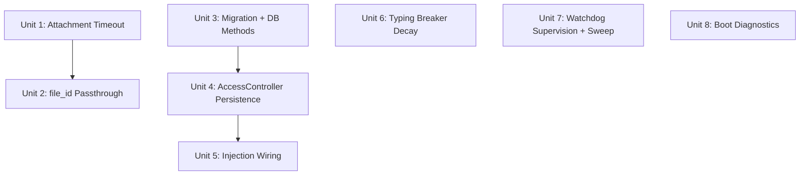

# feat: Telegram Channel 鲁棒性加固 (Round 3)

## Overview

Harden Aleph's Telegram channel infrastructure by fixing 6 identified weak spots: attachment fetch timeout, pairing persistence, watchdog supervision, typing breaker deadlock, cooldown memory leak, and missing boot diagnostics. No new features — only making existing features work correctly in all edge cases.

## Problem Frame

Round 1/2 added message coalescing, offset persistence, error cooldown, and edit-based streaming. Code audit + OpenClaw comparison revealed 6 silent failure modes that can degrade production use without any user-visible error. (see origin: docs/brainstorms/2026-04-04-telegram-robustness-hardening-requirements.md)

## Requirements Trace

- R1. Attachment fetch timeout (5s) with graceful degradation
- R2. media_download pipeline handles file_id passthrough for url:None attachments
- R3. Paired users persisted to SQLite (i64 user_id)
- R4. Load paired users from DB at startup
- R5. Write failures non-fatal (warn only, memory authoritative for session)
- R6. StateDatabase injection into AccessController via setter pattern
- R7-R8. Watchdog JoinHandle monitored in select!, panic triggers restart
- R9-R11. Typing breaker: time-decay half-open after 5 min
- R12-R13. Background sweep task for error cooldown (30 min interval)
- R14-R16. Non-blocking boot diagnostics with structured logging

## Scope Boundaries

- **Out**: Reasoning Lane, message dedup, Prometheus metrics, group migration, Channel trait changes
- **Unchanged**: Coalescer core logic, AccessController DM/Group policies, existing Channel trait interface

## Context & Research

### Relevant Code and Patterns

- **Timeout pattern**: `tokio::time::timeout(Duration, async_op)` — used in `transport/stdio.rs`, `pipeline/media_download.rs`
- **Migration pattern**: Savepoint + idempotency check + ordered registry in `migration.rs`. Example: `migrate_add_channel_offsets()`
- **Deferred injection**: `Option<Arc<T>>` field + setter method + clone into spawn — established by `offset_tracker`
- **select! with JoinHandle**: `polling.rs` uses mpsc channel + CancellationToken for watchdog/dispatcher coordination
- **ErrorCooldown sharing**: Already `Arc<ErrorCooldown>` in `TelegramChannel`, passed to delivery functions
- **media_download error path**: `process_attachment()` falls through to `Err("no path, data, or url")` → caller logs warn and skips

### Teloxide API Verification (teloxide 0.13.0)

| Question | Answer | Source |
|----------|--------|--------|
| `Me.can_read_all_group_messages` exists? | **Yes** | teloxide_core/types/Me |
| `get_file()` per-request timeout? | **No** — must wrap with `tokio::time::timeout` | Payload trait only has `timeout_hint()` |
| `get_chat()` error for deleted group? | `ApiError::ChatNotFound`, `GroupDeactivated`, `BotKicked` | teloxide_core/errors/ApiError |
| `JoinHandle` panic detection in select!? | `JoinError::is_panic()` / `is_cancelled()` | tokio::task::JoinError |

## Key Technical Decisions

- **file_id passthrough via Attachment struct**: Rather than adding a new field, detect url=None + id present in `process_attachment()` and return a `LocalMedia` with the original attachment metadata intact. LLM context builder already handles attachments without local_path by passing metadata. (Minimal change, no schema change to Attachment)
- **AccessController gets `Option<Arc<StateDatabase>>`**: Follows offset_tracker injection pattern. When None (e.g., tests), persistence is silently skipped. No separate `PairingStore` abstraction — direct DB calls inside AccessController.
- **Typing breaker uses `Mutex<Option<Instant>>`**: `check_typing()` is called infrequently (once per message), so Mutex contention is negligible. Simpler than AtomicU64 timestamp encoding which requires platform-specific Instant↔u64 conversion.
- **Sweep task lifecycle**: Spawned inside the polling loop iteration (same as watchdog). Cancelled + respawned on dispatcher restart. JoinHandle NOT monitored — sweep failure is non-critical.
- **Boot diagnostics run as a single `tokio::spawn`**: Fire-and-forget task after `get_me()` succeeds. Each check has its own 5s timeout. Results collected and logged as one structured message.

## Open Questions

### Resolved During Planning

- **teloxide `Me` struct**: Confirmed `can_read_all_group_messages: bool` exists in teloxide 0.13.0
- **get_file() timeout**: Must use `tokio::time::timeout` wrapper (no native per-request timeout)
- **JoinHandle panic in select!**: `JoinError::is_panic()` distinguishes panic from cancellation
- **Typing breaker sync primitive**: Use `Mutex<Option<Instant>>` — simple, low contention
- **media_download nil path**: Current code drops attachment with warn log. Need to add file_id passthrough case before the fallthrough error.

### Deferred to Implementation

- Exact column constraints for `paired_users` table (may add `UNIQUE` index on `(channel_id, user_id)` — PK already covers this)
- Whether boot diagnostics should also check admin permissions (R15c "optional") — implement if trivial, skip if API is complex

## Implementation Units



- [ ] **Unit 1: Attachment Fetch Timeout (R1)**

**Goal:** Prevent handler thread blocking when Bot API is slow.

**Requirements:** R1

**Dependencies:** None

**Files:**
- Modify: `src/gateway/interfaces/telegram/handlers.rs`
- Test: `src/gateway/interfaces/telegram/handlers.rs` (cfg(test) module)

**Approach:**
- Wrap `bot.get_file(&file_id).await` with `tokio::time::timeout(Duration::from_secs(5), ...)`
- On timeout: return attachment with `url: None` (preserve file_id, mime_type, size, filename)
- On success: existing URL resolution logic unchanged
- Log timeout at warn level with file_id for debugging

**Patterns to follow:**
- `src/gateway/transport/stdio.rs` line 367: `tokio::time::timeout` wrapper pattern
- Existing `extract_attachments()` warn-and-continue pattern for `get_file()` errors

**Test scenarios:**
- Happy path: `get_file()` succeeds within timeout → attachment has URL
- Error path: `get_file()` returns error → attachment has url=None, file_id preserved
- Edge case: timeout (mock slow response) → attachment has url=None, file_id/mime_type/size preserved, warn logged

**Verification:**
- `cargo test -p alephcore` passes
- Attachment struct always has file_id and mime_type populated regardless of get_file outcome

---

- [ ] **Unit 2: media_download file_id Passthrough (R2)**

**Goal:** Ensure attachments with url=None don't get silently dropped by the download pipeline.

**Requirements:** R2

**Dependencies:** Unit 1

**Files:**
- Modify: `src/gateway/pipeline/media_download.rs`
- Test: `src/gateway/pipeline/media_download.rs` (cfg(test) module)

**Approach:**
- In `process_attachment()`, before the final `Err("no path, data, or url")` fallthrough, add a check: if `attachment.id` is non-empty (file_id exists), return `Ok(LocalMedia)` with the original attachment metadata and no local_path
- The `LocalMedia` struct's `local_path` will be a sentinel or the attachment is passed through as-is for the LLM context builder to handle
- No change to `Attachment` struct — existing `id` field already stores file_id

**Patterns to follow:**
- Existing `process_attachment()` early return pattern for path/data/url cases
- `download_all()` already handles partial results (some Ok, some Err) gracefully

**Test scenarios:**
- Happy path: attachment with url → downloaded as before
- Happy path: attachment with path → used as before
- New path: attachment with only id + mime_type (url=None, path=None, data=None) → returns LocalMedia with metadata, not error
- Edge case: attachment with empty id and no url/path/data → still returns error (no regression)

**Verification:**
- Existing tests still pass
- New test confirms file_id-only attachment is not dropped

---

- [ ] **Unit 3: paired_users Migration + DB Methods (R3)**

**Goal:** Add SQLite table and StateDatabase methods for pairing persistence.

**Requirements:** R3

**Dependencies:** None (can parallel with Unit 1-2)

**Files:**
- Modify: `src/resilience/database/migration.rs`
- Modify: `src/resilience/database/state_database/mod.rs`
- Test: `src/resilience/database/state_database/mod.rs` (cfg(test) module)

**Approach:**
- Add `migrate_add_paired_users(conn)` function following the savepoint + idempotency pattern from `migrate_add_channel_offsets()`
- Schema: `CREATE TABLE paired_users (channel_id TEXT NOT NULL, user_id INTEGER NOT NULL, paired_at TEXT NOT NULL, PRIMARY KEY(channel_id, user_id))`
- Register in `StateDatabase::new()` migration sequence (after `migrate_add_channel_offsets`)
- Add StateDatabase methods: `load_paired_users(channel_id: &str) -> Vec<i64>`, `add_paired_user(channel_id: &str, user_id: i64)`, `remove_paired_user(channel_id: &str, user_id: i64)`
- All rusqlite bindings use `i64` for user_id to match Telegram's user ID range

**Patterns to follow:**
- `migration.rs:470-510` — `migrate_add_channel_offsets()` savepoint pattern
- `state_database/mod.rs` — existing `get_channel_offset()` / `set_channel_offset()` method pattern

**Test scenarios:**
- Happy path: migration creates table on fresh DB
- Idempotency: migration runs twice without error
- Happy path: add_paired_user + load_paired_users returns the user
- Happy path: remove_paired_user removes correctly
- Edge case: load_paired_users on empty table → returns empty Vec
- Edge case: add_paired_user duplicate → upsert (INSERT OR IGNORE)

**Verification:**
- Migration test passes
- CRUD operations work round-trip

---

- [ ] **Unit 4: AccessController Pairing Persistence (R4, R5, R6)**

**Goal:** AccessController loads paired users from DB at startup and writes on new pairing.

**Requirements:** R4, R5, R6 (class-level: adds db field, setter, load/write methods to AccessController)

**Dependencies:** Unit 3

**Files:**
- Modify: `src/gateway/interfaces/telegram/access.rs`
- Test: `src/gateway/interfaces/telegram/access.rs` (cfg(test) module)

**Approach:**
- Add `db: Option<Arc<StateDatabase>>` field to `AccessController`
- Add `set_state_database(&mut self, db: Arc<StateDatabase>)` method — must be called before `AccessController` is wrapped in `Arc` (same pattern as struct construction). NOT interior mutability — the setter is called during channel init, before sharing.
- Add `pub async fn load_from_database(&self, channel_id: &str)` — takes channel_id as parameter (AccessController does not store it). Loads paired users from DB into `runtime_users` via RwLock write lock.
- Modify `try_pair()` success path: after adding to `runtime_users`, if `db` is Some, call `db.add_paired_user()`. On write error, `warn!` but don't fail.
- `check_message()` logic unchanged — reads from `runtime_users` which now includes DB-loaded users

**Patterns to follow:**
- `offset.rs` — `OffsetTracker::new()` loads from DB in constructor
- `mod.rs` — `set_offset_tracker()` deferred injection pattern

**Test scenarios:**
- Happy path: load_from_database populates runtime_users, check_message allows loaded user
- Happy path: try_pair writes to DB via add_paired_user
- Error path: DB write fails → pairing still succeeds in memory, warn logged
- Nil path: db=None → persistence silently skipped, pairing works in-memory only
- Edge case: DB-loaded user + config allowed_user → no conflict (union of both)

**Verification:**
- Paired user survives simulated restart (load → check → allowed)
- Write failure doesn't prevent in-memory pairing

---

- [ ] **Unit 5: Injection Wiring in Subsystems Builder (R6)**

**Goal:** Wire StateDatabase into TelegramChannel's AccessController in the production startup path.

**Requirements:** R6 (integration-level: wires StateDatabase into TelegramChannel and calls load_from_database in start())

**Dependencies:** Unit 4

**Files:**
- Modify: `src/gateway/interfaces/telegram/mod.rs`
- Modify: `src/bin/aleph-server/commands/start/builder/subsystems.rs`

**Approach:**
- Add `set_state_database(&mut self, db: Arc<StateDatabase>)` to `TelegramChannel` — stores reference and forwards to `self.access`
- In subsystems builder, after creating TelegramChannel and before calling `start()`, call `channel.set_state_database(state_db.clone())`
- Call `self.access.load_from_database(&self.info.id)` inside `TelegramChannel::start()` before starting polling

**Patterns to follow:**
- `mod.rs:107-110` — `set_offset_tracker()` pattern
- `subsystems.rs` — existing wiring for offset_tracker injection

**Test scenarios:**
- Test expectation: none — this unit is pure wiring (no new logic). Correctness verified transitively by Unit 4's integration tests + manual e2e startup confirming "loaded N paired users from database" log line

**Verification:**
- `cargo check` passes with new wiring
- Startup logs show "loaded N paired users from database"

---

- [ ] **Unit 6: Typing Breaker Time-Decay (R9, R10, R11)**

**Goal:** Replace permanent typing circuit breaker with 5-minute half-open decay.

**Requirements:** R9, R10, R11

**Dependencies:** None (can parallel with Units 1-5)

**Files:**
- Modify: `src/gateway/interfaces/telegram/error_cooldown.rs`
- Test: `src/gateway/interfaces/telegram/error_cooldown.rs` (cfg(test) module)

**Approach:**
- Replace `typing_breaker_count: AtomicU32` with `typing_breaker: Mutex<TypingBreakerState>`
- `TypingBreakerState`: `{ consecutive_failures: u32, tripped_at: Option<Instant> }`
- `check_typing()`: if `tripped_at` is None → true. If `tripped_at.elapsed() > 5min` → true (half-open probe). Otherwise → false.
- `record_typing_failure()`: increment failures. If failures >= 10, set `tripped_at = Some(Instant::now())`. If already tripped and in half-open window, refresh `tripped_at` (re-trip for another 5 min).
- `record_typing_success()`: reset to `{ 0, None }` (full recovery).
- Log half-open probe attempts and outcomes at info level for observability.

**Patterns to follow:**
- Existing `ErrorCooldown` check/record pattern
- `Instant::now()` + `elapsed()` comparison (used in `PollingState::maybe_reset_attempts`)

**Test scenarios:**
- Happy path: <10 failures → check_typing returns true
- Trip: 10 failures → check_typing returns false
- Decay: 10 failures, advance time 5+ min → check_typing returns true (half-open)
- Half-open success: probe succeeds → record_typing_success → fully recovered
- Half-open failure: probe fails → re-tripped for another 5 min
- Reset: record_typing_success at any point clears all state

**Verification:**
- All existing typing breaker tests updated and passing
- New decay tests pass

---

- [ ] **Unit 7: Watchdog Supervision + Cooldown Sweep (R7, R8, R12, R13)**

**Goal:** Monitor watchdog JoinHandle in select!, add background cooldown sweep.

**Requirements:** R7, R8, R12, R13

**Dependencies:** None (can parallel)

**Files:**
- Modify: `src/gateway/interfaces/telegram/polling.rs`

**Approach:**

*Watchdog supervision (R7-R8):*
- Change `let _watchdog = tokio::spawn(...)` to `let watchdog_handle = tokio::spawn(...)`
- Add branch to main select!: `result = &mut watchdog_handle => { match result { Err(e) if e.is_panic() => "watchdog_panic", _ => "watchdog_exit" } }`
- Both `watchdog_panic` and `watchdog_exit` trigger same restart path as `stall` (existing backoff logic applies)
- Log the JoinError details at error level before restart

*Cooldown sweep (R12-R13):*
- Accept `error_cooldown: Arc<ErrorCooldown>` as new parameter to `run_polling_loop`. Call site in `mod.rs:419` updated: clone `self.error_cooldown` and pass to `run_polling_loop(bot, handler, status, shutdown_rx, offset, error_cooldown_clone)`
- Inside the polling loop iteration, spawn sweep task sharing the `watchdog_cancel` CancellationToken:
  ```
  let sweep_handle = tokio::spawn(sweep_loop(ec_clone, sweep_token));
  ```
- `sweep_loop`: `loop { select! { _ = interval(30min).tick() => { ec.sweep_expired(); }, _ = token.cancelled() => break } }`
- sweep_handle NOT added to select! — failure is non-critical
- Pass ErrorCooldown Arc from TelegramChannel to polling loop (modify function signature)

**Patterns to follow:**
- `polling.rs:160-204` — existing watchdog spawn + cancellation pattern
- `polling.rs:207-214` — existing select! branches

**Test scenarios:**
- Happy path: watchdog runs normally, no select! trigger
- Error path: watchdog panic → select! detects, triggers restart with backoff
- Edge case: watchdog normal exit (non-panic) → also triggers restart (defensive)
- Happy path: sweep runs at 30 min intervals without interfering with polling
- Edge case: sweep task panic → silently ignored, polling continues

**Verification:**
- `cargo check` passes
- Existing polling restart tests still pass
- Structured log confirms watchdog monitoring active

---

- [ ] **Unit 8: Boot Diagnostics (R14, R15, R16)**

**Goal:** Run non-blocking startup diagnostics and log actionable warnings.

**Requirements:** R14, R15, R16

**Dependencies:** None (can parallel)

**Files:**
- Modify: `src/gateway/interfaces/telegram/mod.rs`

**Approach:**
- After `get_me()` succeeds in `start()`, spawn a fire-and-forget diagnostics task
- The task collects diagnostics with per-check timeouts (5s each):
  - (a) Check `me.can_read_all_group_messages` — if false, add warning: "Privacy mode is enabled. Talk to @BotFather and disable privacy mode for group message access"
  - (b) For each configured group in `config.group_allowlist`, call `bot.get_chat(ChatId(id)).await` with timeout. Track reachable/unreachable count. On error, add warning with specific error type.
  - (c) Admin check: skip for now (deferred to implementation — if trivial after get_chat succeeds, include; otherwise skip)
- Collect all results into a single structured log line:
  `info!(privacy_mode = !me.can_read_all_group_messages, groups_reachable = "2/3", warnings = ?warnings, "Telegram boot diagnostics")`
- Warnings array contains actionable fix suggestions

**Patterns to follow:**
- `mod.rs:168-179` — existing `get_me()` call and result handling
- `tokio::time::timeout` pattern for per-check timeouts

**Test scenarios:**
- Happy path: all diagnostics pass → log with empty warnings array
- Error path: privacy mode enabled → warning with BotFather instruction
- Error path: one group unreachable → groups_reachable shows N-1/N, warning includes group identifier
- Edge case: diagnostics task itself panics → bot startup unaffected (fire-and-forget)
- Edge case: no groups configured → skip group checks, report privacy mode only
- Edge case: diagnostics check times out (>5s per check) → mark as unknown, continue remaining checks

**Verification:**
- `cargo check` passes
- Boot log contains diagnostics line with correct format

## System-Wide Impact

- **Interaction graph:** Unit 2 (media_download) is used by the pipeline for ALL channels, not just Telegram. The file_id passthrough must not break other channels' attachments that legitimately have no url (if any). Guard the new path with `!attachment.id.is_empty()` check.
- **Error propagation:** R5 write failures in AccessController stay at warn level — they do NOT propagate to the user or block pairing. Memory is authoritative for the current session.
- **State lifecycle:** paired_users table grows monotonically (users are rarely un-paired). No cleanup mechanism needed for single-user self-hosted use. If future multi-tenant use requires cleanup, add a `remove_paired_user` method (already included in Unit 3).
- **API surface parity:** No Channel trait changes. Other channels are unaffected.
- **Unchanged invariants:** `Channel::send()`, `Channel::edit()`, `Channel::send_typing()` signatures unchanged. ErrorCooldown's public API (`check`, `record_failure`, `record_success`) unchanged — only typing breaker internals change.

## Risks & Dependencies

| Risk | Mitigation |
|------|------------|
| media_download change affects non-Telegram channels | Guard new path with `!attachment.id.is_empty()` check; run full test suite |
| Mutex contention on typing breaker | `check_typing()` called once per message (low frequency); Mutex is fast for uncontended case |
| StateDatabase unavailable at runtime | `Option<Arc<StateDatabase>>` pattern — None means silently skip persistence, log at warn |
| Boot diagnostics slow down perceived startup | Fire-and-forget tokio::spawn; bot responds to messages before diagnostics complete |
| polling loop signature change (ErrorCooldown param) | Single call site in `mod.rs:start()`, straightforward to update |

## Sources & References

- **Origin document:** [docs/brainstorms/2026-04-04-telegram-robustness-hardening-requirements.md](docs/brainstorms/2026-04-04-telegram-robustness-hardening-requirements.md)
- Related code: `src/gateway/interfaces/telegram/` (all modules), `src/resilience/database/migration.rs`, `src/gateway/pipeline/media_download.rs`
- teloxide 0.13.0 API: `Me` struct, `ApiError` variants, `JoinError` methods
