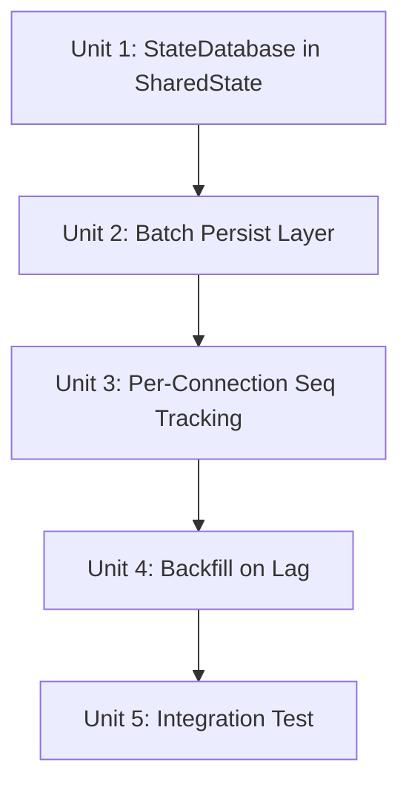

# feat: Sequenced Event Stream with Gap Detection & Server-Side Backfill

## Overview

When WebChat users watch an agent run, the tokio `broadcast::channel(1024)` can overflow for slow subscribers, silently dropping StreamEvent messages. This plan adds event persistence at the `GatewayEventEmitter` layer and automatic server-side backfill in the WebSocket handler, so WebChat trace output is eventually complete even when broadcast lag occurs.

## Problem Frame

`handler.rs:606` logs `warn!("Connection {} lagged, missed {} events")` but takes no recovery action. The `GatewayEventEmitter` already assigns monotonic `seq` to every `StreamEvent` (via its own `AtomicU64`), and the `agent_events` SQLite table already supports seq-based gap-fill queries (`get_events_since_seq`). The missing piece is wiring persistence into the emitter and backfill into the handler.

(see origin: docs/brainstorms/2026-04-04-sequenced-event-stream-requirements.md)

## Requirements Trace

- R1. GatewayEventEmitter persists StreamEvent to agent_events alongside broadcast
- R2. Persisted seq matches broadcast seq (same AtomicU64 source)
- R3. Async batch persistence (50ms / 32 events, whichever first); force-flush before backfill query
- R4. Handler extracts run_id + seq from broadcast JSON on Lagged
- R5. Handler queries agent_events for missed events by seq range
- R6. Backfill events pushed as JSON-RPC notifications with topic `event.backfill`
- R7. Handler buffers real-time events during backfill, replays in order after
- R8. Per-connection `last_delivered_seq` map with cleanup on run terminal events
- R9. Normal forwarding updates last_delivered_seq
- R10. StreamEvent JSON already contains run_id + seq (no wire format change)
- R11. GatewaySharedState adds Arc\<StateDatabase\>
- R12. Backfill limited to 1000 events per run per backfill; partial recovery acceptable beyond limit

## Scope Boundaries

- Not included: cross-device reconnection recovery
- Not included: global gateway seq (per-emitter seq only)
- Not included: client-side gap detection
- Not included: new database tables or schema changes
- Not included: non-StreamEvent event backfill (config changes, presence)

## Context & Research

### Relevant Code and Patterns

- `GatewayEventEmitter` (`src/gateway/event_emitter/impls.rs:26-209`): has `seq_counter: AtomicU64`, serializes StreamEvent to JSON, publishes String to `GatewayEventBus`
- `event_method()` (`src/gateway/event_emitter/mod.rs:162-179`): maps StreamEvent variants to method strings like `"stream.tool_start"`, `"stream.response_chunk"`
- `GatewayEventBus` (`src/gateway/event_bus.rs`): `broadcast::channel<String>(1024)`, `publish(event: String) -> usize`
- `handler.rs:586-616`: WebSocket event forwarding loop, Lagged handler at line 606
- `GatewaySharedState` (`src/gateway/server/mod.rs:80-95`): all shared state fields, no StateDatabase
- `AgentEvent` (`src/resilience/types.rs:368-383`): `{id, task_id, seq, event_type, payload_json, is_structural, timestamp}`
- `bulk_insert_events` (`src/resilience/database/events.rs`): batch insert to agent_events
- `get_events_since_seq` (`src/resilience/database/events.rs`): queries by `(task_id, seq)` composite index

### Institutional Learnings

- Telegram delivery module uses a similar pattern: async batch processing with flush-on-demand for message coalescing
- The Skeleton & Pulse model (is_structural flag) distinguishes immediate structural events from batched pulse events — reuse this classification

## Key Technical Decisions

- **StreamEvent → AgentEvent mapping**: `event_type` = return value of `event_method()` (e.g., `"stream.tool_start"`). `payload_json` = **only the StreamEvent params JSON** (not the JSON-RPC wrapper) — requires one `serde_json::to_string(&event)` in emit() before wrapping into JsonRpcRequest. This avoids double-wrapping during backfill. `is_structural` = true for RunAccepted/ToolStart/ToolEnd/RunComplete/RunError, false for ResponseChunk/Reasoning/ToolUpdate/ReasoningBlock
- **Batch persistence via shared mpsc + background task**: A single `mpsc::Sender<AgentEvent>` is created at server startup and shared across all `GatewayEventEmitter` instances (including per-request ones in `handlers/agent.rs`). One background tokio task collects and flushes via `bulk_insert_events()`. Flush triggers: 50ms timer OR 32 events accumulated (whichever first). `PersistHandle` (with `flush()` method) is stored in `GatewaySharedState` alongside `state_db`, making it accessible from the WebSocket handler for force-flush before backfill
- **Backfill with concurrent buffering**: On Lagged, handler spawns DB query via `tokio::spawn` while continuing to `recv()` from broadcast into a buffer Vec. When DB query completes, merge backfill + buffer (dedup by seq), send all to client in seq order. This avoids both event loss and the try_recv-drain-misses-inflight problem
- **Two-step seq extraction from JSON-RPC envelope**: Broadcast JSON is `{"jsonrpc":"2.0","method":"stream.xxx","params":{"run_id":"...","seq":42}}`. Extract seq via: parse top-level to `serde_json::Value`, access `.params`, deserialize `SeqInfo { run_id, seq }` from params. Only applied to events where `method` starts with `"stream."` — TopicEvents and non-stream events are skipped. Monotonic guard: only update `last_delivered_seq` when extracted seq > current tracked value (handles RunAccepted/ModelResolved/SessionUpdated which lack seq field)
- **Optional StateDatabase**: `GatewaySharedState.state_db: Option<Arc<StateDatabase>>` — backfill is a no-op when None (tests, minimal configs)
- **Backfill event format**: During backfill, stored `payload_json` is re-wrapped into the same JSON-RPC notification format as normal events (using original `event_type` as method), with an additional `"_backfill": true` field in params. Clients that don't check this field see structurally identical events

## Open Questions

### Resolved During Planning

- **How to handle concurrent events during backfill?** Buffer-and-replay approach: continue consuming from broadcast into a Vec, push backfill from DB, then push buffered events. No pause, no recursive lag risk.
- **StreamEvent → AgentEvent mapping?** Reuse `event_method()` for event_type, reuse the serialized JSON string for payload_json. Zero extra serialization cost.
- **How to extract run_id + seq from JSON String efficiently?** Lightweight serde struct with only run_id and seq fields, `#[serde(default)]` on both. Negligible overhead per event.
- **flush() completion mechanism?** Oneshot channel pattern: PersistHandle.flush() sends a signal via oneshot::Sender, background task flushes and responds via oneshot::Sender. Timeout handling deferred to implementation.
- **Backfill size limit?** 1000 events per run per backfill (R12). Beyond that, partial recovery is acceptable.

### Deferred to Implementation

- Exact buffer capacity for the backfill Vec — start unbounded, profile if needed

## High-Level Technical Design

> *This illustrates the intended approach and is directional guidance for review, not implementation specification.*

```
Normal flow:
  Agent Loop → GatewayEventEmitter.emit(StreamEvent)
    ├─ seq = next_seq()
    ├─ params_json = serde_json::to_string(&event)     ← StreamEvent only
    ├─ wire_json = JsonRpcRequest::notification(method, params_json)
    ├─ event_bus.publish(wire_json)                     ← broadcast to all WS clients
    └─ persist_tx.send(AgentEvent{                      ← shared mpsc, async batch
         task_id: run_id, seq, event_type: event_method(),
         payload_json: params_json, is_structural, timestamp
       })

  Background Persist Task (single, shared across all emitters):
    loop { collect from mpsc, flush when 32 events OR 50ms elapsed }

  WS Handler normal path:
    wire_json = event_bus.recv()
    if method starts with "stream.":
      params = parse wire_json → extract .params
      (run_id, seq) = SeqInfo::from(params)
      if seq > last_delivered_seq[run_id]:
        last_delivered_seq[run_id] = seq              ← monotonic guard
    send to client

Backfill flow (on RecvError::Lagged):
    1. Spawn DB query task:
       persist_handle.flush().await
       For each (run_id, last_seq) in last_delivered_seq:
         missed = state_db.get_events_since_seq(run_id, last_seq)  [cap: 1000/run]
    2. Meanwhile, continue recv() from broadcast → buffer Vec
    3. When DB query completes:
       a. Re-wrap each missed AgentEvent.payload_json as JSON-RPC notification
          with original event_type as method + "_backfill": true in params
       b. Push backfill events to client
       c. Push buffered events to client (in seq order)
       d. Update last_delivered_seq from all pushed events
    4. Resume normal path
```

## Implementation Units



- [ ] **Unit 1: Add StateDatabase to GatewaySharedState**

**Goal:** Make StateDatabase accessible from the WebSocket handler context

**Requirements:** R11

**Dependencies:** None

**Files:**
- Modify: `src/gateway/server/mod.rs` — add `state_db: Option<Arc<StateDatabase>>` and `persist_handle: Option<PersistHandle>` to `GatewaySharedState`
- Modify: server builder code that constructs `GatewaySharedState` — pass StateDatabase and PersistHandle through
- Modify: `src/bin/aleph-server/server_init.rs` — create shared `mpsc::Sender` and spawn persist background task at startup
- Test: `src/gateway/server/handler.rs` tests (existing tests should still compile with None)

**Approach:**
- Add `pub state_db: Option<Arc<StateDatabase>>` and `pub persist_handle: Option<PersistHandle>` fields to `GatewaySharedState`
- At server startup in `server_init.rs`, create `mpsc::channel`, spawn persist background task, store `PersistHandle` in shared state
- Pass shared `mpsc::Sender` to all `GatewayEventEmitter` construction sites (including `handlers/agent.rs:216`, `server_init.rs:169`, `server_init.rs:324`)
- Update all construction sites to pass the database reference and persist_tx (or None for tests)
- This is a data-plumbing change with no behavioral impact

**Patterns to follow:**
- Existing `GatewaySharedState` field pattern — `pub field: Arc<T>` wrapped in Option when not always available

**Test scenarios:**
- Happy path: server starts with StateDatabase provided, field is Some
- Happy path: server starts without StateDatabase (test mode), field is None, no panic

**Verification:**
- `cargo check -p alephcore` passes
- Existing handler tests compile and pass unchanged

---

- [ ] **Unit 2: Batch Persistence Layer in GatewayEventEmitter**

**Goal:** Persist every emitted StreamEvent to agent_events table via async batch writes

**Requirements:** R1, R2, R3

**Dependencies:** Unit 1

**Files:**
- Modify: `src/gateway/event_emitter/impls.rs` — add mpsc sender, send AgentEvent on every emit()
- Create: `src/gateway/event_emitter/persist.rs` — background flush task, force-flush method
- Modify: `src/gateway/event_emitter/mod.rs` — re-export persist module
- Test: `src/gateway/event_emitter/tests.rs` — new test cases

**Approach:**
- Add `persist_tx: Option<mpsc::Sender<AgentEvent>>` to `GatewayEventEmitter` (shared sender from Unit 1)
- In `emit()`: first `serde_json::to_string(&event)` to get params_json (StreamEvent only, no JSON-RPC wrapper). Then wrap into `JsonRpcRequest::notification(method, params_json)` for broadcast. Then construct `AgentEvent` with `payload_json: params_json` (not the wire JSON). This avoids double-wrapping during backfill
- `persist.rs`: background task and `PersistHandle` (flush via oneshot pattern). Background task is spawned once at server startup (Unit 1), not per-emitter
- Enumerate all `GatewayEventEmitter` construction sites that need `persist_tx` parameter: `handlers/agent.rs:216` (::new), `server_init.rs:169` and `:324` (::with_output_mode), plus test files (pass None)
- When `persist_tx` is None (no DB), skip persistence silently

**Patterns to follow:**
- Telegram delivery module's batch coalescing pattern (time + count trigger)
- Existing `bulk_insert_events()` call pattern in resilience module

**Test scenarios:**
- Happy path: emit 10 StreamEvents → all 10 appear in agent_events after flush
- Happy path: batch triggers at 32 events without waiting for timer
- Happy path: batch triggers at 50ms timer with fewer than 32 events
- Edge case: emit with persist_tx = None → no error, no persistence
- Edge case: force-flush on empty buffer → no-op, no error
- Integration: seq in agent_events matches seq in serialized JSON for same event

**Verification:**
- `cargo test -p alephcore --lib` passes
- After emitting N events and flushing, `get_events_since_seq(run_id, 0)` returns N rows with correct seq ordering

---

- [ ] **Unit 3: Per-Connection Seq Tracking in Handler**

**Goal:** Track last_delivered_seq per run_id for each WebSocket connection

**Requirements:** R4, R8, R9, R10

**Dependencies:** Unit 2

**Files:**
- Modify: `src/gateway/server/handler.rs` — add seq tracking state, extract seq on every forwarded event
- Create: `src/gateway/event_emitter/seq_extract.rs` — lightweight `SeqInfo { run_id, seq }` struct + parse helper

**Approach:**
- Two-step JSON parsing (P0 fix): broadcast JSON is `{"jsonrpc":"2.0","method":"stream.xxx","params":{...}}`. First parse top-level to `serde_json::Value`, check if `method` starts with `"stream."`. If not (TopicEvent, config event), skip seq tracking entirely. If yes, extract `.params` and deserialize `SeqInfo { run_id, seq }` from params
- `SeqInfo` struct: `#[derive(Deserialize, Default)] struct SeqInfo { #[serde(default)] run_id: String, #[serde(default)] seq: u64 }`
- Monotonic guard (P1 fix for RunAccepted/ModelResolved/SessionUpdated which lack seq): only update `last_delivered_seq[run_id]` when extracted `seq > 0 && seq > current_value`. This prevents seq=0 defaults from overwriting valid tracking state
- HashMap is local to the connection task (no shared state needed). On WebSocket disconnect, HashMap is automatically freed via Rust RAII — no explicit cleanup needed
- On receiving terminal events (`stream.run_complete`, `stream.run_error`), remove the run_id entry after delivery

**Patterns to follow:**
- Existing handler event forwarding loop structure (handler.rs:586-604)
- Existing TopicEvent detection pattern (handler.rs:587-598) — check for `method` field presence

**Test scenarios:**
- Happy path: forward 5 stream events for run "A" → last_delivered_seq["A"] == seq of 5th event
- Happy path: forward events for 2 different runs → both tracked independently
- Edge case: TopicEvent (no `method` field starting with `stream.`) → seq tracking skipped entirely
- Edge case: RunAccepted event (has run_id but no seq → seq defaults to 0) → last_delivered_seq NOT updated (monotonic guard)
- Edge case: SessionUpdated event (no run_id, no seq) → seq tracking skipped
- Edge case: RunComplete event delivered → run_id entry removed from map
- Edge case: RunError event delivered → run_id entry removed from map

**Verification:**
- Handler compiles and forwards events as before
- Seq tracking HashMap is populated correctly (verified via unit test with mock events)

---

- [ ] **Unit 4: Gap Detection and Backfill on Lagged**

**Goal:** When broadcast lag is detected, automatically backfill missed events from database

**Requirements:** R5, R6, R7

**Dependencies:** Unit 1, Unit 2, Unit 3

**Files:**
- Modify: `src/gateway/server/handler.rs` — replace warn-only Lagged handler with backfill logic
- Test: `src/gateway/server/handler.rs` or separate test file

**Approach:**
- On `RecvError::Lagged(n)`:
  1. If `state_db` is None: fall back to current behavior (warn only), continue loop
  2. Spawn DB query via `tokio::spawn`:
     - Call `persist_handle.flush().await` (from GatewaySharedState) to force-flush batch buffer
     - For each `(run_id, last_delivered_seq_value)` in snapshot of `last_delivered_seq`:
       query `state_db.get_events_since_seq(run_id, last_delivered_seq_value)` [cap: 1000/run per R12]
  3. Meanwhile, continue `recv()` from broadcast into `buffer: Vec<String>` (not try_recv — avoids missing in-flight events)
  4. When DB query completes (via JoinHandle):
     - Re-wrap each `AgentEvent.payload_json` as JSON-RPC notification with original `event_type` as method, add `"_backfill": true` in params
     - Push backfill events to client
     - Push buffered events to client (in seq order, with monotonic dedup against backfill)
     - Update `last_delivered_seq` from all pushed events (with monotonic guard)
  5. TopicEvents in the buffer are passed through immediately without seq tracking
  6. Resume normal loop

**Patterns to follow:**
- Existing event forwarding code at handler.rs:586-604 for JSON-RPC notification format
- Existing TopicEvent → JSON-RPC wrapping pattern at handler.rs:587-598

**Test scenarios:**
- Happy path: emit 2000 events (exceeding 1024 buffer), connect slow client → client eventually receives all 2000 events (backfill covers the gap)
- Happy path: backfill events arrive with `"_backfill": true` in params
- Edge case: state_db is None → Lagged produces warn log only (existing behavior preserved)
- Edge case: no events in DB for a run_id (run already cleaned up) → backfill is empty, no error
- Edge case: concurrent events arrive during backfill → buffered and replayed in order after backfill
- Error path: DB query fails → log error, continue with buffered events only (graceful degradation)
- Integration: full flow — emit events, simulate slow client, verify client receives complete ordered sequence

**Verification:**
- `cargo test -p alephcore --lib` passes
- Lagged connections recover automatically instead of losing events
- Event ordering is preserved: backfill events come before buffered real-time events

---

- [ ] **Unit 5: Integration Test — End-to-End Backfill Verification**

**Goal:** Verify the complete flow from event emission through lag detection to backfill delivery

**Requirements:** All (R1-R11)

**Dependencies:** Units 1-4

**Files:**
- Create: `tests/event_backfill_test.rs` or extend existing gateway integration tests

**Approach:**
- Set up a minimal gateway with StateDatabase, GatewayEventEmitter with persist layer, and a mock WebSocket client
- Emit a burst of StreamEvents that exceeds the broadcast buffer (>1024)
- Verify the mock client receives all events (some via normal delivery, gap via backfill)
- Verify event ordering (seq monotonically increasing in received events)
- Verify backfill events have topic `"event.backfill"`

**Patterns to follow:**
- Existing gateway integration test patterns (if any in `tests/` directory)
- `CollectingEventEmitter` pattern for test event collection

**Test scenarios:**
- Integration: 1500 events emitted, slow client → client receives exactly 1500 events with monotonic seq
- Integration: multiple concurrent runs, slow client → backfill covers all runs independently
- Integration: no lag scenario → zero backfill events, all delivered normally

**Verification:**
- Integration test passes reliably
- No flaky behavior from timing-dependent backfill

## System-Wide Impact

- **Interaction graph:** `GatewayEventEmitter.emit()` now has a side-effect (persistence). Any code calling emit() is unaffected — the persist channel is fire-and-forget. The background persist task interacts with `StateDatabase` which is shared with trace replay and session management.
- **Error propagation:** Persist failures are logged but do not block event emission or broadcasting. Backfill query failures degrade gracefully to current behavior (warn-only).
- **State lifecycle risks:** The `last_delivered_seq` HashMap is per-connection and cleaned up on run terminal events. The persist task's mpsc channel is dropped when the emitter is dropped, causing the background task to exit.
- **API surface parity:** No wire format changes — StreamEvent JSON already contains run_id and seq. WebChat and other clients see the same event format. Backfill events use a new topic `"event.backfill"` which unknown clients will simply ignore.
- **Unchanged invariants:** The GatewayEventBus broadcast behavior is unchanged. Existing topic filtering via SubscriptionManager is unchanged. The agent_events table schema is unchanged.
- **Integration coverage:** The persist → DB → backfill → client path crosses multiple layers. Unit 5 integration test covers this end-to-end.

## Risks & Dependencies

| Risk | Mitigation |
|------|------------|
| Batch persist adds I/O to every agent run | Async + batched, no hot-path blocking. 50ms flush interval means ~20 DB writes/sec max |
| SQLite write contention with other DB users | bulk_insert_events already handles this via Mutex; same contention profile as existing trace writes |
| Backfill of very large gaps (>1000 events) | Safety cap at 1000 events per run per backfill. Beyond that, client gets partial recovery (still better than zero) |
| Backfill buffer Vec memory during heavy burst | Bounded by broadcast channel catch-up time (~milliseconds). If buffer grows large, it means the gap was also large — acceptable |
| Handler JSON parsing overhead per event | SeqInfo partial deserialize is ~50ns per event. Negligible vs WebSocket I/O |

## Sources & References

- **Origin document:** [docs/brainstorms/2026-04-04-sequenced-event-stream-requirements.md](../brainstorms/2026-04-04-sequenced-event-stream-requirements.md)
- Related code: `src/gateway/event_emitter/impls.rs` (GatewayEventEmitter), `src/gateway/server/handler.rs` (WebSocket handler), `src/resilience/database/events.rs` (agent_events CRUD)
- Inspiration: OpenClaw's event sequence numbers with client-side gap detection (we improve on this with server-side automatic backfill)
