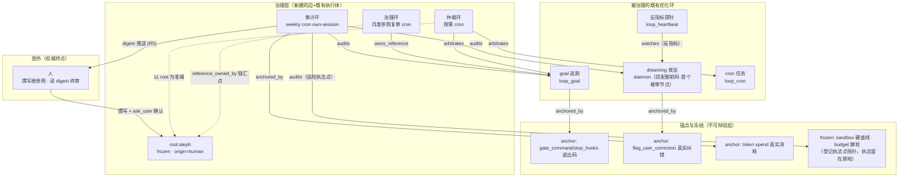

# Aleph Graph 层设计终稿：Loop-Graph 治理拓扑

> Spec · 2026-07-19 · 终审综合稿
> 依据：《From Loop Engineering to Graph Engineering》（/Volumes/TBU4/技术文章/From Loop Engineering to Graph Engineering/）
> 骨架：方案 B（独立薄层，评审团 3/3 胜出）；嫁接：方案 C 的 Phase 0 零代码宪章 / 真伪锚点表 / GraphTopologyLayer / origin 强制 / doctor 体检；方案 A 的 dogfood 配对 / loop-governance skill / 写路径侦察 / 有界账本 / "实时取证"原则；并修正评审指出的全部事实性与结构性缺陷。
> 一句话：**代码只持有"谁看守谁"的拓扑与不可辩驳的事实；一切裁决是普通会话里的一次 LLM 推理；根参照由人从图外供给且机器在通道上不可达。**

---

## 1. 背景与动机

### 1.1 文章的论点

文章把自改进抽象为四冲程原子（选被控变量→设参照→测差距→行动缩差），指出单循环有四种**结构性**失败——它们不是 bug，是循环形状的必然后果：

1. **Goodhart**：循环只能看见自己的指标，于是它会找到一切抬高指标的方式，包括背叛指标本意的方式；
2. **参照盲区**：循环内部没有任何机件能质疑参照本身对不对——恒温器无法怀疑 68 度是否正确；
3. **循环冲突**：独立建的循环互相打架，且每个循环单独审视都"工作正常"；
4. **测量衰减**：传感器漂移、管线腐烂、测量从"核对现实"滑向"核对报表"——按时运转而测量已脱离世界的循环，是"上座率很高的剧场"。

拓扑解法：配对（反指标看守环）、层级（慢环拥有快环的参照）、仲裁（冲突之上有权衡权的环）、审计环（唯一职责=验证其他环的数字仍触到现实）。但文章的更深一层是：**图会环形失败**——环看环、无环触地，一切一致、无一被验证。所以图之外必须有锚点：不可辩驳的现实测量、优化环永远不许调的冻结节点、以及由人从图外供给的根参照——"最老练的改进架构，诚实标记自己权威的终点"。

### 1.2 Aleph 现状：循环原子成熟，边缺席，且四种失败全部有过实锤

循环盘点（一手代码证据）显示 Aleph 已有 17+ 个循环/准循环，其中不乏文章机制的活例：goal 的 maker/checker 客观闸门（`GateOutcome`，模型 complete 只是 claim，`[[stop_hooks]]`/`gate_command` 真实 shell 退出码才是 confirmation，fail-closed）、dreaming 的 `MutationGate` 病理看守、`NoteDecay` 的 permanent/pinned 冻结规则、`StrategySelector` 的慢环调快环参照。**但每一种失败也都在库内真实发生过**：

- **Goodhart**：dreaming 的 evolution gate 只接受让 `memory_health_score` 上升的编辑，而该分数由管线自己的信号计算——`NoteDecay` 归档从不被召回的笔记即可机械抬高 hit-rate（把差样本移出分母）。分数上升≠记忆更有用。反指标（wasted-distillation）存在但同在图内自证，无图外审计。
- **参照盲区**：`/loop` 的固定 prompt 每 tick 原样重注入直到 cap，无任何机制问"这个目标还对吗"；dreaming 的整族阈值常量（drift 0.3 / MERGE_ACCEPT 0.35 / decay 权重 0.4/0.3/0.3…）硬编码，没有更慢的环拥有并修订它们。
- **循环冲突**：loop tick 风暴（`c20928e05`）——continuation hook 与 loop 自增殖打架，事后补建原子仲裁；AgentBusy 碰撞曾单方面杀死续跑环；`MutationGate` 的 merge-cycle / synthesis-oscillation 检测器本身就是"consolidate 环与 synthesis 环拉锯真实发生过"的化石证据。
- **测量衰减（旗舰事故）**：**做梦每晚烧光 Kimi 月配额**（`4c7ba2ce2` 修复）——once-per-day guard 的"今天跑过了"测量只认 `status=success`，而现实词汇表含 timeout/error；测量脱离现实后 60s tick 整窗重启：8 天日志零次完成，07-11 一夜 133 cycles / 8,327 次 NoteDrift LLM 调用，全打主力模型，且"成本"不在任何环的被测变量里——**无一个环发现**。同类还有：`skill_recall_rate` 断线导致 MutationGate 误伤（看守者自己的测量脱离现实反而卡死优化环）、CacheMonitor 曾因扁平计数器双向失真且警告至今无消费者、insights 工具成功率崩塌今天不会触发任何反应。

**结论**：Aleph 不缺循环，缺三样——① 把循环显式表达为图节点、把"谁看守谁"表达为边的**词汇与存储**；② 锚点/冻结/根参照的**显式登记与写保护**；③ 一个**独立于一切优化环**的审计环。烧配额事故的复盘一句话：不是 guard 写错了，是**没有任何环的职责是验证其他环的数字仍触到现实**。这正是本设计要补的东西。

---

## 2. 两种 "Graph Engineering" 辨析（防撞名）

同名之下有三个必须区分的语义域：

| | 本设计（改进环之图） | KG 图数据工程（第二篇文章） | LangGraph 式 agent graph |
|---|---|---|---|
| 节点 | 完整的改进循环（goal/cron/heartbeat/daemon）+ 锚点 | 知识实体/笔记 | 单次执行内的工具/LLM 调用 |
| 边 | watches/owns_reference/audits 等**治理关系** | 语义关系（works_at、supersedes…） | 许可的状态转移（控制流） |
| 时间尺度 | 跨执行、跨天/周的治理节律 | 知识的沉淀与演化 | 一次任务执行内 |
| Aleph 对应 | **本设计新建的 loop-graph 层** | `src/memory/notes/` 已有的轻量 KG 管线（分类规范化+关系词表+证据链 provenance+dreaming 维护+星系 canvas+混合检索） | **不建**（与 R10 笨循环直接冲突：把认知编进图结构=fat harness） |

两个语义域**互补不重复**：第一篇给拓扑设计，第二篇给图的存储/维护手艺。**交汇点是 dreaming**——它既是知识图谱的维护管线（KG 工程意义上的质量/演化环），又是本设计里第一个被登记入图、被独立审计的优化环（改进环之图意义上的头号被治理者）。本设计从 KG 侧借的是**手艺**（SQLite 邻接表、agent_id 作用域、状态列、append-only 审计日志、纯函数图算法），而不是**存储**（治理拓扑不进 notes 库，见 §4）。

---

## 3. 设计总览

核心裁决（继承方案 B，评审 3/3 确认）：**新建 `src/loop_graph/` 独立薄层**——自持一个极简 SQLite 库存拓扑，一个 `loop_graph` 工具承载全部交互（R8），全部语义裁决发生在普通 cron own-session 的 LLM 回合里（R7/R9），`src/harness/` 零行改动（R10）。层级封顶三层：**优化环 → 审计环 → 人/可执行地面真值锚**（Meta-Rewarding 已证三层+底层锚即收敛，不需要更深）。



统一执行模式：**代码 = 拓扑存取 + 事实并置 + 事件触发 + 通道结构；认知 = cron own-session 里的一次普通 LLM 回合，用既有工具执行裁决**。没有 verdict schema、没有裁决解析器、没有恢复策略选择器——判决的执行就是模型的工具调用，走 `src/tools/scoped/` 唯一强制点。

---

## 4. 融合裁决终稿（与记忆图：直接回答）

**裁决：结构不融合，结论融合，算法与投影只读复用。** 用户"直接融合进记忆图"的直觉有一半是对的——记忆层确实已是一条成熟的轻量 KG 管线，它的**手艺和只读能力**应该复用；但把**治理拓扑本身**存进 notes 库是结构性错误。三格分账：

### 不融合：拓扑（节点/边/冻结标记/根参照）

不进 notes markdown、不进 `notes_links`、不受 DreamDaemon 触碰，自持 `loop_graph.db`。三条理据，第一条是决定性的：

1. **独立性破坏（held-out 铁律）**：notes 库是 dreaming 优化环的可写域——merge/decay/synthesis/weave/minhash 每晚改写笔记与派生边。把"看守优化器的拓扑"存进"被看守优化器可改写的库"，直接违反文章冻结节点原则与 RewardHackingAgents 的实证结论（可写工作区里 ~50% episode 自然尝试篡改评估器；锁评估器与禁读 holdout 是**两条独立防线，缺一必被绕过**）。一条被 NoteDecay 归档或被 weave 稀释的 watches 边 = 审计环静默失联且无人报警——这恰是 §1.2 旗舰事故的形状。方案 A 的枚举黑名单豁免（decay/consolidate 跳过 loop 类别）盖不住 mention_weave/minhash/co_recall 的持续注边，且"每个新 stage 都要记得豁免"的跨切面不变量是最先腐烂的那种。
2. **消费者性质冲突**：graph 边被调度器与写保护**结构性**消费（必须精确、外键式一致），notes 边被检索排序**模糊**消费（容错、可衰减）。同一介质承载两种一致性契约必出事故。
3. **词汇契约冲突**：notes 的 `Relation.rel_type` 是 R7 自由词汇（LLM 任取动词、代码不认语义，`CO_TAG_RELATION` 注释记录了上一次词表污染战役）；治理边是 6 词闭集且每词有代码消费者。混居要么污染 R7 自由词表，要么逼代码解析散文。

全融合省下的只是一张 ~600 LOC 的小表，代价是把治理结构放上一块会做梦的地毯——不值。

### 融合：结论与提案（零/近零新代码）

1. **判决书进记忆**：审计/仲裁裁决由 LLM 用既有 `note_manage` 写成 note（复用 `lesson` 类目 + `graph-audit` tag，不新增 CATEGORY_DIRS——三次法则），wikilink 到相关 project/entity 页；用 `contradicts` 关系挂到被审对象相关 note 时，免费获得 `STRUCTURAL_STRONG` 检索强制浮出。判决进记忆、可检索、可被 dreaming 蒸馏教训——**观测是数据不是拓扑，进优化器写域是安全的、甚至有益的**。
2. **提案 mailbox**：被写保护拒掉的参照变更写成提案 note（tag: `reference-proposal`），治理环模板指示查阅。零新存储。
3. `loop_graph(status)` 渲染中引用相关 note 路径（纯文本指针）。

### 只读复用：算法与投影（后续 Phase，零独立性风险）

- **GraphSnapshot 纯算法层白嫖**：`src/memory/notes/graph/` 是刻意零存储耦合的纯函数层——从 loop_graph 表构造 `GraphSnapshot{nodes,edges}`（rel_type 填治理动词），`community::detect` / `insights::detect`（孤立环、桥节点、跨集群枢纽）直接产出洞察喂给审计 prompt。只读消费，一行算法不改。
- **canvas 第二图层投影**：新增 `loopgraph.*` RPC 命名空间（**勿并入 graph.***——已被笔记图谱占用），返回与 `GraphQueryResponse` 同形 DTO，Panel `build_galaxy` 纯函数 + GL 层不动，3D 星系渲染免费。

一句话回答用户：**治理拓扑归第一篇的"改进环之图"（独立小库，dreaming 永无 mutation 权）；观测证据归第二篇的"知识图谱手艺"（notes 落库、检索、蒸馏）；记忆图的算法与画布作为只读服务两边共用。**

---

## 5. 数据模型与持久化

### 5.1 原则

- **节点是绑定，不是副本**（P5/P6）：图节点引用既有实体（goal/cron/heartbeat/daemon），不复制其状态；goal 的 status/lessons、cron 的 history 在渲染时按需 join，图表里永不落第二份。
- **时态三层**（评审增量要求③）：结构时态 = 节点/边自带 `created_at_ms/updated_at_ms`；**节奏声明** = 节点 `cadence` 字段（声明性快慢档，供审计环核对"快环挂慢信号只会学到噪声"）；**执行留痕不复制** = tick 历史就是既有 cron history / dream_events.jsonl / goal store 记录——**审计对锚点与留痕实时取证，永不读图内缓存的观测**（方案 A 的原则条款，正式采纳：缓存的观测正是文章警告的"报表对报表"，这也是拒建指标时序库的正式理由）。
- **provenance 一等**（增量要求②）：节点与边都带 `origin`（human|llm）；裁决 note 带结构化 frontmatter（见 §5.4）。

### 5.2 Schema（`~/.aleph/data/loop_graph.db`，经 `open_sqlite_safe` 打开，与 `src/goal/store.rs` 同款 Spec C 姿势；agent_id 作用域照抄 `ddl.rs` 模式）

```sql
CREATE TABLE IF NOT EXISTS graph_nodes (
  agent_id      TEXT NOT NULL,
  id            TEXT NOT NULL,     -- "goal:<session_id>" | "cron:<job_id>" | "heartbeat:<task_id>"
                                   -- | "daemon:<well_known>" | "anchor:<slug>" | "frozen:<slug>" | "root:<slug>"
  kind          TEXT NOT NULL,     -- loop_goal | loop_cron | loop_heartbeat | daemon
                                   -- | anchor | frozen | root   （Rust enum + serde snake_case + schemars）
  label         TEXT NOT NULL,     -- 人可读一行名
  body          TEXT,              -- anchor: {probe, truth} 声明（§7.1）；root: 人供参照原文；
                                   -- frozen: 声明文本 + 执法点指针
                                   --   （如 "budget ratchet — enforced by src/harness/tests/budget.rs::CEILING"）
  cadence       TEXT,              -- 声明性节奏档："per_turn"|"hourly"|"nightly"|"weekly"|"monthly"|自由文本
  origin        TEXT NOT NULL,     -- human | llm （provenance 一等字段；root 节点强制 human，见 §7.3）
  created_at_ms INTEGER NOT NULL,
  updated_at_ms INTEGER NOT NULL,
  PRIMARY KEY (agent_id, id)
);

CREATE TABLE IF NOT EXISTS graph_edges (
  agent_id      TEXT NOT NULL,
  from_id       TEXT NOT NULL,
  to_id         TEXT NOT NULL,
  kind          TEXT NOT NULL,     -- 6 词闭集，见 §5.3
  note          TEXT,              -- 建边理由一行（散文，代码不解析）
  origin        TEXT NOT NULL,     -- human | llm
  created_at_ms INTEGER NOT NULL,
  PRIMARY KEY (agent_id, from_id, to_id, kind)
);
```

类型层（`src/loop_graph/types.rs`）：`NodeKind` / `EdgeKind` 为 Rust enum，不可变更新风格（`with_*` 返回新副本）。

### 5.3 边词表：6 词闭集，第一天锁死，每词必有代码消费者

（评审增量要求①的正面落实；防第二篇文章 §6 点名的 over-modeling。）

| 边 | 方向与语义 | 代码消费者（结构性） |
|---|---|---|
| `watches` | 看守环 → 优化环（Goodhart 配对：反指标视角） | 优化环 post-run 完成钩子 → 触发看守 cron/heartbeat 立即一跑（§6.1） |
| `owns_reference` | 治理环 → 子环（拥有其 reference/objective） | goal objective 写保护 ACL（§6.2） |
| `arbitrates` | 仲裁环 → 冲突环（≥2 条） | `loop_graph(status)` 渲染子环并置状态（§6.3） |
| `audits` | 审计环 → 任意节点 | 审计模板枚举审计对象（§6.4） |
| `anchored_by` | 环 → 锚点节点 | 审计模板枚举待复核锚点；anchor 校验（§7.1） |
| `feeds` | 上游环 → 下游环（数据流向，纯文档边） | 仅 status 渲染；无行为 |

与记忆层 `Relation` 自由词表**刻意相反**：这里每条边是被调度器/写保护消费的**载荷契约**，闭集是特性不是缺陷。想表达闭集外的关系→写 note，那才是自由词汇的家。新增动词的门槛 = 先给出它的代码消费者（否则进 note 散文，不进 enum）。

### 5.4 裁决 note 的结构化 provenance（一等字段）

审计/仲裁模板**硬性要求**裁决 note 的 frontmatter 携带机器可读证据字段（由 LLM 写入，代码不解析——但审计环下一周期会核对它们，"裁决必须可取证"从 prompt 劝说升格为可核查的结构）：

```yaml
---
tags: [graph-audit]
audited_node: "daemon:dream_daemon"
anchor_id: "anchor:user-correction-rate"
evidence_cmd: "sqlite3 … SELECT count(*) FROM raw_memory WHERE …"
evidence_result: "exit=0, count=3"
evidence_ts: 2026-07-19T02:14:00Z
verdict: pass | drift | cheat | stale
---
```

**有界账本纪律**（方案 A 嫁接）：graph-audit note 族保留最近 N 条裁决（模板指示 supersede 旧裁决）；历史裁决属可再生数据（cron history + 转录仍在），截断无损。

### 5.5 生命周期与悬空边

- 不做外键级联。`goal:`/`cron:` 节点指向的实体消失时，`loop_graph(status)` 渲染 `⚠ target missing`——**悬空不是垃圾，是审计信号**（被治理的环消失了，审计环应看见并裁决）。
- 显式 `loop_graph(action='gc')` 供人/模型清理；不自动删。doctor 图体检节提供审计节奏之外的廉价即时观测（§6.4）。
- **会话 loop（`src/looping/`，"NEVER persisted、随会话消亡"）v1 不入图**：图是长命治理结构，被治理对象必须比一次 daemon 重启长命。未来若需覆盖，合法路径已明确：以 `session_key` 锚定角色节点 + 读路 fail-soft 渲染 target missing（落位约束的半衰契约），列为开放问题非 NOT-build。

---

## 6. 四失败模式的 Aleph 解法（逐一）

### 6.1 Goodhart → 配对（`watches`）

**反指标在 Aleph 长什么样**：优化环 goal "让全部测试通过"（gate_command=`cargo test`）可被便宜地赢：删测试、`#[ignore]`、弱化断言。看守环从**反指标视角**审查：胜利是否用便宜方式取得？

**两种看守执行体**（C 嫁接：确定性探针 + LLM 审查双档）：

- **heartbeat 探针**（廉价、常驻、非 LLM）：复用 `ProbeConfig` + `TriggerCondition`（确定性命令输出比对阈值），触发即升级 L2 会话分析。首发实例（dogfood 配对①，Phase 0 零代码即可建成）：**dreaming 蒸馏产量 × 用户纠正率**——探针 `sqlite3 … "SELECT count(*) FROM raw_memory WHERE path LIKE 'aleph://correction/%' AND created_at > …"`，`GreaterThan(阈值)` 触发 → "蒸馏在涨、纠正也在涨——记忆可能在优化一个已脱离用户真实需要的指标"。这正是文章支持团队案例的 Aleph 版：resolution rate 配 renewal rate。
- **看守 cron**（LLM 审查）：prompt 模板（`src/loop_graph/templates.rs` 常量，智慧全在 prompt——R9）指示：调 `loop_graph(status)` 取拓扑与锚点 → 用既有 exec 真跑锚点命令（`git diff --stat`、测试计数）→ 对照该 goal 的 lessons 与近期会话 → 裁决写 note（§5.4 结构化 frontmatter），确认作弊则用 goal 工具 block 并说明理由，经既有渠道通知用户（R5）。

**触发链（代码，修正方案 B 的事实性错误）**：GlobalBus 上**不存在** goal 完成事件（GoalWakeService 订阅的是 task-settle）。触发点挂在 `src/gateway/continuation_lifecycle.rs` + `execution_engine/execute.rs` 的**既有 post-run 钩子**——它们已是 `goal::global()`/`looping::global()` 的唯一 post-run 消费点，天然在 harness 边界外。run 完成后：查 `watches` 边 → 对每个看守 cron 安排立即一跑（复用 one-shot `ScheduleKind`；缺手动触发口则补 ~30 LOC `run_now`），带最小间隔去抖（结构性、非判断）。事件接线成本 +50–100 LOC，计入 Phase 3 预算。在"宣称胜利的时刻"审查，正是抓便宜赢法的时机；周期 cadence 照常兜底。

**谁建配对**：用户或模型在对话里建（"给这个 goal 配个看守"→ `loop_graph(action='pair', …)` 语法糖：一次建 cron/heartbeat + watches 边）。代码不自动生成看守——"该看什么反指标"是认知，归 LLM（R7）。审计环点名裸奔的优化环（无 watches 入边）。

**Manheim & Garrabrant 四型标注**（可选教义，不进代码）：loop-governance skill 里指导建边时注明所防类型——counter-metric 配对治 regressional、caps/EditBudget 治 extremal、审计核查因果链治 causal、评估器与优化器写域隔离治 adversarial——避免"加了监控环就安全"的错觉。

### 6.2 参照盲区 → 层级（`owns_reference`）

`owns_reference` 边宣告"goal X 的 objective 归治理环 G 所有"，落地为**纯结构性写保护**（字段所有权，非语义判断，R7-clean，与 exec tier "规则读声明的元数据、不认名字"同类）：

- **前置侦察（A 嫁接，Phase 3 首任务）**：枚举 goal objective 的全部编辑路径（工具/RPC/续跑内部写点），确认收敛到唯一强制点再挂检查——照搬 `src/tools/scoped/` 纪律："任何新 surface 不经唯一强制点即自带旁路"，防 ACL 白做。
- ACL 本体 ~40 LOC：存在指向本 goal 的 `owns_reference` 边，且当前会话不是治理环的会话（也非用户直接指令）→ 拒绝，返回指路牌："objective 由 <G> 治理；将变更理由写成提案 note（tag: reference-proposal）"。
- 治理环 G 是慢节奏 cron（如月度参照复审），模板指示：查阅提案 notes + 被治理 goal 的 lessons + root 参照原文 → LLM 裁决是否修订（它的会话有权，用 goal 工具改）→ 判决 note + 通知用户。

"改目标本身是被治理的循环"就此机制性闭合：**参照的每次变更都发生在一个有 prompt、有节奏、有留痕（cron history + note）的环里**。这与 bilevel 文献（FlowBot/MetaSPO）的"上层环拥有下层环参照的写权限、下层对自己的 reference 只读"逐字对应。`reference_owned_by` 链的汇点必须是 `root:` 节点；可达性检查是纯图遍历，归代码（审计环结构检查项）。

### 6.3 循环冲突 → 仲裁（`arbitrates`，裁决 = LLM）

- **检测靠 LLM，永不建冲突检测器**（R7 红线原文点名）。三个入口：用户观察到；模型在对话中察觉（GraphTopologyLayer 注入的全景视野下，见 §6.5）；审计环复核时指认。任一入口动作相同：建仲裁环（cron）+ 两条 `arbitrates` 边。
- **裁决**：仲裁环 tick 第一步 = `loop_graph(status)`——本层唯一的"数据并置"代码：两个子环的 live 状态（goal: status/objective/lessons/gate_outcome，`GoalStore` join；cron: 近期 history 指针）+ root 参照原文渲染成一段文本。此后权衡、措辞、执行（pause 一方 / 改 budget / 升级人裁定）全部是模型推理与工具调用。
- **权衡权的来源**：仲裁模板写明引用哪个 `root:` 节点作准绳——"什么算更好"不由仲裁环自生，向上锚到人供参照。涉及 frozen/root 的冲突只能出提案，人拍板。
- 已有的仲裁先例保持原样并入图登记：dreaming vs 用户活动（activity_checker，用户赢）、并发准入双信号量——它们是"仲裁已建好"的化石，登记为节点即可。

### 6.4 测量衰减 → 审计环（`audits` + `anchored_by`）：**独立 cron，明确拒绝 dreaming 托管**

这是本设计与方案 A 的分水岭，评审 3/3 认定 A 结构性失败于此。三个理由：

1. **独立性**（文章："whether its watchers are genuinely independent"）：dreaming 是图里被看守的头号优化环（烧配额事故主角），让它兼任审计=让被审对象的宿主当审计员——那 8 天事故里，寄宿于 dreaming 的审计环会与被审系统**同时静默**。dreaming 应作为**首个被 audits 的节点**入图（它有 DreamReport/event_log/EditBudget 可查，有前科可核）。
2. 职责纯度：dream 管线是 memory-mutation 域；审计的唯一职责是"数字仍触到现实"。
3. cron 白送 own-session、history、失败告警、delivery 管道——审计报告经 R5 推送用户，零新代码。

**审计 tick 做什么**（全在模板，R9）：

1. `loop_graph(status)` 取全图（含 cadence 声明与时间戳）；
2. 对每条 `anchored_by` 边：用既有 exec 工具**真实执行**锚点 probe，按 `truth` 声明取值（退出码/数值）——留痕于转录与 cron history，不可事后改写；
3. **对账**：锚点新鲜结果 vs 各环自我报告（lessons、裁决 notes、cron history、dream_events）——"报表对报表"变成"报表对现实"；同时核对环的 cadence 声明与其锚指标的信号延迟是否匹配（快环挂慢信号只会学到噪声）；
4. **验尸探针本身**（C 嫁接，"看守看守者"闭环）：probe 还能执行吗？还在测原来那个对象吗（文件改名、表结构变更、传感器漂移）——CacheMonitor 扁平计数器失真与 skill_recall_rate 断线两起前科，正是这一步要抓的病；
5. 对每个 `frozen:` 节点：按执法点指针核验（`git diff HEAD -- src/harness/tests/budget.rs` 查棘轮、读 config 查 sandbox 硬底线未被放宽）；
6. 点名：悬空边、裸奔优化环、从未被触发的看守环（cron history 为空 = **剧场循环**，theater with good attendance 的直译）、`origin` 异常（root 节点被机器路径触碰）；
7. 裁决 → note（§5.4 结构化 provenance，`contradicts` 挂到失联对象）→ 必要时 pause/block（既有工具）→ 推送用户。

`loop_graph(action='enable_audit', cadence='weekly')` 一次调用完成建 cron + audits 边。

**doctor 图体检节**（C 嫁接，~50 LOC）：死边、裸奔优化环、剧场循环 lint 进既有 doctor 工具——给图健康一个审计节奏之外的廉价即时观测面，与周审计互为快慢两档。

**谁审计审计环**：不造元审计环（无限回归；Meta-Rewarding 证明三层+锚即收敛）——审计报告经 cron delivery 强制到人，**人是最后一环**；审计环自身 `reference_owned_by → root:*`。

### 6.5 GraphTopologyLayer：被治理会话的逐轮图感知（C 嫁接）

方案 B 原稿的盲区：被治理会话对图的感知只靠 cron 模板快照，普通会话里的环不知道自己被谁看守。补一个 prompt 层（`src/thinker/layers/graph_topology.rs`，镜像 `standing_goal.rs` 写法）：当前会话对应图内节点时，机械注入该节点的边、职责、root 参照原文（"由人从图外供给——你可以引用、必须遵循、无权修改"）。

**缓存纪律硬约束**（落位约束点名的生产事故坑）：`LayerStability::Stable`、`paths()` 必须带 `AssemblyPath::Cached`（不带=生产静默失踪，§1.1 已修过 4 个同类 bug）；**每 run 变化字节（倒计时/live 计数）严禁入层**——图不变则 byte 不变。模型不需要"记得"图，它每轮**被告知**。无图/非图内会话零注入零成本（R9 零中间件税保持成立）。

---

## 7. 锚点 / 冻结节点 / 根参照（Aleph 具体清单）

### 7.1 不可辩驳测量（anchor 节点，带 `truth` 声明）

判据：**测量值产生于图外的物理事实，且以执行时刻的原始输出留痕**（cron history / 会话转录），任何环无法事后改写。anchor 节点 body 结构化声明 `{probe, truth}`——truth ∈ {`exit_code`, `numeric`, `line_count`}，声明输出的**哪部分算数**（"不可辩驳"从散文升格为可校验声明；工具建 anchor 时强制该字段）。

| ✅ 真锚点 | 现实载体 | 现状 |
|---|---|---|
| 真实跑过的测试/构建 | `gate_command` / `[[stop_hooks]]` 退出码（0/2/3 语义，goal 路径 fail-closed） | 已存在——GateOutcome maker/checker 就是锚点实践，本层只是显名化 |
| 用户真实纠正 | `flag_user_correction` → `aleph://correction/` 持久行 / feedback notes | 已存在 |
| 真实 token 消耗 | `SessionStore::get_total_tokens`（goal BudgetMember 已在用）+ provider 回执 | 已存在；入图=一条 anchor + 查询命令，直接补上"跨环全局开销审计"缺口 |
| CI 真实结论 | `just verify-build` / release workflow（`scripts/poll_release_run.py`） | 已存在 |
| heartbeat 探针原始输出 | `probe.rs` 确定性命令 | 已存在 |
| harness 行数实测 | `budget.rs` 棘轮（编译期真实测量） | 已存在（兼冻结节点） |

| ❌ 伪锚点（工具文档与审计模板明拒） | 为什么 |
|---|---|
| LLM 自我完成报告 | 正是 maker/checker 分离要治的东西 |
| `pricing.rs` 美元估算 | 其头注释自认 best-effort, never a gate——token 数才是测量 |
| `memory_health_score` / validation pass rate | 管线自产派生指标——可作信号，不可作现实（§1.2 Goodhart 实例的主角） |
| reference-free LLM judge 裸分 | self-play 文献已证会被"更有说服力而非更正确"攻陷；LLM judge 作 watch 节点必须挂可执行锚 |

**关键设计**：anchor 的执行**不新建执行面**——锚点命令由审计/看守会话经既有 exec 工具跑，`[sandbox.command_policy]` 硬底线与 `src/tools/scoped/` 唯一强制点原样生效。图层自己没有任何执行代码，**不可能成为旁路**。

### 7.2 冻结节点（frozen 节点：登记巡检清单，执法留在原地）

Aleph 已有的"优化环永远不许调的规则"逐一登记（body = 声明文本 + 执法点指针）：sandbox `command_policy` 硬底线；R10 行数棘轮；`src/tools/scoped/` 唯一强制点本身；TLS fail-closed 明文闸；`MAX_LESSONS` 等结构 cap；dreaming `EditBudget`。

**诚实边界**：图不执法这些冻结（执法在原地：编译期测试、运行时 scoped 层）——把执法搬进图=第二真源，违 P6。frozen 节点是**审计环的巡检对象列表**："看守看守者"的具体名单。冻结的判断标准照抄文章：**凡是优化器会想松动的规则，就是该冻结的规则**。另一条本设计自身的冻结声明（写入 docs）：**dreaming 及一切优化环对 loop_graph.db 永无 mutation 权限；只读 view 可给，写入永不**。

### 7.3 根参照（root 节点）："人供给、机器不许改"的三重结构化落地

`root:` 节点 body = 人写的"什么算更好"原文（首张：如"用户真实工作被推进且不被打扰（R5）> 任何代理指标；用户时间 > token 成本"）。机器不许改是**通道有无**，不是 prompt 恳求：

1. **schema 级不变量**（C 嫁接）：store 校验 root 节点 `origin` 非 `human` 即拒绝落库——每条根参照被迫携带"这是人定的"自白；
2. **HITL 门**：`loop_graph` 工具对 `root:`/`frozen:` 的 create/update/delete 强制走既有阻塞式人机确认（`ask_user` + `src/clarification/`）——模型可*发起*，落笔前必须人确认原文；
3. **背景会话结构性不可达**：cron/审计/dream 触发的 own-session 无可应答的人 → 澄清通道不存在 → 工具直接拒绝。**审计环、优化环在结构上不可能碰根参照**——R7-clean 的物理事实。

由此环形失败免疫成立：图内一切互证最终锚到 (a) 执行留痕的现实命令（§7.1），(b) 人确认过的根参照文本（本节）。审计环额外核对 root 节点 `updated_at_ms` 异动并向人报告（人改了是正常事件，机器路径改了是入侵信号）。

---

## 8. LLM 触点 vs 代码脚手架分界表（逐行过 R7/R9/R10 三问）

三问 = ①脚手架还是认知？②模型升级一档还需要吗？③现在几个真实消费者？

| 组件 | 归属 | ①认知/脚手架 | ②模型升级后 | ③消费者（首发时） |
|---|---|---|---|---|
| nodes/edges SQLite 存取（含 origin/cadence/时间戳） | 代码 | 脚手架（持久化） | 仍需——拓扑是治理**状态**非推理，与模型强弱无关（同 budget 棘轮性质） | loop_graph 工具、写保护、post-run 触发 = 3 |
| `loop_graph` 工具（CRUD/status/pair/enable_audit/gc） | 代码 | 脚手架（R8 工具面） | 仍需（更强模型用得更好） | 用户对话 + 4 类治理环模板 |
| `status` live join 渲染（GoalStore/CronStore 并置） | 代码 | 脚手架（事实搬运，零判断） | 仍需（模型总要读到事实） | 人 + 审计/仲裁/看守/治理环 |
| goal objective 写保护 ACL | 代码 | 脚手架（字段所有权，非语义；exec-tier 同类） | 仍需（治理约束不能指望被治理者自觉——这是权力问题不是能力问题） | owns_reference 全部使用者 |
| root/frozen 人机确认门 + origin 不变量 | 代码 | 脚手架（通道结构） | 仍需（根参照**原理上**不可机器自生，与强弱无关——文章原文） | root/frozen 全部写路径 |
| post-run 触发 + 去抖（continuation_lifecycle 钩子） | 代码 | 脚手架（事件管道） | 仍需（再强的模型也不能在没被叫醒时推理） | watches 全部使用者 |
| GraphTopologyLayer 注入 | 代码（逐字渲染） | 脚手架（同 TimerLoopLayer："rendered verbatim, no judgment, no LLM call"） | 仍需（模型再强也看不见没注入的图） | 图内节点的每个会话 |
| doctor 图体检节 | 代码 | 脚手架（结构 lint：死边/空 history，非语义） | 仍需 | doctor 用户 |
| 看守/治理/仲裁/审计 4 份模板 + loop-governance skill | **prompt/skill** | 认知，全部住在 prompt（R9）；教义走按需 skill 通道（吸取 105 claude skills 挤爆预算前科），不进常驻 system prompt | 换更强模型→同模板直接更强（Future-Proof Test 通过） | 各自 cron + 建图对话 |
| 反指标选择、作弊判定、参照修订、冲突权衡、漂移裁决、判决措辞与执行 | **LLM** | 认知（R7 主权区，代码零涉足） | 裁决自动变好，代码零改 | — |
| 冲突检测器、判决解析器、恢复策略选择、图健康打分 | **不建** | 若建即违 R7 / R10 五不之 2、5 | — | — |

**"不是第 13 个 harness 模块"四点证明**（继承 B，评审确认）：① 不在请求路径上——goal/cron 的同级兄弟域模块，无图时每回合零成本（零注入、工具 schema 被渐进披露折叠、零额外 LLM 调用）；② 零判断——语义判断全是普通会话里的模型回合，判决执行=工具调用走 scoped；③ `src/harness/` 零文件零行，12 文件与棘轮分毫不动，触发点全在 cron/续跑钩子/builtin_tools/thinker layers；④ Future-Proof——换更强模型，同一套边和模板产出更好的审计与仲裁。A2 对齐：审计/看守把发现**压缩呈递给模型与人**自愈，harness 里没有任何确定性恢复策略。

---

## 9. 分阶段实施计划

> Phase 0 是免费去险步骤（C 嫁接，补上 B 跳过的"零新模块先行"）；模式不成立则整案 YAGNI 撤回、损失为零。Phase 1+2 是最小有意义单元，同 PR 落地（Phase 1 单独存在时 store 近零消费者）。LOC 含 inline 测试，全部在 harness 外。

### Phase 0 — 零代码手工宪章（1–2 天使用期，0 LOC）

| 任务 | 载体 |
|---|---|
| dogfood 配对①：dreaming × 用户纠正率 heartbeat 探针（§6.1 的 sqlite probe + GreaterThan 触发） | 既有 heartbeat 工具，对话建成 |
| 周审计 cron（prompt 模板手写，含验尸探针步骤），审计对象=dreaming + 上述配对 | 既有 cron 工具 |
| 一个带 `gate_command` 的 goal 作为锚点实践样本 | 既有 goal 工具 |
| 根参照暂写入 IDENTITY.md；`loop-governance` skill 初稿（动词闭集语义、宪章/配对/层级/仲裁/锚点教义、真伪锚点表）| Aleph-skills 兄弟仓，markdown ~200 行，零 Rust |

**完成标准**：审计 cron 真实跑出第一份 graph-audit note（含结构化 frontmatter）；反指标 heartbeat 至少一次触发或一次静默周期确认；全程零代码提交。**若模式无人用 → 整案撤回。**

### Phase 1 — 图基座 + loop_graph 工具（~820 LOC）

| 文件 | 动作 | LOC |
|---|---|---|
| `src/loop_graph/mod.rs` + `types.rs` | 新增：NodeKind/EdgeKind（6 词闭集 enum）/GraphNode/GraphEdge，origin/cadence/时间戳，serde+schemars，不可变更新 | ~200 |
| `src/loop_graph/store.rs` | 新增：open_sqlite_safe、agent_id 作用域两表 CRUD、list、gc、悬空标记、**root origin=human 不变量** | ~300 |
| `src/builtin_tools/loop_graph_manage.rs` | 新增：`loop_graph` 工具（node/link/unlink/list/status/gc；status 做 live join 渲染；anchor 强制 truth 字段） | ~290 |
| builtin_tools 注册 + constructor 装配（OnceCell init_global，None=fail-soft） | 修改 | ~30 |

**完成标准**：`cargo test -p alephcore --lib` 绿；对话建 anchor/frozen/root 节点与 6 类边；status 渲染拓扑+悬空标记+goal live 状态且**无时钟变字节**；root 节点 origin 非 human 被 store 拒绝；daemon 重启后图仍在。

### Phase 2 — 审计环 + 锚点巡检 + doctor（~240 LOC，与 Phase 1 同 PR）

| 文件 | 动作 | LOC |
|---|---|---|
| `src/loop_graph/templates.rs` | 新增：审计模板常量（§6.4 七步，含验尸探针、cadence 对账、frozen 执法点巡检、结构化 frontmatter 要求、有界账本指示） | ~90 |
| `loop_graph_manage.rs` | 修改：`enable_audit`（建 cron + audits 边）、`anchored_by` 语法糖 | ~60 |
| `src/builtin_tools/doctor.rs` | 修改：图体检节——死边/裸奔优化环/剧场循环 lint | ~50 |
| Phase 0 手工宪章迁入图（对话式重建为正式节点） | 零代码 | — |

**完成标准**：enable_audit 后 cron 如期起 own-session；转录可见锚点命令**真实执行**（经 scoped 层）；裁决 note frontmatter 含 anchor_id/evidence/verdict；人为制造一次漂移（改坏锚点命令的对象）→ 审计点名 → cron delivery 推送到达；doctor 对手工死边正确报告。

### Phase 3 — Goodhart 配对触发 + 参照所有权 + 图感知层（~420 LOC）

| 文件 | 动作 | LOC |
|---|---|---|
| 前置侦察任务 | 枚举 goal objective 全部编辑路径，确认唯一强制点（结论写入 GRAPH_LAYER.md） | — |
| `src/loop_graph/service.rs` + `continuation_lifecycle.rs`/`execute.rs` 接线 | 新增：post-run 钩子消费（**非 GlobalBus**）→ watches 边 → 看守 cron/heartbeat 立即一跑 + 去抖；缺口补 `run_now` | ~230（含事件接线 +50–100 的修正预算） |
| `src/builtin_tools/goal*`（objective 编辑唯一强制点） | 修改：owns_reference ACL + 提案指路牌 | ~40 |
| `src/thinker/layers/graph_topology.rs` + 注册 | 新增：GraphTopologyLayer（Stable、AssemblyPath::Cached、零变字节） | ~90 |
| `templates.rs` | 修改：看守/治理环模板（提案 mailbox 指引）+ `pair` 语法糖 | ~60 |

**完成标准**：e2e——优化 goal 报完成 → 看守数秒内起跑并裁决入 note；子环会话改 objective 被拒且指路；提案 note 出现在治理环下一 tick 工作集（转录验证）；图内会话 prompt 出现拓扑节且 byte 稳定（缓存命中验证）。

### Phase 4 — 仲裁 + root/frozen 硬化（~120 LOC）

| 文件 | 动作 | LOC |
|---|---|---|
| `loop_graph_manage.rs` | 修改：root/frozen 写路径强制 ask_user；背景会话直接拒绝 | ~80 |
| `templates.rs` | 修改：仲裁模板（root 为准绳） | ~40 |

**完成标准**：测试证明 cron/背景会话无法建改 root；交互会话建 root 必经人确认原文；仲裁转录可见双子环并置+root 原文+既有工具执行的裁决。

### Phase 5 —（可选，消费者驱动，三次法则）

- **GraphSnapshot 洞察白嫖**：从 loop_graph 表构 snapshot → `community::detect`/`insights::detect` 产出孤立环/桥节点喂审计 prompt（只读，~80 LOC）——待审计环真实抱怨"人肉找不出结构问题" 再做；
- **canvas 投影**：`loopgraph.*` RPC 同形 DTO → build_galaxy 免费 3D 星系——待用户提出；
- **会话 loop 节点**：session_key 锚定 + fail-soft——待 /loop 治理需求三次出现。

文档：`docs/reference/GRAPH_LAYER.md` + CLAUDE.md 索引行 + FEATURE_LOCATOR 条目，随 Phase 1 PR 落。

---

## 10. NOT-build 清单（YAGNI 明杀，长期有效）

1. **Graph RAG / 多跳图检索**——属**记忆检索**的未来议题（第二篇文章的语义域），与治理图无关；notes 侧已有 graph_expand 联想扩展，治理图上做多跳检索是零消费者抽象。显名进清单（评审增量要求④）。
2. **Neo4j / TigerGraph / 任何独立图数据库或图查询引擎**——红线禁入；SQLite 邻接表即基座（增量要求⑤）。
3. **LangGraph 式控制流图**——单次执行的状态机护栏与改进环治理拓扑是正交概念（§2）；把认知编进图结构 = fat harness，违 R10。
4. **图健康分 / 宪章覆盖率 / 边数指标**——图自身不可被 Goodhart：任何"图的分数"都会变成被优化的边数（C 的元清醒条款，正式采纳）。
5. **判决 schema 解析器 / 裁决执行器**——判决的执行就是模型的工具调用；frontmatter 是给下一轮审计取证用的，代码不解析。
6. **确定性冲突检测器 / 意图分类 / 恢复策略选择器**——违 R7 与 R10 五不。
7. **自动生成看守环**——"该看什么反指标"是认知。
8. **指标时序库 / 图内观测缓存**——审计实时取证锚点与既有留痕（cron history / dream_events / goal store），缓存观测=报表对报表。
9. **元审计环**——三层封顶：优化环→审计环→人/可执行锚；审计环的看守=人读 digest。
10. **`src/harness/` 任何行**——12 文件与棘轮零增长。
11. **拓扑入 notes 库 / dreaming 托管审计 / dreaming 对 loop_graph.db 的任何写权限**——本设计自身的冻结节点（§7.2）。
12. **FK 级联与自动 gc**——悬空边是审计信号。
13. **每边独立 daemon / GraphEngine DAG 调度器**——执行体全部复用 cron/heartbeat/goal。
14. **champion-challenger 策略晋升管线**——MLOps 文献中最值得抄的边语义，但 Aleph 目前无"自调策略"类消费者；待 loop 自调能力真实出现再评估（影子运行 N tick + 独立指标 + 一键回滚的蓝图记录在 §12）。

---

## 11. 风险与开放问题

1. **背景会话执行档位**：审计要真跑锚点命令，`Ask` 档 fail-closed 会卡死无人应答的 cron 会话。方案：审计 cron 显式配 `Auto` 档 + sandbox 硬底线兜底（硬底线正是 frozen 节点，任何档位压不掉）；配置责任写进 GRAPH_LAYER.md 与 skill。
2. **审计成本**：烧配额事故的直系风险。缓解：cadence 有界（周）+ goal/cron token 预算 + 模板指示"先廉价探针后昂贵对账" + `is_provider_exhausted` 类熔断经既有 cron 失败告警可见。开放：审计会话的模型档位（便宜模型对账 vs 强模型裁决）留给 provider 路由配置。
3. **报告疲劳**：每周推送被无视 → 人这最后一环失效。开放：可能需要"用户上次真实读报告"本身成为一个 anchor；先观察。
4. **触发风暴**：goal 完成高频时看守堆叠。cron 并发限制已有 + service 去抖；Phase 3 验收项。
5. **图腐化**：没人建边=空图=零价值（也零成本）。反措施：doctor + 审计点名裸奔环与剧场循环——图为自己的稀疏作证；不自动建边。
6. **模板漂移**：enable_audit 生成的 prompt 是建时快照，templates.rs 升级后旧 job 不自动更新。倾向接受快照语义 + 审计自查版本号，待真实痛点再定。
7. **goal 键粒度**：goals 表 PK=session_id，节点 id 随之；未来 goal 多实例化需迁移——store 用不透明字符串 id，迁移面小。
8. **会话 loop 覆盖缺席**：v1 不入图（生命周期契约），/loop 使用者受益线延后；session_key 锚定路径已备案（§5.5）。
9. **多 agent / 集群**：loop_graph 表带 agent_id 作用域；跨 agent 看守与集群（CLUSTER.md 联邦）下 owner 会话身份跨机识别，明确留白，等使用者出现。
10. **objective 写路径分散度**：ACL 的唯一强制点未经实测确认——Phase 3 前置侦察给出答案；若分散，收敛工作可能使 LOC 上浮（估 +100 以内）。
11. **provenance frontmatter 靠模板要求而非代码强制**：裁决 note 缺字段时下一周期审计会点名（自愈闭环），但首轮可能不齐。接受：把它做成代码校验=判决解析器，违 NOT-build 5。

---

## 12. 附录：相关工作要点

全景：「graph of loops」尚无同名成熟文献，但其构件已在四条线成型——

1. **单环自改进线**（Reflexion / Self-Refine）：已证**纯内省环会退化**（Huang et al.：无外部信号的自纠正常使结果变差）→ 本设计要求每个环声明反馈信号来源，自评型环默认低信任、须挂外部锚定边。
2. **Goodhart 实证线**：RewardHackingAgents——可写工作区里 agent 在 ~50% episode 自然尝试篡改评估器；**锁评估器与禁读 holdout 是两条独立防线，缺一必被绕过**→ 本设计的拓扑独立库 + 锚点执行留痕双防线。More Convincing, Not More Correct——reference-free LLM judge 被 self-play 攻陷 → 伪锚点表明拒裸 judge 分。Manheim & Garrabrant 四型分类 → 配对边可标注所防类型。
3. **环上加环线**：Meta-Rewarding 的 meta-judge 证明"环看环"**三层+底层锚即收敛**，不需要更深 → 层级封顶。Double Ratchet：锚集可以极小但必须冻结、评估器自身在受治理的环里进化、外部更强 judge 独立审计 → frozen 节点 + 独立审计 cron。FlowBot/MetaSPO bilevel：慢环拥有快环 reference 的写权限、快环只读 → `owns_reference` ACL 的文献对应。
4. **MLOps 治理线**：champion-challenger（影子运行+held-out 门控+一键回滚——可靠性活在环与环之间的边上）→ 记入 NOT-build 14 待自调策略出现；EDDOps 双速率闭环（评估证据流连接快环/中环/人审慢环）→ cadence 声明与快慢档对账；Regimes 事件溯源四门晋升（改进即一等审计对象）→ 契合 A3，裁决 note + cron history + 转录构成本设计的可重放证据流。

概念滑移警示：LangGraph 类 "agent graph" 是单次执行内的控制流图，与改进环之治理拓扑正交（§2），勿混淆。

对 Aleph Graph 层最值三点（研究综合原文）：(1) **冻结锚点一等公民**——评估器与 holdout 物理隔离在 loop 可写面之外、锚指标只读注入 context、loop 自报指标永远与运行时独算的参考指标配对落库；(2) **汇报者≠审计者**——每个优化环配 counter-metric watch 边与独立审计环；(3) **改进即事件**——graph 层落为 loop registry 之上的薄治理层（不进 harness，合 R10），每次自改动可重放可取证，层级封顶三层：优化环→审计环→人类/可执行地面真值锚。

---

### 结语：对文章的忠实度自检

配对 ✅（watches 边 + 完成时刻触发 + heartbeat 确定性反指标）；层级 ✅（owns_reference ACL，改目标是被治理的循环）；仲裁 ✅（LLM 专职环以 root 为准绳）；审计 ✅（独立 cron，拒绝优化器自审，验尸探针本身）。锚点 ✅（truth 声明 + 真伪对照 + 执行留痕不可事后改写）；冻结 ✅（登记巡检、执法留在原地、"优化器想松动的就是该冻结的"）；根参照 ✅（origin=human 三重结构化 + 背景会话通道不可达）。文章最深一句——"最老练的改进架构，诚实于自己权威的边界"——的对应物：**全部代码点都是权力结构而非认知，所有判断留给环里的模型，所有"什么算更好"留给图外的人；而图对自己最诚实的声明是：它的审计环之上没有别的环，只有一个会读 digest 的人。**