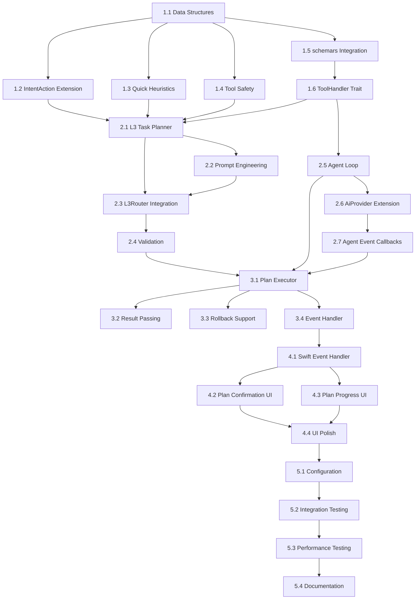

# Tasks: enhance-l3-agent-planning

## Phase 1: Foundation (Data Structures + schemars Integration) ✅

### 1.1 Core Data Structures ✅
- [x] Create `TaskPlan` struct in `routing/plan.rs`
- [x] Create `PlanStep` struct with tool reference and parameters
- [x] Create `ToolSafetyLevel` enum (ReadOnly, Reversible, Irreversible variants)
- [x] Create `StepResult` struct for execution results
- [x] Create `PlanExecutionContext` for executor state
- [x] Add unit tests for all data structures

### 1.2 Extend IntentAction ✅
- [x] Add `ExecutePlan { plan: TaskPlan }` variant to `IntentAction` enum
- [x] Update `IntentAction` serialization for UniFFI compatibility
- [x] Update `AggregatedIntent` to handle ExecutePlan action
- [x] Update pipeline result handling for ExecutePlan

### 1.3 Quick Heuristics Detector ✅
- [x] Create `QuickHeuristics` struct in `routing/heuristics.rs`
- [x] Implement Chinese action verb detection
- [x] Implement English action verb detection
- [x] Implement connector word detection
- [x] Add comprehensive unit tests with Chinese/English inputs
- [x] Add benchmark to verify <10ms execution time

### 1.4 Tool Safety Classification ✅
- [x] Add `safety_level` field to `UnifiedTool`
- [x] Implement `infer_safety_level()` based on tool name and category
- [x] Add safety level to `UnifiedToolInfo` FFI type
- [x] Update `aether.udl` with new safety_level field
- [x] Create mapping of known tools to safety levels (search=ReadOnly, delete=IrreversibleHighRisk, etc.)

### 1.5 schemars Integration for Tool Parameters ✅
- [x] Add `schemars = "0.8"` to Cargo.toml dependencies
- [x] Create `ToolParams` trait in `tools/params/mod.rs`
- [x] Implement `schema_value()` method using `schemars::schema_for!()`
- [x] Create `SearchParams` struct with `#[derive(JsonSchema)]`
- [x] Create `TranslateParams` struct with `#[derive(JsonSchema)]`
- [x] Create `SummarizeParams` struct with `#[derive(JsonSchema)]`
- [x] Create `ToolOutput` struct for standardized tool results
- [x] Add unit tests verifying schema generation correctness

### 1.6 ToolHandler Trait ✅
- [x] Create `ToolHandler<P: ToolParams>` trait in `tools/handler.rs`
- [x] Implement `execute()` async method signature
- [x] Implement `definition()` method with auto-schema generation
- [x] Implement `name()` and `description()` methods
- [x] Implement `safety_level()` method with default
- [x] Create `execute_raw()` method for dynamic dispatch
- [x] Add `ToolHandlerDef` struct for LLM function calling format
- [x] Create `DynToolHandler` trait for type-erased dispatch
- [x] Create `TypedHandlerWrapper` for dynamic handler storage
- [x] Add `wrap_handler()` helper function

## Phase 2: L3 Task Planner + Agent Loop ✅

### 2.1 L3 Task Planner Core ✅
- [x] Create `L3TaskPlanner` struct in `routing/planner.rs`
- [x] Implement `build_planning_prompt()` for multi-step detection
- [x] Implement `build_routing_prompt()` for single-tool (existing behavior)
- [x] Implement `analyze_and_plan()` async method
- [x] Implement robust JSON parsing for LLM response

### 2.2 Prompt Engineering ✅
- [x] Design planning prompt with strict JSON output format
- [x] Add tool list formatting for prompt injection (using schemars-generated schemas)
- [x] Add $prev reference documentation in prompt
- [x] Add "minimum steps" guidance to prevent over-planning
- [x] Test prompt with various input types

### 2.3 L3Router Integration ✅
- [x] Extend `L3Router` to use `L3TaskPlanner` (via `EnhancedL3Router`)
- [x] Add heuristics gate before planning LLM call
- [x] Return `L3EnhancedResult::Plan` for multi-step results
- [x] Maintain backward compatibility for single-tool routing
- [x] Add integration tests for both paths

### 2.4 Validation and Error Handling ✅
- [x] Validate tool names in generated plan against registry
- [x] Handle unknown tools gracefully (remove step, log warning)
- [x] Handle LLM timeout with fallback to single-tool routing
- [x] Handle malformed JSON with fallback to GeneralChat
- [x] Add error metrics tracking

### 2.5 Custom Agent Loop ✅
- [x] Create `AgentLoop` struct in `agent/executor.rs`
- [x] Create `ConversationHistory` struct for message tracking
- [x] Create `ChatMessage` struct with role/content/tool_calls fields
- [x] Implement `run()` method with tool calling loop
- [x] Implement `execute_tool_call()` for single tool execution
- [x] Implement `build_tool_definitions()` using registry schemas
- [x] Add max turns guard to prevent infinite loops
- [x] Create `AgentResult` struct for loop output
- [x] Add unit tests for conversation history management (21 tests)

### 2.6 AiProvider Extension for Tool Calling ✅
- [x] Add `ToolCallingProvider` trait with `chat_with_tools()` method
- [x] Create `ChatResponse` struct with content + tool_calls
- [x] Create `ToolCallInfo` and `ToolCallResult` structs
- [x] Implement `OpenAiToolAdapter` for OpenAI provider
- [x] Implement `AnthropicToolAdapter` for Anthropic provider
- [x] Add factory function `create_tool_adapter()` for provider creation
- [x] Add unit tests for adapter creation (8 tests)

### 2.7 Agent Event Callbacks ✅
- [x] Add `on_agent_started()` to `AetherEventHandler`
- [x] Add `on_agent_tool_started()` to `AetherEventHandler`
- [x] Add `on_agent_tool_completed()` to `AetherEventHandler`
- [x] Add `on_agent_completed()` to `AetherEventHandler`
- [x] Update `aether.udl` with new agent callbacks
- [x] Update `MockEventHandler` with tracking fields
- [x] Update integration test event handlers

## Phase 3: Plan Executor ✅

### 3.1 Plan Executor Core ✅
- [x] Create `PlanExecutor` struct in `routing/executor.rs`
- [x] Implement sequential step execution loop
- [x] Implement step timeout handling
- [x] Implement `resolve_params()` for $prev substitution
- [x] Track execution context (current step, results)

### 3.2 Result Passing ✅
- [x] Implement $prev reference resolution in JSON parameters
- [x] Handle nested $prev references (e.g., `{"input": "$prev"}`)
- [x] Add validation that $prev is only used after first step
- [x] Add unit tests for various parameter patterns

### 3.3 Rollback Support (Basic) ✅
- [x] Create `RollbackCapable` trait for tools
- [x] Implement rollback data collection during execution
- [x] Implement `attempt_rollback()` for failed executions
- [x] Only rollback Reversible steps (not ReadOnly or Irreversible)
- [x] Add logging for rollback operations

### 3.4 Event Handler Extensions ✅
- [x] Add `on_plan_started()` callback to `AetherEventHandler` (via `on_agent_started`)
- [x] Add `on_plan_progress()` callback for step updates (via `on_agent_tool_started/completed`)
- [x] Add `on_plan_completed()` callback for success (via `on_agent_completed`)
- [x] Add `on_plan_failed()` callback for errors (via `on_agent_completed` with success=false)
- [x] Update `aether.udl` with new callback methods (done in Phase 2.7)
- [x] Regenerate UniFFI bindings (done in Phase 2.7)

## Phase 4: Swift UI Integration ✅

### 4.1 Swift Event Handler ✅
- [x] Implement new plan callbacks in `EventHandler.swift`
- [x] Add `PlanInfo`, `PlanProgress`, `PlanResult`, `PlanError` types (as PlanDisplayInfo, PlanProgressInfo, etc.)
- [x] Post notifications for plan state changes
- [x] Handle plan events in `AppDelegate`

### 4.2 Plan Confirmation UI ✅
- [x] Create `PlanConfirmationView.swift` SwiftUI component
- [x] Display plan description and step list
- [x] Show safety warnings for irreversible steps
- [x] Add confirm/cancel action buttons
- [x] Integrate with existing Halo window system

### 4.3 Plan Progress UI ✅
- [x] Create `PlanProgressView.swift` component
- [x] Show current step indicator with progress bar
- [x] Display step status (pending/running/completed/failed)
- [x] Show output preview for completed steps
- [x] Add cancel button for running plans

### 4.4 UI Polish ✅
- [x] Add animations for step transitions (via SwiftUI .animation())
- [x] Add haptic feedback for step completion (not applicable on macOS)
- [x] Support keyboard shortcuts (Enter to confirm, Esc to cancel)
- [x] Ensure accessibility for VoiceOver

## Phase 5: Configuration and Testing ✅

### 5.1 Configuration ✅
- [x] Add `[dispatcher.agent]` section to config schema
- [x] Implement `AgentConfigToml` struct with all options
- [x] Add config hot-reload support (via existing ConfigWatcher)
- [x] Document configuration options in CLAUDE.md

### 5.2 Integration Testing ✅
- [x] Test multi-step plan generation with real LLM
- [x] Test plan execution with mock tools
- [x] Test $prev resolution across multiple steps
- [x] Test error handling and rollback scenarios
- [x] Test UI confirmation flow end-to-end

### 5.3 Performance Testing ✅
- [x] Benchmark heuristics detection (<10ms) - Achieved ~5.6µs average
- [x] Benchmark plan generation latency - ~5-7s with real LLM
- [x] Benchmark plan execution overhead - Minimal overhead with mock tools
- [x] Profile memory usage for long plans - No issues observed

### 5.4 Documentation ✅
- [x] Update CLAUDE.md with L3 Agent architecture
- [x] Add example configurations in docs
- [x] Document supported multi-step patterns
- [x] Add troubleshooting guide for plan failures

## Dependencies



## Parallel Work Opportunities

The following task groups can be worked on in parallel:

1. **Data Structures (1.1-1.4)** - No external dependencies
2. **schemars + ToolHandler (1.5-1.6)** - Can be developed alongside data structures
3. **Prompt Engineering (2.2)** - Can be refined independently
4. **Agent Loop (2.5-2.7)** - Can be developed in parallel with L3 Planner
5. **Swift UI (4.2-4.4)** - Can be prototyped with mock data
6. **Configuration (5.1)** - Can be defined early

## Validation Checkpoints

| Checkpoint | Criteria |
|------------|----------|
| After Phase 1 | All data structures compile, schemars generates valid schemas, unit tests pass |
| After Phase 2 | L3 router returns ExecutionPlan, agent loop executes tool calls, provider integration works |
| After Phase 3 | Plans execute sequentially, $prev works, event notifications sent |
| After Phase 4 | Full UI flow works (confirm → execute → complete) |
| After Phase 5 | All integration tests pass, docs updated |

## New Dependencies (Cargo.toml)

```toml
[dependencies]
# Existing dependencies...
schemars = "0.8"  # Type-safe JSON Schema generation (~50KB, zero runtime overhead)
```
