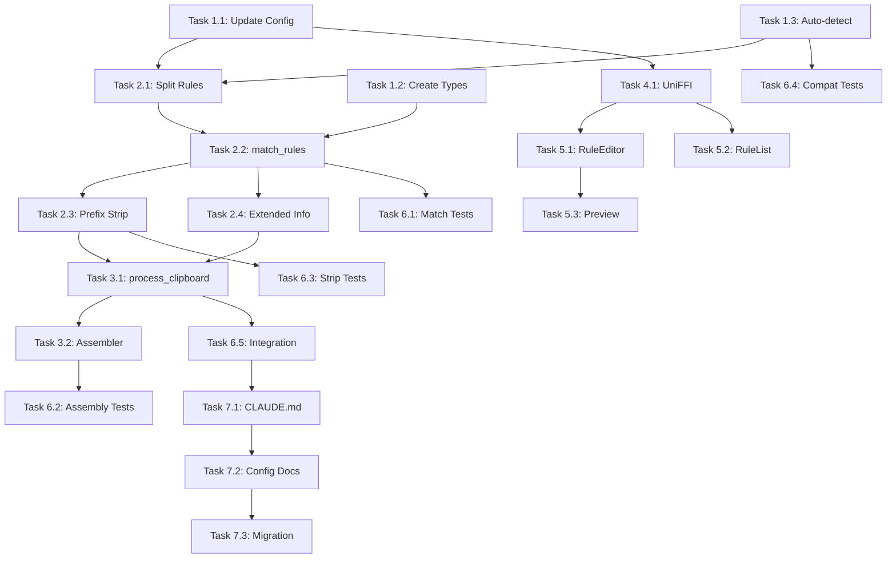

# Tasks: Refactor Routing Rule Logic

## Phase 1: Data Structure Changes

### Task 1.1: Update RoutingRuleConfig
- [ ] Add `rule_type` field to `RoutingRuleConfig` struct
- [ ] Make `provider` field optional (required for command, ignored for keyword)
- [ ] Update serde deserialization with default value detection
- [ ] Add helper methods: `is_command_rule()`, `is_keyword_rule()`
- **File**: `Aleph/core/src/config/mod.rs`

### Task 1.2: Create RoutingMatch Types
- [ ] Create `RoutingMatch` struct
- [ ] Create `MatchedCommandRule` struct
- [ ] Create `MatchedKeywordRule` struct
- [ ] Add `assemble_prompt()` method to `RoutingMatch`
- **File**: `Aleph/core/src/router/mod.rs` (new module or extend existing)

### Task 1.3: Auto-detect Rule Type on Load
- [ ] Implement rule type auto-detection in `Config::load_from_file()`
- [ ] If regex starts with `^/`, default to command rule
- [ ] If regex doesn't start with `/`, default to keyword rule
- [ ] Preserve explicit `rule_type` if specified
- **File**: `Aleph/core/src/config/mod.rs`

## Phase 2: Router Logic Changes

### Task 2.1: Split Rules by Type
- [ ] Add `command_rules` and `keyword_rules` vectors to `Router`
- [ ] Populate both vectors during `Router::new()`
- [ ] Validate command rules have `provider` field
- [ ] Validate keyword rules have `system_prompt` field
- **File**: `Aleph/core/src/router/mod.rs`

### Task 2.2: Implement match_rules()
- [ ] Create `Router::match_rules()` method
- [ ] Phase 1: Match command rules (first-match-stops)
- [ ] Phase 2: Match keyword rules (all-match)
- [ ] Return `RoutingMatch` struct
- **File**: `Aleph/core/src/router/mod.rs`

### Task 2.3: Command Prefix Stripping
- [ ] Enhance `RoutingRule::strip_matched_prefix()` method
- [ ] Ensure prefix is stripped for all command rules
- [ ] Handle edge cases (no content after prefix)
- [ ] Add validation for empty cleaned_input
- **File**: `Aleph/core/src/router/mod.rs`

### Task 2.4: Update route_with_extended_info()
- [ ] Modify to use `match_rules()` internally
- [ ] Update `RoutingDecision` to include keyword prompts
- [ ] Ensure backward compatibility with existing callers
- **File**: `Aleph/core/src/router/mod.rs`, `Aleph/core/src/router/decision.rs`

## Phase 3: Core Integration

### Task 3.1: Update process_clipboard()
- [ ] Use new `match_rules()` method
- [ ] Get provider from command rule or default_provider
- [ ] Assemble combined prompt using `assemble_prompt()`
- [ ] Pass cleaned_input (not original) to AI
- **File**: `Aleph/core/src/core.rs`

### Task 3.2: Update PromptAssembler
- [ ] Accept keyword prompts as additional input
- [ ] Merge keyword prompts with command prompt
- [ ] Ensure proper formatting
- **File**: `Aleph/core/src/prompt/assembler.rs`

## Phase 4: UniFFI Bindings

### Task 4.1: Update aleph.udl
- [ ] Add `rule_type` to RoutingRuleConfig dictionary
- [ ] Ensure optional `provider` field works
- [ ] Regenerate Swift bindings
- **File**: `Aleph/core/src/aleph.udl`

### Task 4.2: Test UniFFI Round-trip
- [ ] Test config serialization/deserialization through UniFFI
- [ ] Verify Swift can create both rule types
- [ ] Verify Swift receives correct match results
- **File**: Test files

## Phase 5: Swift UI Updates

### Task 5.1: Update RuleListView with Grouped Display
- [ ] Group rules by type: "指令规则" section and "关键词规则" section
- [ ] Add section headers with explanation text
- [ ] Show builtin commands with 🔒 icon and "内置指令" badge
- [ ] Different card styling for command vs keyword rules
- [ ] Command cards show: regex, provider, prompt preview
- [ ] Keyword cards show: regex, prompt preview (no provider)
- [ ] Builtin rules: [查看] button only, no edit/delete
- [ ] User rules: [编辑] [删除] buttons
- **File**: `Aleph/Sources/RoutingRulesView.swift` or similar

### Task 5.2: Update RuleEditorSheet
- [ ] Add rule type picker (Segmented control: 指令规则 / 关键词规则)
- [ ] Show explanation text below picker
- [ ] Dynamically show/hide provider picker based on rule type
- [ ] Validate: command rules require provider, keyword rules require prompt
- [ ] Add hint text "指令规则建议以 ^/ 开头"
- [ ] Pre-fill regex with "^/" for command rules
- **File**: `Aleph/Sources/RuleEditorSheet.swift` or similar

### Task 5.3: Add Builtin Rule Detail View
- [ ] Create read-only view for builtin commands
- [ ] Show all fields (regex, provider, prompt)
- [ ] Display "此为内置指令，不可编辑" message
- [ ] Link to documentation if available
- **File**: New `BuiltinRuleDetailView.swift`

### Task 5.4: Add Rule Test Panel (Optional but Recommended)
- [ ] Text input field for test input
- [ ] Real-time display of matched rules
- [ ] Show cleaned input after prefix stripping
- [ ] Show assembled prompt preview
- [ ] Collapsible panel at bottom of rules list
- **File**: New `RuleTestPanel.swift`

### Task 5.5: Add Localization Strings
- [ ] Add "rules.type.command" = "指令规则"
- [ ] Add "rules.type.keyword" = "关键词规则"
- [ ] Add "rules.type.builtin" = "内置指令"
- [ ] Add "rules.command.hint" = "输入以 / 开头触发..."
- [ ] Add "rules.keyword.hint" = "输入包含关键词时..."
- [ ] Add "error.command.empty" = "指令需要内容"
- **File**: `Aleph/Resources/en.lproj/Localizable.strings`, `zh-Hans.lproj/...`

### Task 5.6: Update Halo Error Display
- [ ] Handle empty command error case
- [ ] Display localized error message in Halo
- [ ] Show error animation then auto-dismiss
- **File**: `Aleph/Sources/HaloView.swift` or related

## Phase 6: Testing

### Task 6.1: Unit Tests for Rule Matching
- [ ] Test command rule first-match-stops
- [ ] Test keyword rule all-match
- [ ] Test mixed command + keyword matching
- [ ] Test no matches case
- **File**: `Aleph/core/src/router/mod.rs` (tests module)

### Task 6.2: Unit Tests for Prompt Assembly
- [ ] Test command-only prompt
- [ ] Test keyword-only prompt
- [ ] Test combined prompt
- [ ] Test empty prompts handling
- **File**: `Aleph/core/src/router/mod.rs` (tests module)

### Task 6.3: Unit Tests for Prefix Stripping
- [ ] Test `/draw content` → "content"
- [ ] Test `/draw` alone → error or empty
- [ ] Test complex patterns like `/en/translate`
- [ ] Test non-command patterns (no stripping)
- **File**: `Aleph/core/src/router/mod.rs` (tests module)

### Task 6.4: Backward Compatibility Tests
- [ ] Test loading old config without `rule_type`
- [ ] Test auto-detection of rule types
- [ ] Ensure existing functionality unchanged
- **File**: `Aleph/core/src/config/mod.rs` (tests module)

### Task 6.5: Integration Tests
- [ ] End-to-end test: input → matching → prompt assembly
- [ ] Test with real config file
- **File**: New integration test file

## Phase 7: Documentation

### Task 7.1: Update CLAUDE.md
- [ ] Document two rule types
- [ ] Update config examples
- [ ] Explain prompt assembly logic
- **File**: `CLAUDE.md`

### Task 7.2: Update Config Documentation
- [ ] Add rule type explanation
- [ ] Provide examples for command rules
- [ ] Provide examples for keyword rules
- [ ] Explain matching behavior
- **File**: `docs/CONFIGURATION.md` or inline in CLAUDE.md

### Task 7.3: Add Migration Guide
- [ ] Explain changes from old to new system
- [ ] How to convert existing rules
- [ ] Backward compatibility notes
- **File**: New or update existing docs

## Validation Checklist

Before marking as complete, verify:

- [ ] `cargo test` passes all tests
- [ ] `cargo clippy` has no warnings
- [ ] UniFFI bindings regenerated and Swift compiles
- [ ] Manual testing with real scenarios
- [ ] Documentation updated
- [ ] Config examples work correctly

## Dependencies

## Estimated Effort

| Phase | Tasks | Effort |
|-------|-------|--------|
| Phase 1: Data Structures | 3 | 2-3 hours |
| Phase 2: Router Logic | 4 | 4-5 hours |
| Phase 3: Core Integration | 2 | 2-3 hours |
| Phase 4: UniFFI | 2 | 1-2 hours |
| Phase 5: Swift UI | 6 | 6-8 hours |
| Phase 6: Testing | 5 | 3-4 hours |
| Phase 7: Documentation | 3 | 1-2 hours |
| **Total** | 25 | 19-27 hours |
